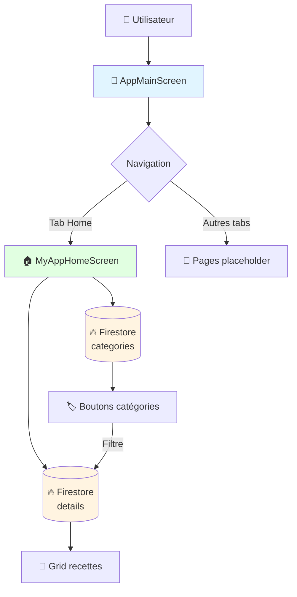

# Documentation du projet Flutter Recipe App

Bienvenue dans la documentation du projet ! Cette section contient des explications détaillées sur l'architecture et le fonctionnement de l'application.

---

## 📚 Documents disponibles

### 1. [Arbre des Widgets](01-arbre_widgets.md)
**Niveau** : Débutant à Intermédiaire  
**Durée de lecture** : ~20 minutes

Visualisation complète de la hiérarchie des widgets dans `app_main_screen.dart` avec des diagrammes détaillés.

**Contenu** :
- Hiérarchie complète des 3 classes principales
- Détail de chaque composant widget par widget
- 10+ diagrammes Mermaid (arbres, séquences, états)
- Relations et flux de données entre widgets
- Diagramme de classes UML

**Idéal pour** : Comprendre la structure et l'organisation du code

---

### 2. [StreamBuilder et Firebase](02-explication_streambuilder.md)
**Niveau** : Intermédiaire  
**Durée de lecture** : ~15 minutes

Explique en détail comment fonctionne le `StreamBuilder` utilisé pour la communication en temps réel avec Firebase Firestore.

**Contenu** :
- Concept de Stream vs requête classique
- Anatomie d'un StreamBuilder
- Analyse du code ligne par ligne
- 6 diagrammes Mermaid illustratifs
- Bonnes pratiques et pièges à éviter

**Idéal pour** : Comprendre la communication en temps réel avec Firebase

---

### 3. [Quiz StreamBuilder](03-quiz_streambuilder.md)
**Niveau** : Tous niveaux  
**Durée** : ~45-60 minutes

Quiz complet avec 30 questions pour tester vos connaissances sur StreamBuilder et le code de app_main_screen.dart.

**Contenu** :
- 10 questions de niveau facile (concepts de base)
- 10 questions de niveau moyen (compréhension du code)
- 10 questions de niveau difficile (analyse avancée et debug)
- Réponses détaillées avec explications
- Grille d'évaluation
- 5 exercices pratiques supplémentaires

**Idéal pour** : Évaluer et valider vos connaissances

---

### 4. [Navigation View All](04-navigation_view_all.md)
**Niveau** : Débutant à Intermédiaire  
**Durée de lecture** : ~20 minutes

Explique comment implémenter la navigation vers une page "View All" qui affiche toutes les recettes.

**Contenu** :
- Architecture de la navigation Flutter
- Bouton "View all" avec Navigator.push()
- Page view_all_items.dart complète
- Widget RecipeCard réutilisable
- Gestion du Stream Firestore avec filtres
- 5 diagrammes Mermaid (flux, séquence, structure)
- Bonnes pratiques et améliorations possibles

**Idéal pour** : Comprendre la navigation et création de pages dynamiques

---

## 🎯 Par où commencer ?

### Si vous êtes nouveau sur le projet
1. Commencez par [Arbre des Widgets](01-arbre_widgets.md) pour comprendre la structure globale
2. Ensuite lisez [StreamBuilder et Firebase](02-explication_streambuilder.md) pour comprendre la logique
3. Testez vos connaissances avec le [Quiz StreamBuilder](03-quiz_streambuilder.md)

### Si vous connaissez Flutter mais pas Firebase
- Allez directement à [StreamBuilder et Firebase](02-explication_streambuilder.md)
- Puis testez-vous avec le [Quiz StreamBuilder](03-quiz_streambuilder.md)

### Si vous voulez comprendre un widget spécifique
- Consultez [Arbre des Widgets](01-arbre_widgets.md) et utilisez Ctrl+F pour chercher le widget

### Si vous voulez évaluer vos compétences
- Faites le [Quiz StreamBuilder](03-quiz_streambuilder.md) pour identifier vos points forts et axes d'amélioration

---

## 🗂️ Structure du fichier principal

```
app_main_screen.dart
├── AppMainScreen (StatefulWidget)
│   └── Gère la navigation avec BottomNavigationBar
│   └── État: selectedIndex
│
├── MyAppHomeScreen (StatefulWidget)
│   └── Page d'accueil avec les recettes
│   └── État: selectedCategory
│   └── Contient 2 StreamBuilders (Categories + Recipes)
│
└── BannerToExplore (StatelessWidget)
    └── Banner promotionnel statique
```

---

## 🔥 Concepts Firebase utilisés

| Concept | Description | Ligne de code |
|---------|-------------|---------------|
| **Firestore instance** | Connexion à la base de données | `FirebaseFirestore.instance` |
| **Collection** | Groupe de documents | `.collection('categories')` |
| **Snapshots** | Stream temps réel | `.snapshots()` |
| **Query** | Filtrage de données | `.where('category', isEqualTo: ...)` |

---

## 🎨 Architecture visuelle rapide



---

## 💡 Ressources externes utiles

### Documentation officielle
- [Flutter StreamBuilder](https://api.flutter.dev/flutter/widgets/StreamBuilder-class.html)
- [Firebase Firestore Flutter](https://firebase.google.com/docs/firestore/quickstart)
- [Iconsax Package](https://pub.dev/packages/iconsax)

### Tutoriels recommandés
- [Understanding Streams in Dart](https://dart.dev/tutorials/language/streams)
- [Firebase with Flutter Best Practices](https://firebase.google.com/docs/flutter/setup)

---

## ❓ FAQ

### Q : Pourquoi utiliser StreamBuilder au lieu de FutureBuilder ?
**R :** `StreamBuilder` écoute les changements en temps réel. Si quelqu'un ajoute une recette dans Firestore, l'UI se met à jour automatiquement. `FutureBuilder` ne fait qu'une seule requête.

### Q : Que se passe-t-il si Firestore est hors ligne ?
**R :** Firebase a un cache local. Les données précédemment chargées restent disponibles.

### Q : Pourquoi Container avec height: 400 pour le GridView ?
**R :** Dans une `Column` (layout vertical), un `GridView` (aussi vertical) crée un conflit de contraintes infinies. La hauteur fixe résout ce problème.

### Q : Peut-on avoir plusieurs StreamBuilders sur la même collection ?
**R :** Techniquement oui, mais c'est inefficace. Mieux vaut utiliser un state management (Provider, Riverpod, Bloc) pour partager le Stream.

---

## 🚀 Améliorations futures possibles

1. **Pagination** : Limiter le nombre de recettes chargées avec `.limit(20)`
2. **Recherche** : Implémenter la recherche dans le TextField actuellement non fonctionnel
3. **Favoris** : Utiliser Firebase pour sauvegarder les recettes favorites
4. **Cache images** : Utiliser `cached_network_image` pour améliorer les performances
5. **State Management** : Migrer vers Provider ou Riverpod pour une meilleure gestion d'état

---

**Documentation maintenue à jour pour le projet Flutter Recipe App**  
*Dernière mise à jour : Novembre 2025*

