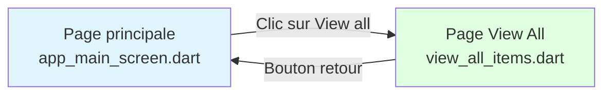
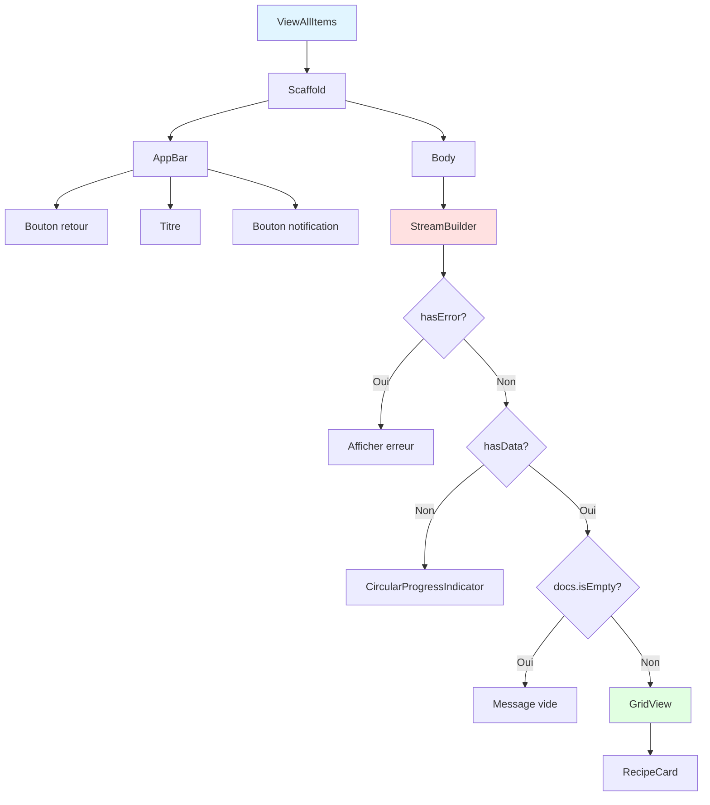
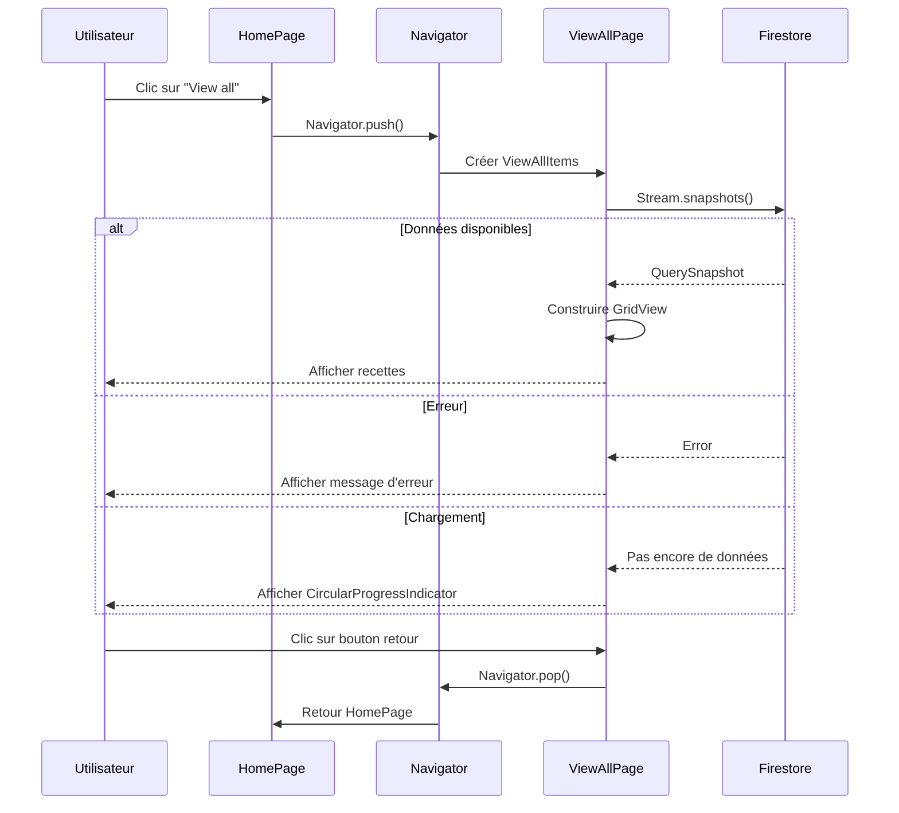
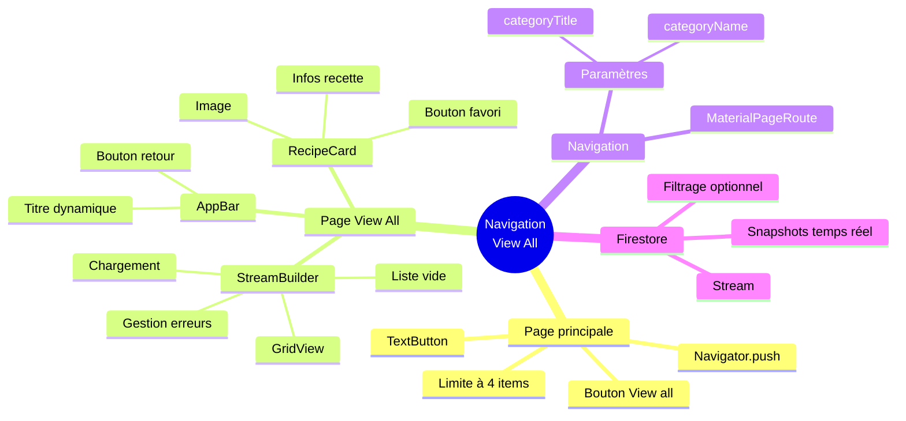

# Navigation "View All" - Documentation

## Vue d'ensemble

Cette documentation explique comment fonctionne la navigation vers la page "View All" qui affiche toutes les recettes d'une catégorie.

---

## Architecture de la fonctionnalité

### Fichiers impliqués

1. **app_main_screen.dart** - Page principale avec le bouton "View all"
2. **view_all_items.dart** - Page qui affiche toutes les recettes

---

## Flux de navigation



---

## Étape 1 : Bouton "View all" dans app_main_screen.dart

### Code ajouté

```dart
// Titre "Quick & Easy" avec bouton "View all"
Row(
  mainAxisAlignment: MainAxisAlignment.spaceBetween,
  children: [
    const Text(
      "Quick & Easy",
      style: TextStyle(
        fontSize: 20,
        fontWeight: FontWeight.bold,
      ),
    ),
    // Bouton "View all" qui navigue vers la page complète
    TextButton(
      onPressed: () {
        Navigator.push(
          context,
          MaterialPageRoute(
            builder: (context) => const ViewAllItems(
              categoryTitle: "Quick & Easy",
              categoryName: null, // null = toutes les recettes
            ),
          ),
        );
      },
      child: const Text(
        "View all",
        style: TextStyle(
          color: kprimaryColor,
          fontSize: 14,
          fontWeight: FontWeight.w600,
        ),
      ),
    ),
  ],
),
```

### Explications

**Row avec MainAxisAlignment.spaceBetween**
- Place le titre à gauche et le bouton à droite

**TextButton**
- Widget Flutter pour créer un bouton texte cliquable

**Navigator.push()**
- Méthode pour naviguer vers une nouvelle page
- Empile la nouvelle page au-dessus de la page actuelle
- L'utilisateur peut revenir avec le bouton retour

**MaterialPageRoute**
- Définit la transition de page standard Material Design

**Paramètres passés**
- `categoryTitle` : Titre affiché dans l'AppBar ("Quick & Easy")
- `categoryName` : Nom de la catégorie dans Firestore (null = tout afficher)

---

## Étape 2 : Limitation du nombre d'items

### Code modifié

```dart
// AVANT : affichait toutes les recettes
stream: _firestore.collection('details').snapshots()

// APRÈS : limite à 4 recettes pour l'aperçu
stream: _firestore.collection('details').limit(4).snapshots()
```

### Pourquoi limiter ?

**Raison 1 : Performance**
- Charge moins de données depuis Firestore
- Affichage plus rapide

**Raison 2 : UX (Expérience utilisateur)**
- Donne un sens au bouton "View all"
- Si tout est déjà affiché, pas besoin du bouton

**Raison 3 : Économie de données**
- Moins de bande passante utilisée
- Important pour les utilisateurs mobiles

---

## Étape 3 : Page view_all_items.dart

### Structure de la page



---

## Composants de view_all_items.dart

### 1. Widget ViewAllItems (StatefulWidget)

**Rôle**
- Page principale qui affiche toutes les recettes

**Paramètres**
- `categoryTitle` (obligatoire) : Titre affiché
- `categoryName` (optionnel) : Nom de la catégorie pour filtrer

**Exemple d'utilisation**

```dart
// Afficher toutes les recettes
ViewAllItems(
  categoryTitle: "Quick & Easy",
  categoryName: null,
)

// Afficher seulement les recettes "Breakfast"
ViewAllItems(
  categoryTitle: "Petit-déjeuner",
  categoryName: "Breakfast",
)
```

---

### 2. AppBar personnalisé

```dart
AppBar(
  backgroundColor: Colors.white,
  elevation: 0,
  leading: IconButton(
    icon: const Icon(Icons.arrow_back_ios, color: Colors.black),
    onPressed: () => Navigator.pop(context), // Retour en arrière
  ),
  title: Text(widget.categoryTitle), // Titre dynamique
  centerTitle: true,
)
```

**Éléments clés**
- `leading` : Bouton à gauche (retour)
- `title` : Titre au centre
- `actions` : Boutons à droite (notification)
- `elevation: 0` : Pas d'ombre sous l'AppBar

---

### 3. StreamBuilder avec gestion d'erreurs

**ÉTAPE 1 : Gestion des erreurs**

```dart
if (snapshot.hasError) {
  return Center(
    child: Column(
      children: [
        Icon(Icons.error_outline, color: Colors.red, size: 60),
        Text('Erreur: ${snapshot.error}'),
      ],
    ),
  );
}
```

**ÉTAPE 2 : État de chargement**

```dart
if (!snapshot.hasData) {
  return Center(
    child: CircularProgressIndicator(color: kprimaryColor),
  );
}
```

**ÉTAPE 3 : Liste vide**

```dart
if (snapshot.data!.docs.isEmpty) {
  return Center(
    child: Column(
      children: [
        Icon(Iconsax.box, size: 60, color: Colors.grey),
        Text('Aucune recette disponible'),
      ],
    ),
  );
}
```

**ÉTAPE 4 : Affichage des données**

```dart
return GridView.builder(
  gridDelegate: SliverGridDelegateWithFixedCrossAxisCount(
    crossAxisCount: 2,
    crossAxisSpacing: 10,
    mainAxisSpacing: 10,
    childAspectRatio: 0.8,
  ),
  itemCount: snapshot.data!.docs.length,
  itemBuilder: (context, index) {
    // Construction de chaque RecipeCard
  },
);
```

---

### 4. Widget RecipeCard (Réutilisable)

**Pourquoi séparer en widget ?**

**Avantage 1 : Lisibilité**
- Code plus propre et organisé
- Plus facile à comprendre

**Avantage 2 : Réutilisabilité**
- Peut être utilisé dans d'autres pages
- Un seul endroit à modifier si besoin de changement

**Avantage 3 : Performance**
- Flutter peut optimiser les widgets const
- Rebuild seulement ce qui change

**Structure de RecipeCard**

```dart
RecipeCard(
  image: "url_de_l_image",
  name: "Nom de la recette",
  time: "30",
  calories: "450",
  onTap: () {
    // Navigation vers les détails
  },
)
```

---

## Gestion du Stream Firestore

### Stream sans filtre

```dart
stream: _firestore.collection('details').snapshots()
```

Résultat : Toutes les recettes de la collection

### Stream avec filtre

```dart
stream: _firestore
    .collection('details')
    .where('category', isEqualTo: 'Breakfast')
    .snapshots()
```

Résultat : Seulement les recettes de la catégorie "Breakfast"

### Stream conditionnel

```dart
stream: categoryName != null
    ? _firestore
        .collection('details')
        .where('category', isEqualTo: categoryName)
        .snapshots()
    : _firestore.collection('details').snapshots()
```

Résultat : Affiche tout ou filtre selon la présence de categoryName

---

## Gestion des données avec valeurs par défaut

### Problème

Firestore peut retourner des champs null ou absents

### Solution

```dart
// MAUVAIS : Peut causer un crash
final name = recipe['name'].toString();

// BON : Utilise une valeur par défaut si null
final name = (recipe['name'] ?? 'Sans nom').toString();
```

### Opérateur ??

L'opérateur `??` signifie : "Si la valeur à gauche est null, utilise la valeur à droite"

Exemples :
```dart
final img = (recipe['image'] ?? '').toString();
// Si image est null, utilise '' (chaîne vide)

final time = (recipe['time'] ?? '').toString();
// Si time est null, utilise ''

final cal = (recipe['cal'] ?? '0').toString();
// Si cal est null, utilise '0'
```

---

## GridView Configuration

### SliverGridDelegateWithFixedCrossAxisCount

```dart
gridDelegate: SliverGridDelegateWithFixedCrossAxisCount(
  crossAxisCount: 2,        // 2 colonnes
  crossAxisSpacing: 10,     // 10px d'espace horizontal entre les items
  mainAxisSpacing: 10,      // 10px d'espace vertical entre les items
  childAspectRatio: 0.8,    // Ratio hauteur/largeur (0.8 = plus haut que large)
),
```

### Visualisation

```
┌─────────┐  10px  ┌─────────┐
│ Item 1  │        │ Item 2  │
│         │        │         │
│  0.8    │        │  0.8    │
│ ratio   │        │ ratio   │
└─────────┘        └─────────┘
     10px (mainAxisSpacing)
┌─────────┐        ┌─────────┐
│ Item 3  │        │ Item 4  │
│         │        │         │
└─────────┘        └─────────┘
```

---

## Gestion des images

### Trois cas possibles

**Cas 1 : Image valide**
```dart
Image.network(
  image,
  width: double.infinity,
  fit: BoxFit.cover,
)
```

**Cas 2 : Erreur de chargement**
```dart
errorBuilder: (context, error, stackTrace) {
  return Container(
    color: Colors.grey[200],
    child: Icon(Icons.restaurant),
  );
}
```

**Cas 3 : Pas d'URL d'image**
```dart
image.isNotEmpty
    ? Image.network(...)
    : Container(
        color: Colors.grey[200],
        child: Icon(Icons.restaurant),
      )
```

---

## Améliorations possibles

### 1. Navigation vers les détails de la recette

```dart
onTap: () {
  Navigator.push(
    context,
    MaterialPageRoute(
      builder: (context) => RecipeDetailsPage(
        recipeId: recipe.id,
      ),
    ),
  );
}
```

### 2. Système de favoris fonctionnel

```dart
// Ajouter dans RecipeCard
final bool isFavorite;

// Dans l'icône
Icon(
  isFavorite ? Iconsax.heart5 : Iconsax.heart,
  color: isFavorite ? Colors.red : Colors.grey,
)
```

### 3. Pagination (charger plus de résultats)

```dart
// Ajouter un bouton en bas du GridView
FloatingActionButton(
  onPressed: () {
    // Charger 20 recettes de plus
  },
  child: Text("Charger plus"),
)
```

### 4. Recherche et filtres

```dart
// Ajouter une barre de recherche dans l'AppBar
TextField(
  onChanged: (value) {
    // Filtrer les résultats
  },
)
```

---

## Diagramme de séquence complet



---

## Points clés à retenir

### Navigation Flutter

**Navigator.push()**
- Empile une nouvelle page
- Garde l'historique de navigation
- Permet de revenir en arrière

**Navigator.pop()**
- Retire la page du dessus de la pile
- Retourne à la page précédente

### StreamBuilder

**Toujours gérer 3 états**
1. Erreur (snapshot.hasError)
2. Chargement (!snapshot.hasData)
3. Données (snapshot.data)

**Bonus : 4e état**
4. Liste vide (snapshot.data.docs.isEmpty)

### Bonnes pratiques

1. Utiliser des valeurs par défaut avec `??`
2. Séparer les widgets complexes en sous-widgets
3. Ajouter des commentaires explicatifs
4. Gérer les erreurs de chargement d'images
5. Limiter le nombre de résultats avec `.limit()`

---

## Résumé visuel



---

**Document créé pour expliquer la navigation "View All" dans l'application de recettes**
*Approche pédagogique pour débutants*

