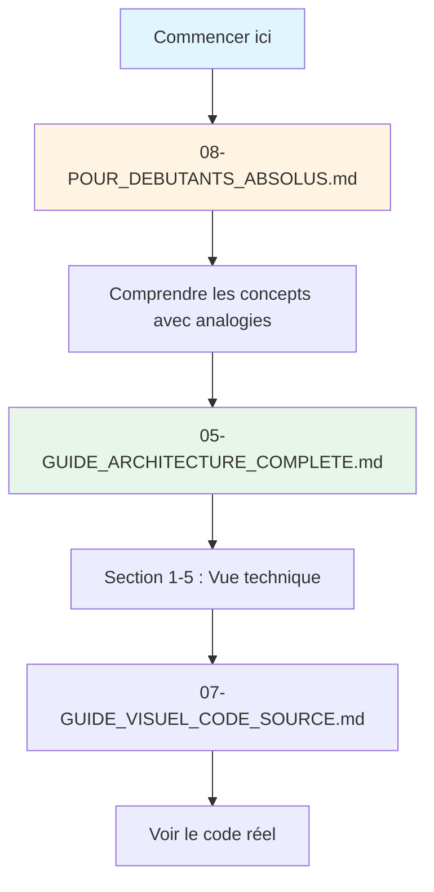
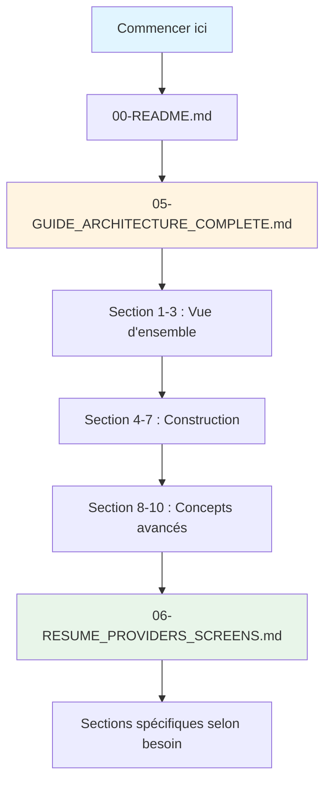
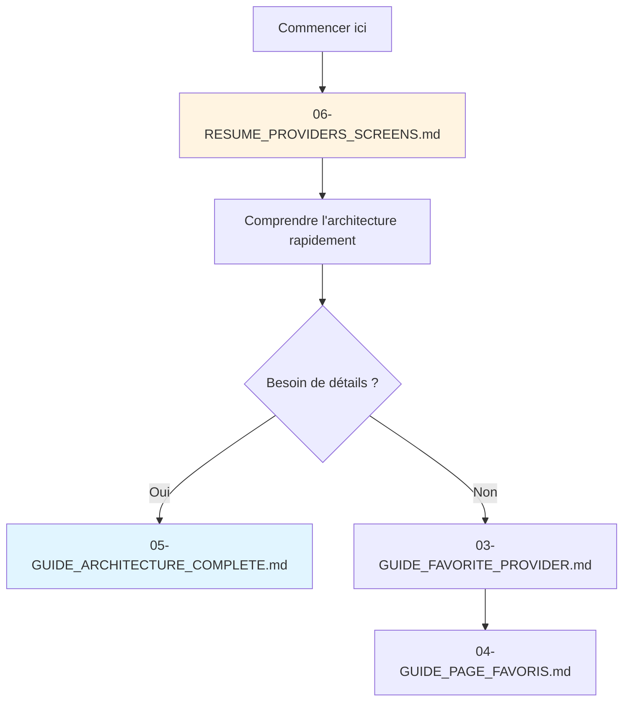
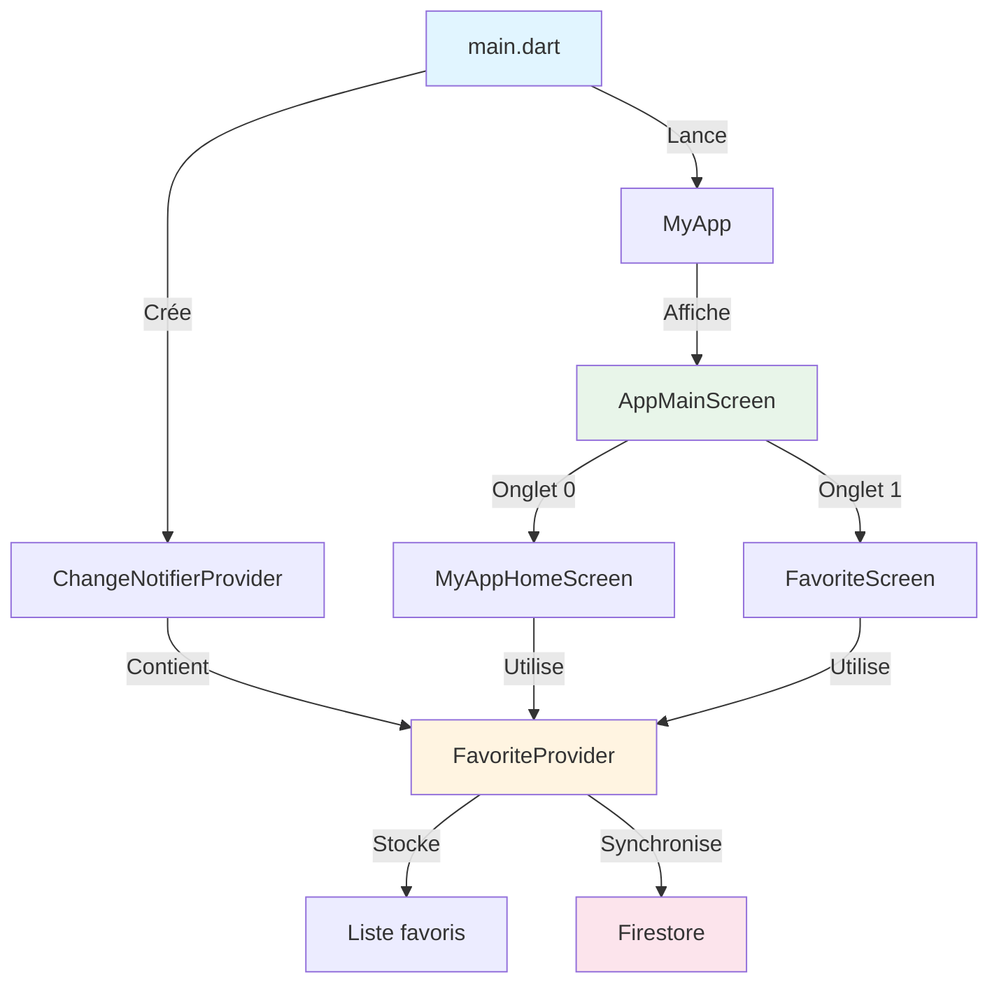
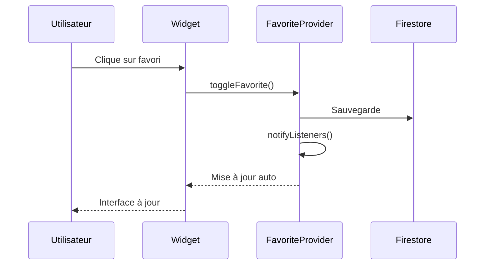

# Index de la Documentation - Projet Flutter Recipe App

## Organisation de la documentation

Ce dossier contient toute la documentation pour comprendre l'architecture et le fonctionnement du projet Flutter, avec une approche pédagogique adaptée aux débutants.

---

## Documents disponibles

### 1. Guide de démarrage

#### 00-README.md
- Vue d'ensemble du projet
- Technologies utilisées
- Instructions de démarrage

#### 01-GUIDE_CONSTRUCTION_ETAPE_PAR_ETAPE.md
- Construction complète de l'application étape par étape
- Du projet vide à l'application fonctionnelle
- Explications détaillées de chaque ajout

---

### 2. Guides sur les Providers

#### 02-REFERENCE_RAPIDE.md
- Référence rapide pour les concepts clés
- Aide-mémoire pour les développeurs

#### 03-GUIDE_FAVORITE_PROVIDER.md
- Explication détaillée du FavoriteProvider
- Méthodes et fonctionnement
- Exemples d'utilisation

#### 05-GUIDE_ARCHITECTURE_COMPLETE.md ⭐
**Document principal pour comprendre l'architecture**
- Vue d'ensemble complète de l'architecture
- Explication détaillée des Providers
- Diagrammes Mermaid pour chaque concept
- Flux de données complets
- Concepts clés pour débutants
- 10 sections détaillées

**Contenu :**
1. Vue d'ensemble de l'architecture
2. Les Providers : Qu'est-ce que c'est ?
3. Structure du projet
4. Configuration initiale (main.dart)
5. Création du FavoriteProvider
6. L'écran principal (AppMainScreen)
7. L'écran des favoris (FavoriteScreen)
8. Communication Provider-Widget
9. Flux de données complet
10. Concepts clés pour débutants

#### 06-RESUME_PROVIDERS_SCREENS.md ⭐
**Document de référence rapide**
- Localisation précise de tous les Providers
- Où et comment chaque écran utilise les Providers
- Tableau récapitulatif avec numéros de lignes
- Diagrammes de navigation
- Checklist pour créer de nouveaux Providers

**Contenu :**
1. Vue d'ensemble rapide
2. Localisation des fichiers
3. Étape par étape : Construction du système
4. Comment chaque écran utilise le Provider
5. Diagramme de navigation complet

#### 07-GUIDE_VISUEL_CODE_SOURCE.md
**Analyse détaillée du code**
- Structure complète de chaque fichier
- Code commenté ligne par ligne
- Numéros de lignes précis
- Diagrammes de classes et de séquence
- Patterns et bonnes pratiques
- Flux d'exécution visuel

**Contenu :**
1. Vue d'ensemble visuelle
2. Fichier par fichier (main.dart, favorite_provider.dart, etc.)
3. Flux d'exécution visuel
4. Interactions entre fichiers
5. Patterns et bonnes pratiques

#### 08-POUR_DEBUTANTS_ABSOLUS.md ⭐
**Guide ultra-simple sans jargon technique**
- Explications avec analogies du quotidien
- Pas de termes compliqués
- Diagrammes simples
- Exemples concrets
- Questions fréquentes

**Contenu :**
1. C'est quoi cette application ?
2. Comment c'est organisé ?
3. Les fichiers principaux expliqués simplement
4. Comment ça communique ?
5. Les concepts clés expliqués simplement

---

### 3. Guides sur les fonctionnalités

#### 04-GUIDE_PAGE_FAVORIS.md
- Implémentation de l'écran des favoris
- Gestion de l'affichage
- Interaction avec le Provider

---

## Parcours d'apprentissage recommandé

### Pour les débutants absolus (sans expérience en programmation)



**Étapes :**
1. COMMENCER PAR `08-POUR_DEBUTANTS_ABSOLUS.md` pour comprendre avec des analogies
2. Continuer avec `05-GUIDE_ARCHITECTURE_COMPLETE.md` pour la vue technique
3. Explorer `07-GUIDE_VISUEL_CODE_SOURCE.md` pour voir le code ligne par ligne
4. Consulter `06-RESUME_PROVIDERS_SCREENS.md` comme aide-mémoire

### Pour les débutants avec bases en programmation



**Étapes :**
1. Lire `00-README.md` pour la vue d'ensemble
2. Suivre `05-GUIDE_ARCHITECTURE_COMPLETE.md` section par section
3. Consulter `06-RESUME_PROVIDERS_SCREENS.md` pour la référence rapide
4. Approfondir avec les guides spécifiques selon vos besoins

---

### Pour les développeurs avec expérience Flutter



**Étapes :**
1. Commencer par `06-RESUME_PROVIDERS_SCREENS.md` pour une vue rapide
2. Consulter `05-GUIDE_ARCHITECTURE_COMPLETE.md` pour les détails si nécessaire
3. Approfondir les fonctionnalités spécifiques avec les autres guides

---

## Structure du code source

### Architecture du projet

```
flutter_rec_oct_2025_v3/
│
├── lib/
│   ├── main.dart                          # Point d'entrée + injection Provider
│   ├── constants.dart                     # Constantes (couleurs)
│   ├── firebase_options.dart              # Configuration Firebase
│   │
│   ├── Provider/
│   │   └── favorite_provider.dart         # Provider des favoris
│   │
│   └── Views/
│       ├── app_main_screen.dart          # Écran principal + navigation
│       ├── favorite_screen.dart          # Écran des favoris
│       └── view_all_items.dart           # Liste complète des recettes
│
├── documentation-4/                        # Documentation (vous êtes ici)
│   ├── 00-INDEX.md                        # Ce fichier
│   ├── 00-README.md
│   ├── 01-GUIDE_CONSTRUCTION_ETAPE_PAR_ETAPE.md
│   ├── 02-REFERENCE_RAPIDE.md
│   ├── 03-GUIDE_FAVORITE_PROVIDER.md
│   ├── 04-GUIDE_PAGE_FAVORIS.md
│   ├── 05-GUIDE_ARCHITECTURE_COMPLETE.md
│   └── 06-RESUME_PROVIDERS_SCREENS.md
│
└── pubspec.yaml                           # Dépendances du projet
```

---

## Diagrammes clés

### Vue d'ensemble de l'architecture



### Flux de données Provider



---

## Correspondance Documentation ↔ Code

### Table de référence rapide

| Document | Sujet | Fichiers source concernés | Niveau |
|----------|-------|---------------------------|---------|
| 08-POUR_DEBUTANTS_ABSOLUS.md | Explications simples avec analogies | Tous les fichiers | Débutant absolu |
| 05-GUIDE_ARCHITECTURE_COMPLETE.md | Architecture complète avec diagrammes | Tous les fichiers | Débutant/Intermédiaire |
| 06-RESUME_PROVIDERS_SCREENS.md | Utilisation précise des Providers | main.dart, tous les Views/ | Tous niveaux |
| 07-GUIDE_VISUEL_CODE_SOURCE.md | Code source ligne par ligne | Tous les fichiers | Intermédiaire |
| 03-GUIDE_FAVORITE_PROVIDER.md | FavoriteProvider détaillé | Provider/favorite_provider.dart | Intermédiaire |
| 04-GUIDE_PAGE_FAVORIS.md | Écran favoris | Views/favorite_screen.dart | Intermédiaire |
| 01-GUIDE_CONSTRUCTION_ETAPE_PAR_ETAPE.md | Construction complète | Tout le projet | Avancé |

---

## Questions fréquentes et où trouver les réponses

### "C'est quoi un Provider ? (explication simple)"
- **Réponse simple** : C'est comme un bibliothécaire qui garde les favoris en mémoire
- **Documentation** : `08-POUR_DEBUTANTS_ABSOLUS.md` - Section 5.1
- **Explication technique** : `05-GUIDE_ARCHITECTURE_COMPLETE.md` - Section 2

### "Où est créé le Provider ?"
- **Réponse rapide** : Dans `lib/Provider/favorite_provider.dart`
- **Explication simple** : `08-POUR_DEBUTANTS_ABSOLUS.md` - Section 3.2
- **Documentation** : `06-RESUME_PROVIDERS_SCREENS.md` - Section 2
- **Explication détaillée** : `05-GUIDE_ARCHITECTURE_COMPLETE.md` - Section 5

### "Où est injecté le Provider ?"
- **Réponse rapide** : Dans `lib/main.dart` ligne 17-20
- **Explication simple** : `08-POUR_DEBUTANTS_ABSOLUS.md` - Section 3.1
- **Documentation** : `06-RESUME_PROVIDERS_SCREENS.md` - Section 3.2
- **Explication détaillée** : `05-GUIDE_ARCHITECTURE_COMPLETE.md` - Section 4

### "Comment utiliser le Provider dans un widget ?"
- **Réponse rapide** : `Consumer<FavoriteProvider>` ou `Provider.of<FavoriteProvider>`
- **Explication simple** : `08-POUR_DEBUTANTS_ABSOLUS.md` - Section 5.3
- **Documentation** : `06-RESUME_PROVIDERS_SCREENS.md` - Section 4
- **Explication détaillée** : `05-GUIDE_ARCHITECTURE_COMPLETE.md` - Section 8

### "Quelle est la différence entre StreamBuilder et FutureBuilder ?"
- **Documentation** : `05-GUIDE_ARCHITECTURE_COMPLETE.md` - Section 10.2 et 10.3
- **Exemple pratique** : `06-RESUME_PROVIDERS_SCREENS.md` - Section 3.4

### "Comment ajouter un nouveau Provider ?"
- **Documentation** : `06-RESUME_PROVIDERS_SCREENS.md` - Section "Checklist"
- **Explication détaillée** : `05-GUIDE_ARCHITECTURE_COMPLETE.md` - Section 10

### "Comment fonctionne la navigation entre les écrans ?"
- **Documentation** : `06-RESUME_PROVIDERS_SCREENS.md` - Section 5
- **Explication détaillée** : `05-GUIDE_ARCHITECTURE_COMPLETE.md` - Section 6

---

## Technologies utilisées

### Framework et langage
- **Flutter** 3.8.0+
- **Dart** 3.8.0+

### Packages principaux
- **provider** 6.1.2 - Gestion d'état
- **firebase_core** 2.32.0 - Intégration Firebase
- **cloud_firestore** 4.17.3 - Base de données NoSQL
- **iconsax** 0.0.8 - Icônes

### Architecture
- **Pattern** : Provider (State Management)
- **Structure** : Séparation Views / Provider / Models
- **Backend** : Firebase Firestore

---

## Glossaire

### Termes clés

**Provider**
- Système de gestion d'état dans Flutter
- Permet de partager des données entre widgets
- Notifie automatiquement les changements

**ChangeNotifier**
- Classe que les Providers étendent
- Permet d'appeler `notifyListeners()` pour notifier les changements

**Consumer**
- Widget qui écoute un Provider
- Se rebuild automatiquement quand le Provider change
- Plus performant que `Provider.of`

**StreamBuilder**
- Widget qui écoute un Stream (flux de données)
- Se rebuild automatiquement quand de nouvelles données arrivent
- Utilisé pour Firestore en temps réel

**FutureBuilder**
- Widget qui attend le résultat d'une opération asynchrone
- Affiche un état de chargement puis le résultat
- Pour des requêtes uniques

**Firestore**
- Base de données NoSQL de Firebase
- Structure en Collections et Documents
- Synchronisation en temps réel

**StatefulWidget**
- Widget avec un état interne
- Peut changer au cours du temps
- Utilise `setState()` pour se mettre à jour

**StatelessWidget**
- Widget sans état interne
- Immuable
- Plus léger et performant

---

## Conventions de code utilisées

### Nommage

```dart
// Variables privées : préfixe _
List<String> _favoriteIds;

// Variables publiques : camelCase
List<String> get favorites;

// Classes : PascalCase
class FavoriteProvider extends ChangeNotifier

// Méthodes : camelCase
void toggleFavorite()

// Constantes : lowerCamelCase ou UPPER_CASE
const Color kprimaryColor;
```

### Organisation des imports

```dart
// 1. Packages Flutter
import 'package:flutter/material.dart';

// 2. Packages externes
import 'package:provider/provider.dart';
import 'package:cloud_firestore/cloud_firestore.dart';

// 3. Fichiers locaux
import '../Provider/favorite_provider.dart';
import '../constants.dart';
```

---

## Prochaines étapes suggérées

### Pour étendre le projet

1. **Ajouter un système d'authentification**
   - Firebase Auth
   - Favoris par utilisateur
   - Profils utilisateurs

2. **Implémenter le Meal Plan**
   - Nouveau Provider : `MealPlanProvider`
   - Planification hebdomadaire
   - Notifications

3. **Ajouter des détails de recettes**
   - Écran de détails
   - Ingrédients et instructions
   - Notes et commentaires

4. **Améliorer la recherche**
   - Recherche en temps réel
   - Filtres avancés
   - Suggestions

5. **Mode hors ligne**
   - Cache local
   - Synchronisation en arrière-plan
   - Gestion des conflits

---

## Aide supplémentaire

### Ressources recommandées

**Documentation officielle**
- [Flutter Documentation](https://flutter.dev/docs)
- [Provider Package](https://pub.dev/packages/provider)
- [Firebase Documentation](https://firebase.google.com/docs)

**Pour aller plus loin**
- Les autres guides dans ce dossier (documentation-1, documentation-2, documentation-3)
- Tutoriels Flutter sur YouTube
- Community Flutter sur Discord

---

## Version de la documentation

- **Dernière mise à jour** : Novembre 2025
- **Version du projet** : 1.0.0
- **Compatibilité** : Flutter 3.8.0+

---

## Contribution à la documentation

Si vous souhaitez améliorer cette documentation :
1. Les fichiers sont en format Markdown
2. Les diagrammes utilisent la syntaxe Mermaid
3. Gardez une approche pédagogique
4. Ajoutez des exemples de code commentés

---

## Récapitulatif des documents créés

### Documents principaux (par ordre de difficulté)

1. **08-POUR_DEBUTANTS_ABSOLUS.md** - Niveau : Débutant absolu
   - Explications sans jargon
   - Analogies du quotidien
   - Parfait pour commencer

2. **05-GUIDE_ARCHITECTURE_COMPLETE.md** - Niveau : Débutant/Intermédiaire
   - Architecture complète
   - 10 sections détaillées
   - Nombreux diagrammes Mermaid

3. **06-RESUME_PROVIDERS_SCREENS.md** - Niveau : Tous niveaux
   - Référence rapide
   - Localisation précise
   - Numéros de lignes

4. **07-GUIDE_VISUEL_CODE_SOURCE.md** - Niveau : Intermédiaire
   - Code ligne par ligne
   - Patterns détaillés
   - Structure complète

### Autres documents disponibles

- **00-README.md** - Vue d'ensemble du projet
- **01-GUIDE_CONSTRUCTION_ETAPE_PAR_ETAPE.md** - Construction complète (1129 lignes)
- **02-REFERENCE_RAPIDE.md** - Aide-mémoire
- **03-GUIDE_FAVORITE_PROVIDER.md** - Focus sur le Provider (430 lignes)
- **04-GUIDE_PAGE_FAVORIS.md** - Focus sur l'écran favoris

---

**Commencez votre apprentissage :**
- **Débutants absolus** : Commencer par `08-POUR_DEBUTANTS_ABSOLUS.md`
- **Débutants avec bases** : `05-GUIDE_ARCHITECTURE_COMPLETE.md`
- **Développeurs expérimentés** : `06-RESUME_PROVIDERS_SCREENS.md`
- **Référence rapide** : `06-RESUME_PROVIDERS_SCREENS.md` + `07-GUIDE_VISUEL_CODE_SOURCE.md`

