# Guide Complet : Architecture du Projet Flutter - Étape par Étape

## Table des Matières

1. [Vue d'ensemble de l'architecture](#1-vue-densemble-de-larchitecture)
2. [Les Providers : Qu'est-ce que c'est ?](#2-les-providers-quest-ce-que-cest)
3. [Structure du projet](#3-structure-du-projet)
4. [Étape 1 : Configuration initiale (main.dart)](#4-étape-1--configuration-initiale-maindart)
5. [Étape 2 : Création du FavoriteProvider](#5-étape-2--création-du-favoriteprovider)
6. [Étape 3 : L'écran principal (AppMainScreen)](#6-étape-3--lécran-principal-appmainscreen)
7. [Étape 4 : L'écran des favoris (FavoriteScreen)](#7-étape-4--lécran-des-favoris-favoritescreen)
8. [Étape 5 : Communication Provider-Widget](#8-étape-5--communication-provider-widget)
9. [Flux de données complet](#9-flux-de-données-complet)
10. [Concepts clés pour débutants](#10-concepts-clés-pour-débutants)

---

## 1. Vue d'ensemble de l'architecture

### Diagramme de l'architecture globale

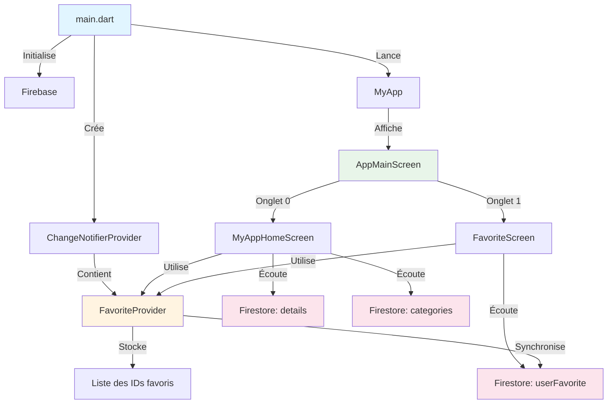

### Explication simple

Imaginez votre application comme une maison :
- **main.dart** : La porte d'entrée (point de départ)
- **Provider** : Le système électrique qui alimente toute la maison
- **FavoriteProvider** : Un interrupteur central pour gérer les favoris
- **Screens** : Les différentes pièces de la maison
- **Firebase** : La connexion Internet qui apporte les données

---

## 2. Les Providers : Qu'est-ce que c'est ?

### Analogie du tableau d'affichage

Pensez à un **Provider** comme un **tableau d'affichage dans une école** :

1. **Sans Provider** : Chaque classe doit envoyer un élève pour vérifier les nouvelles
2. **Avec Provider** : Quand il y a une nouvelle, TOUTES les classes sont automatiquement informées

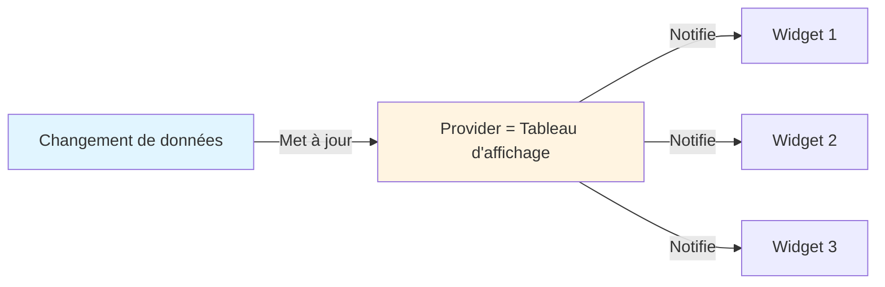

### Les 3 types de communication avec Provider

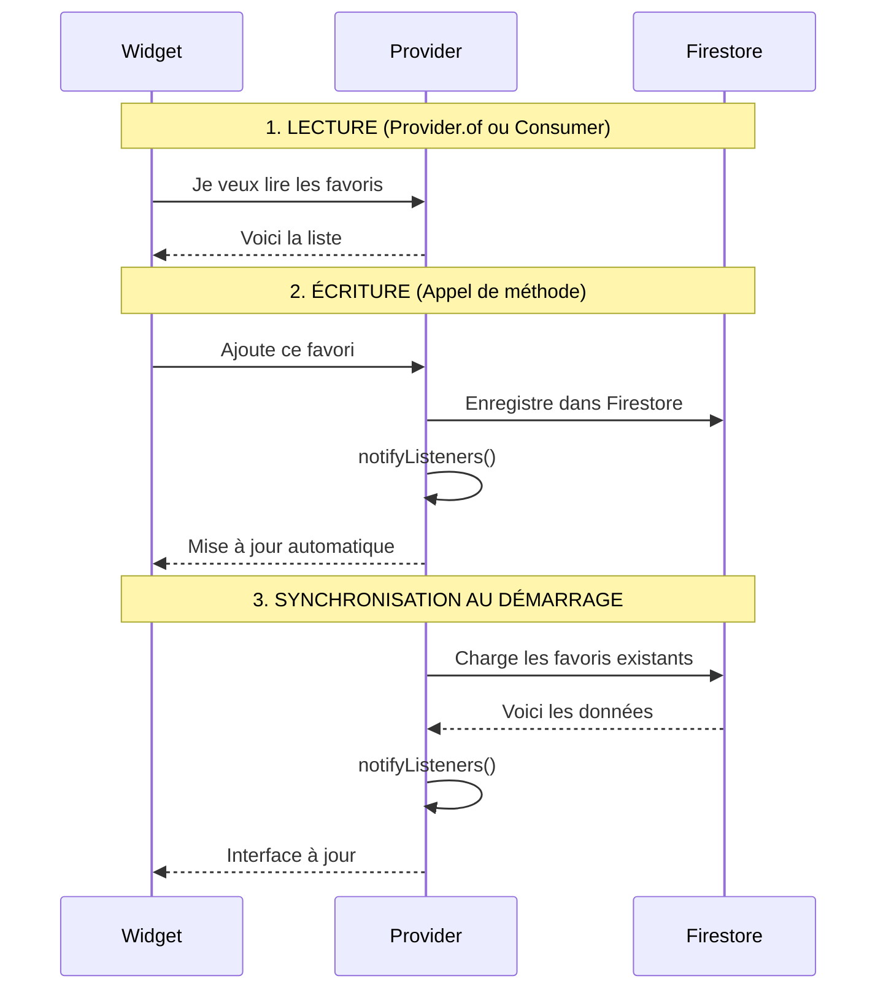

---

## 3. Structure du projet

### Organisation des fichiers

```
lib/
├── main.dart                          # Point d'entrée
├── constants.dart                     # Couleurs et constantes
├── firebase_options.dart              # Configuration Firebase
│
├── Provider/
│   └── favorite_provider.dart         # Gestion des favoris
│
└── Views/
    ├── app_main_screen.dart          # Écran principal avec navigation
    ├── favorite_screen.dart          # Écran des favoris
    └── view_all_items.dart           # Liste complète des recettes
```

### Collections Firebase Firestore

```mermaid
graph TB
    A[Firestore Database] --> B[Collection: categories]
    A --> C[Collection: details]
    A --> D[Collection: userFavorite]
    
    B --> B1[Document: { name: 'Breakfast' }]
    B --> B2[Document: { name: 'Lunch' }]
    
    C --> C1["Document: recipe_id_1<br/>{ name, image, time, cal, category }"]
    C --> C2["Document: recipe_id_2<br/>{ name, image, time, cal, category }"]
    
    D --> D1["Document: recipe_id_1<br/>{ isFavorite: true }"]
    D --> D2["Document: recipe_id_3<br/>{ isFavorite: true }"]
    
    style A fill:#e1f5ff
    style B fill:#fff4e1
    style C fill:#e8f5e9
    style D fill:#fce4ec
```

---

## 4. Étape 1 : Configuration initiale (main.dart)

### Diagramme du démarrage de l'application

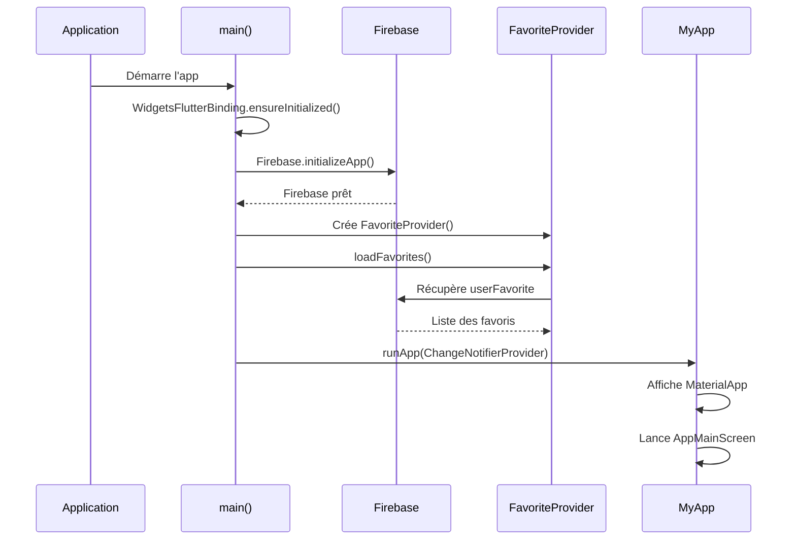

### Code commenté : main.dart

```dart
void main() async {
  // ÉTAPE 1 : Initialisation des bindings Flutter
  // Nécessaire avant toute opération asynchrone
  WidgetsFlutterBinding.ensureInitialized();
  
  // ÉTAPE 2 : Initialisation de Firebase
  // Connexion à votre base de données Firebase
  await Firebase.initializeApp(
    options: DefaultFirebaseOptions.currentPlatform,
  );
  
  // ÉTAPE 3 : Lancement de l'application avec Provider
  runApp(
    ChangeNotifierProvider(
      // Crée une instance du FavoriteProvider
      create: (context) => FavoriteProvider()..loadFavorites(),
      // L'opérateur .. permet d'appeler loadFavorites() immédiatement
      child: const MyApp(),
    ),
  );
}
```

### Explication du ChangeNotifierProvider

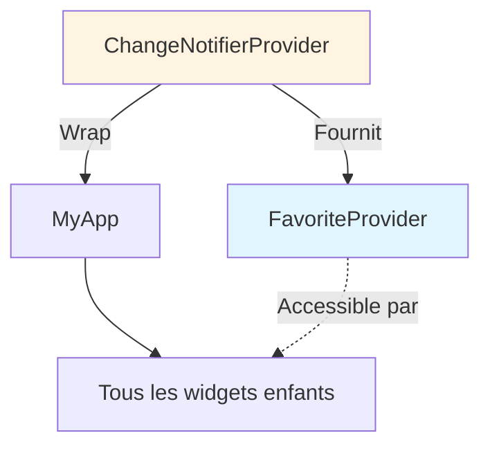

**Pourquoi au niveau de main() ?**
- Le Provider doit être au-dessus de TOUS les widgets qui en ont besoin
- Comme une racine d'arbre : tous les widgets peuvent y accéder

---

## 5. Étape 2 : Création du FavoriteProvider

### Architecture du FavoriteProvider

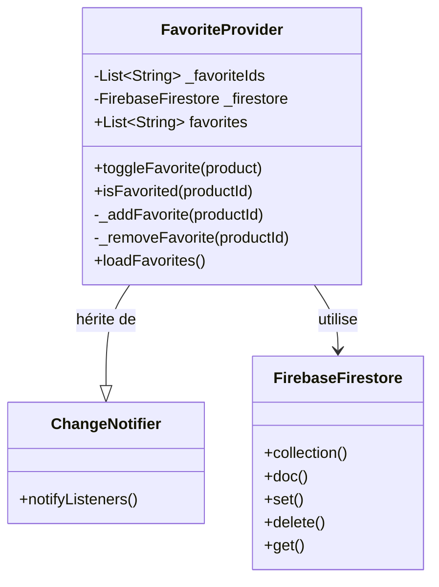

### Cycle de vie d'un favori

```mermaid
stateDiagram-v2
    [*] --> NonFavori
    NonFavori --> Favori : toggleFavorite()
    Favori --> NonFavori : toggleFavorite()
    
    NonFavori : _favoriteIds ne contient PAS l'ID
    NonFavori : Icône coeur vide
    NonFavori : Pas dans Firestore
    
    Favori : _favoriteIds contient l'ID
    Favori : Icône coeur plein rouge
    Favori : Document dans Firestore
    
    state Favori {
        [*] --> AjoutLocal
        AjoutLocal --> AjoutFirestore
        AjoutFirestore --> Notification
        Notification --> [*]
    }
```

### Code commenté : FavoriteProvider

```dart
class FavoriteProvider extends ChangeNotifier {
  // DONNÉES PRIVÉES (le _ rend la variable privée)
  List<String> _favoriteIds = [];
  final FirebaseFirestore _firestore = FirebaseFirestore.instance;
  
  // GETTER : Pour lire les favoris depuis les widgets
  List<String> get favorites => _favoriteIds;
  
  // MÉTHODE 1 : Basculer un favori (ajouter/retirer)
  void toggleFavorite(DocumentSnapshot product) async {
    String productId = product.id;
    
    // Vérifier si déjà dans les favoris
    if (_favoriteIds.contains(productId)) {
      // Retirer du favori
      _favoriteIds.remove(productId);
      await _removeFavorite(productId);
    } else {
      // Ajouter aux favoris
      _favoriteIds.add(productId);
      await _addFavorite(productId);
    }
    
    // IMPORTANT : Notifier tous les widgets qui écoutent
    notifyListeners();
  }
  
  // MÉTHODE 2 : Vérifier si un produit est favori
  bool isFavorited(String productId) {
    return _favoriteIds.contains(productId);
  }
  
  // MÉTHODE PRIVÉE : Ajouter à Firestore
  Future<void> _addFavorite(String productId) async {
    try {
      await _firestore.collection("userFavorite").doc(productId).set({
        'isFavorite': true,
      });
    } catch (e) {
      print(e.toString());
    }
  }
  
  // MÉTHODE PRIVÉE : Retirer de Firestore
  Future<void> _removeFavorite(String productId) async {
    try {
      await _firestore.collection("userFavorite").doc(productId).delete();
    } catch (e) {
      print(e.toString());
    }
  }
  
  // MÉTHODE 3 : Charger les favoris au démarrage
  Future<void> loadFavorites() async {
    try {
      QuerySnapshot snapshot = await _firestore.collection("userFavorite").get();
      _favoriteIds = snapshot.docs.map((doc) => doc.id).toList();
      notifyListeners();
    } catch (e) {
      print(e.toString());
    }
  }
}
```

### Flux de données lors du toggle

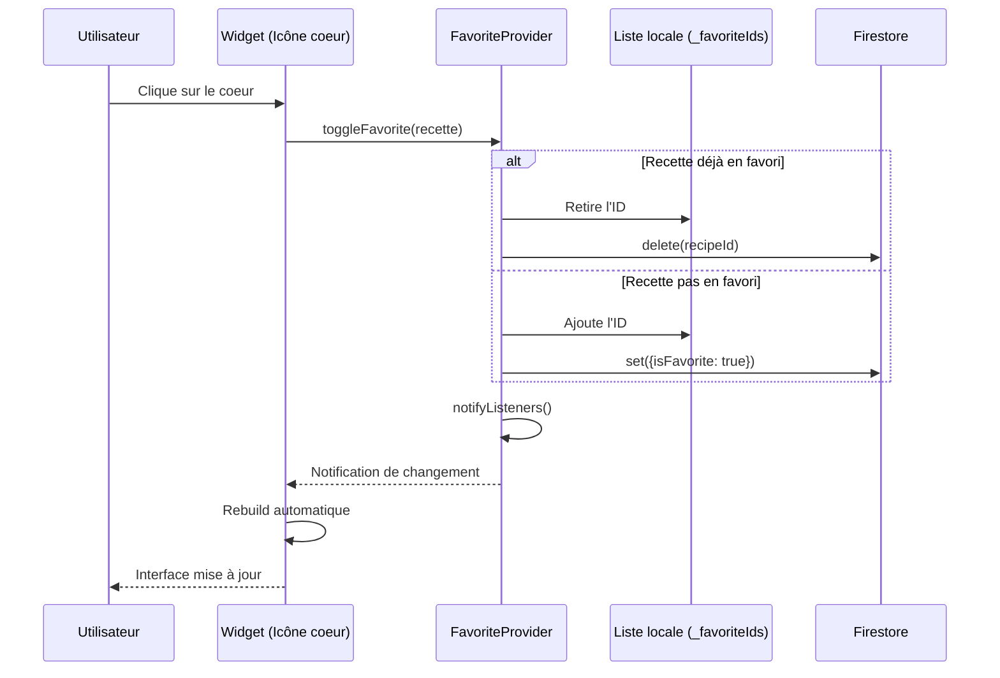

---

## 6. Étape 3 : L'écran principal (AppMainScreen)

### Structure de l'écran principal

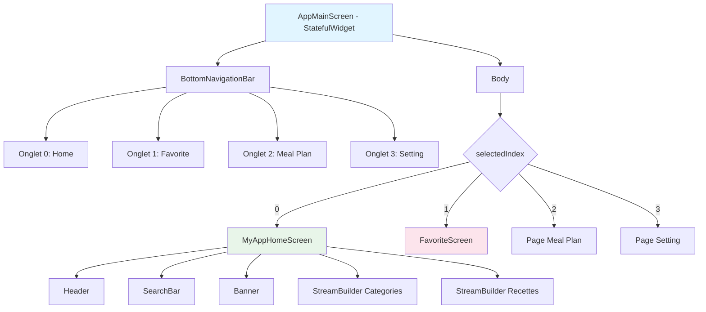

### Navigation entre les onglets

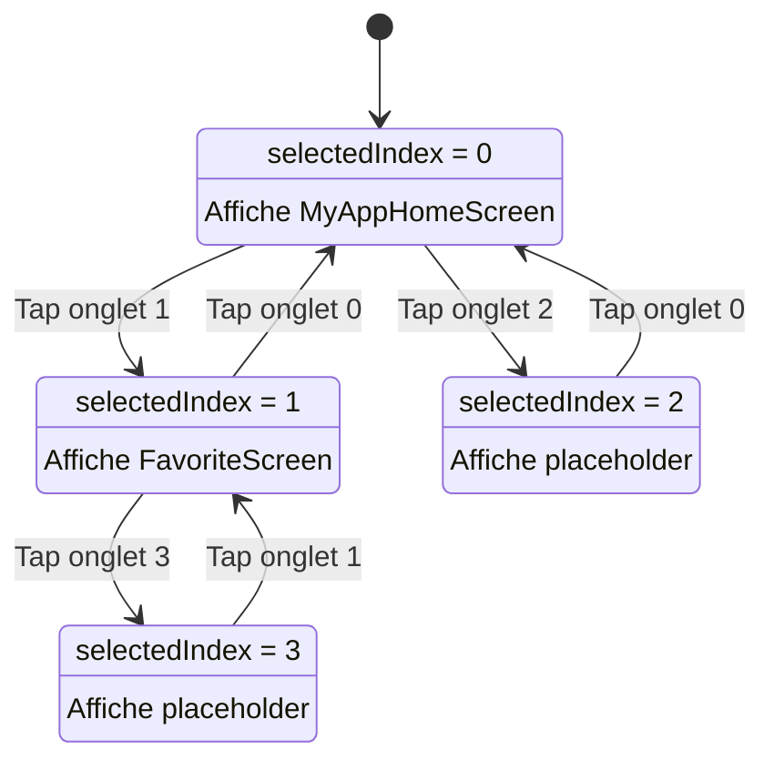

### Code commenté : AppMainScreen

```dart
class AppMainScreen extends StatefulWidget {
  const AppMainScreen({Key? key}) : super(key: key);

  @override
  State<AppMainScreen> createState() => _AppMainScreenState();
}

class _AppMainScreenState extends State<AppMainScreen> {
  // ÉTAT : Index de l'onglet sélectionné
  int selectedIndex = 0;

  @override
  Widget build(BuildContext context) {
    return Scaffold(
      // NAVIGATION BAR EN BAS
      bottomNavigationBar: BottomNavigationBar(
        currentIndex: selectedIndex,
        items: [ /* ... */ ],
        onTap: (index) {
          // Changement d'onglet
          setState(() {
            selectedIndex = index;
          });
        },
      ),
      
      // BODY : Affiche le bon écran selon l'index
      body: selectedIndex == 0
          ? const MyAppHomeScreen()
          : selectedIndex == 1
              ? const FavoriteScreen()
              : Center(child: Text("Page index: $selectedIndex")),
    );
  }
}
```

### MyAppHomeScreen : Gestion des catégories

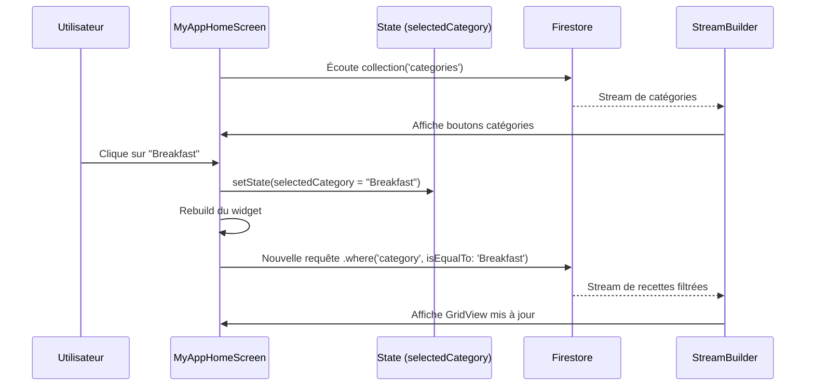

### StreamBuilder : Comment ça marche

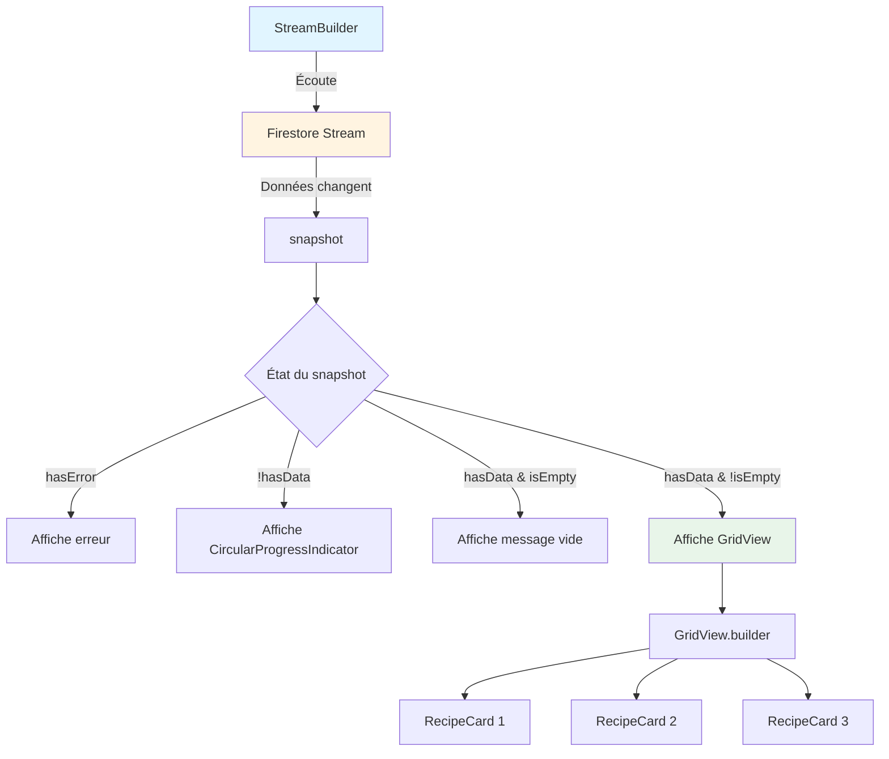

### Code commenté : StreamBuilder pour les recettes

```dart
StreamBuilder<QuerySnapshot>(
  // STREAM : Écoute les changements dans Firestore
  stream: selectedCategory == "All" 
      ? _firestore.collection('details').limit(4).snapshots()
      : _firestore.collection('details')
          .where('category', isEqualTo: selectedCategory)
          .limit(4)
          .snapshots(),
  
  // BUILDER : Construit l'interface selon l'état du stream
  builder: (context, snapshot) {
    if (snapshot.hasData) {
      return GridView.builder(
        itemCount: snapshot.data!.docs.length,
        itemBuilder: (context, index) {
          final recipe = snapshot.data!.docs[index];
          
          // Consumer pour écouter le FavoriteProvider
          return Consumer<FavoriteProvider>(
            builder: (context, favoriteProvider, child) {
              final isFavorite = favoriteProvider.favorites.contains(recipe.id);
              
              return GestureDetector(
                onTap: () {
                  favoriteProvider.toggleFavorite(recipe);
                },
                child: Icon(
                  isFavorite ? Iconsax.heart5 : Iconsax.heart,
                  color: isFavorite ? Colors.red : Colors.grey,
                ),
              );
            },
          );
        },
      );
    } else {
      return CircularProgressIndicator();
    }
  },
)
```

---

## 7. Étape 4 : L'écran des favoris (FavoriteScreen)

### Architecture de FavoriteScreen

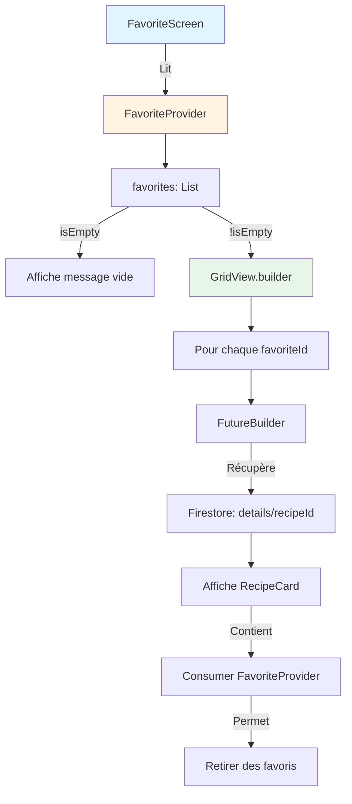

### Différence StreamBuilder vs FutureBuilder

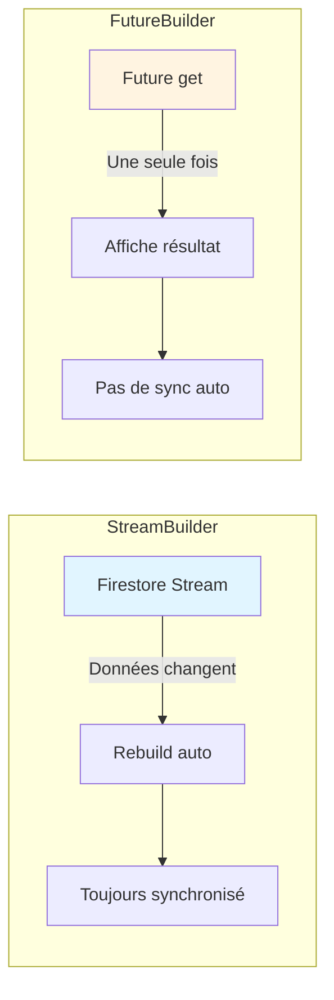

### Flux de données dans FavoriteScreen

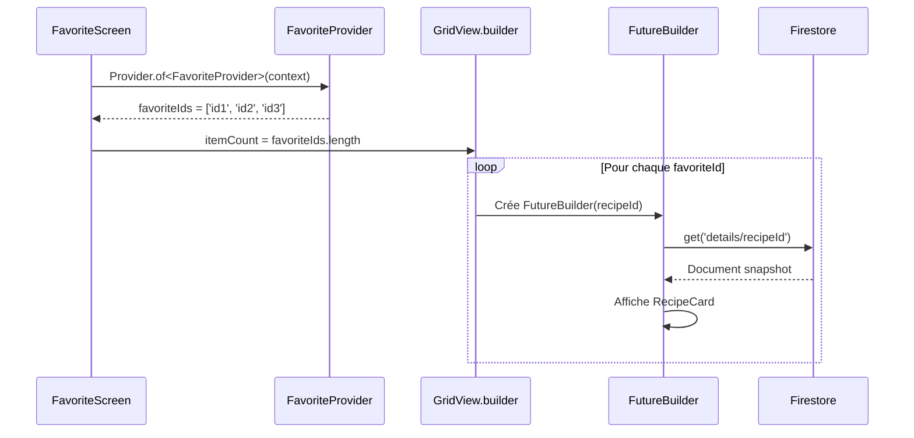

### Code commenté : FavoriteScreen

```dart
class FavoriteScreen extends StatelessWidget {
  const FavoriteScreen({Key? key}) : super(key: key);

  @override
  Widget build(BuildContext context) {
    // ÉTAPE 1 : Récupérer le FavoriteProvider
    final favoriteProvider = Provider.of<FavoriteProvider>(context);
    final favoriteIds = favoriteProvider.favorites;

    return Scaffold(
      appBar: AppBar(
        title: const Text('My Favorites'),
      ),
      
      // ÉTAPE 2 : Vérifier si la liste est vide
      body: favoriteIds.isEmpty
          ? Center(
              child: Column(
                mainAxisAlignment: MainAxisAlignment.center,
                children: [
                  Icon(Iconsax.heart, size: 100, color: Colors.grey[300]),
                  const SizedBox(height: 20),
                  Text('No favorites yet'),
                ],
              ),
            )
          
          // ÉTAPE 3 : Afficher la grille de favoris
          : Padding(
              padding: const EdgeInsets.all(15),
              child: GridView.builder(
                gridDelegate: const SliverGridDelegateWithFixedCrossAxisCount(
                  crossAxisCount: 2,
                  crossAxisSpacing: 10,
                  mainAxisSpacing: 10,
                  childAspectRatio: 0.8,
                ),
                itemCount: favoriteIds.length,
                
                itemBuilder: (context, index) {
                  final recipeId = favoriteIds[index];
                  
                  // ÉTAPE 4 : FutureBuilder pour récupérer les détails
                  return FutureBuilder<DocumentSnapshot>(
                    future: FirebaseFirestore.instance
                        .collection('details')
                        .doc(recipeId)
                        .get(),
                    
                    builder: (context, snapshot) {
                      if (!snapshot.hasData) {
                        return Container(
                          child: const Center(
                            child: CircularProgressIndicator(),
                          ),
                        );
                      }

                      final recipe = snapshot.data!;
                      final data = recipe.data() as Map<String, dynamic>?;
                      
                      if (data == null) {
                        return const SizedBox.shrink();
                      }

                      // ÉTAPE 5 : Afficher la carte de recette
                      return RecipeCard(recipe);
                    },
                  );
                },
              ),
            ),
    );
  }
}
```

### Pourquoi FutureBuilder ici ?

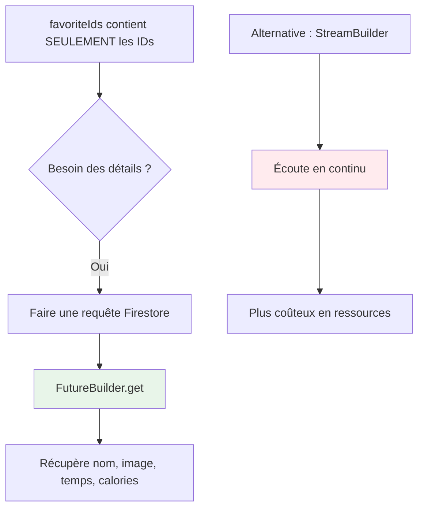

**Choix du FutureBuilder** :
- On a déjà les IDs (du Provider)
- On a besoin des détails UNE SEULE FOIS
- Pas besoin d'écouter les changements en temps réel

---

## 8. Étape 5 : Communication Provider-Widget

### Les 2 façons d'accéder au Provider

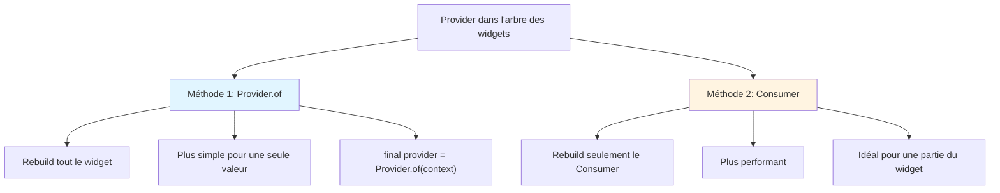

### Exemple comparatif

#### Option 1 : Provider.of

```dart
class FavoriteScreen extends StatelessWidget {
  @override
  Widget build(BuildContext context) {
    // Récupère le provider
    final favoriteProvider = Provider.of<FavoriteProvider>(context);
    
    // Si le provider change, TOUT le build() se reconstruit
    return Text('Favoris: ${favoriteProvider.favorites.length}');
  }
}
```

#### Option 2 : Consumer

```dart
class RecipeCard extends StatelessWidget {
  @override
  Widget build(BuildContext context) {
    return Container(
      child: Column(
        children: [
          Text('Nom de la recette'),
          
          // Seul ce Consumer se reconstruit
          Consumer<FavoriteProvider>(
            builder: (context, favoriteProvider, child) {
              final isFavorite = favoriteProvider.isFavorited(recipeId);
              
              return Icon(
                isFavorite ? Icons.favorite : Icons.favorite_border,
                color: isFavorite ? Colors.red : Colors.grey,
              );
            },
          ),
        ],
      ),
    );
  }
}
```

### Cycle de vie d'une mise à jour

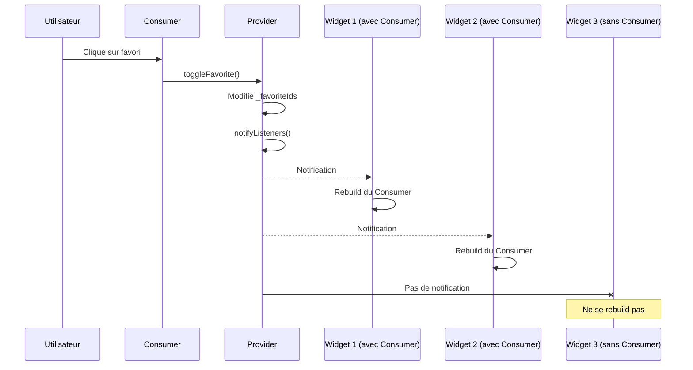

### Optimisation : listen: false

```dart
// Cas d'usage 1 : ÉCOUTER les changements
final provider = Provider.of<FavoriteProvider>(context);
// Le widget se rebuild quand le provider change

// Cas d'usage 2 : JUSTE appeler une méthode
final provider = Provider.of<FavoriteProvider>(context, listen: false);
// Le widget ne se rebuild PAS
// Utile pour un bouton qui appelle juste une méthode
```

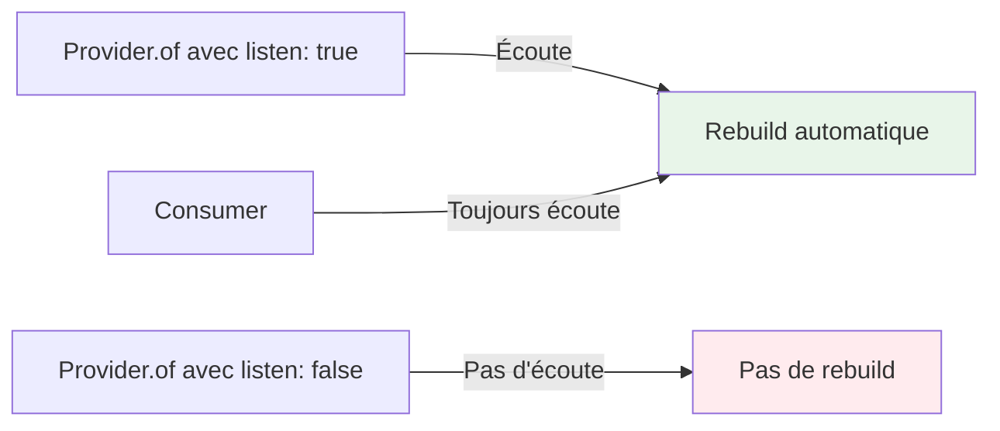

---

## 9. Flux de données complet

### Scénario complet : Ajouter un favori

```mermaid
sequenceDiagram
    participant U as Utilisateur
    participant UI as RecipeCard
    participant C as Consumer
    participant P as FavoriteProvider
    participant L as _favoriteIds
    participant FS as Firestore
    participant W1 as MyAppHomeScreen
    participant W2 as FavoriteScreen

    Note over U,W2: PHASE 1 : Action utilisateur
    U->>UI: Clique sur l'icône coeur
    UI->>C: GestureDetector.onTap()
    C->>P: toggleFavorite(recipe)
    
    Note over U,W2: PHASE 2 : Modification locale
    P->>L: _favoriteIds.add(recipeId)
    P->>FS: _addFavorite(recipeId)
    FS->>FS: Crée document dans userFavorite
    FS-->>P: Confirmation
    
    Note over U,W2: PHASE 3 : Notification des widgets
    P->>P: notifyListeners()
    P-->>W1: Notification de changement
    P-->>W2: Notification de changement
    
    Note over U,W2: PHASE 4 : Mise à jour de l'interface
    W1->>W1: Rebuild des Consumer
    W1->>UI: Icône coeur devient rouge
    W2->>W2: Rebuild
    W2->>W2: Ajoute la recette dans la grille
```

### Scénario : Chargement initial

```mermaid
sequenceDiagram
    participant App as Application
    participant Main as main()
    participant P as FavoriteProvider
    participant FS as Firestore
    participant UI as MyApp
    participant Home as MyAppHomeScreen

    App->>Main: Démarre
    Main->>P: FavoriteProvider()..loadFavorites()
    P->>FS: collection('userFavorite').get()
    FS-->>P: [id1, id2, id3]
    P->>P: _favoriteIds = [id1, id2, id3]
    P->>P: notifyListeners()
    
    Main->>UI: runApp()
    UI->>Home: Affiche écran d'accueil
    Home->>Home: Construit GridView
    Home->>P: Provider.of<FavoriteProvider>(context)
    P-->>Home: favorites = [id1, id2, id3]
    Home->>Home: Affiche icônes rouges pour favoris
```

### Synchronisation entre écrans

```mermaid
graph TB
    A[FavoriteProvider - Source unique de vérité] --> B[MyAppHomeScreen]
    A --> C[FavoriteScreen]
    A --> D[ViewAllItems]
    
    B -->|Ajoute favori| A
    C -->|Retire favori| A
    D -->|Toggle favori| A
    
    A -->|notifyListeners| B
    A -->|notifyListeners| C
    A -->|notifyListeners| D
    
    style A fill:#fff4e1
    style B fill:#e1f5ff
    style C fill:#e1f5ff
    style D fill:#e1f5ff
```

**Avantage principal** : Une seule source de vérité
- Pas de désynchronisation entre écrans
- Cohérence garantie
- Facile à déboguer

---

## 10. Concepts clés pour débutants

### 1. StatefulWidget vs StatelessWidget

```mermaid
graph TB
    A[Widget] --> B[StatelessWidget]
    A --> C[StatefulWidget]
    
    B --> B1[Pas d'état interne]
    B --> B2[Ne change pas dans le temps]
    B --> B3[Exemple: Text, Icon]
    
    C --> C1[A un état interne]
    C --> C2[Peut changer dans le temps]
    C --> C3[Méthode setState]
    C --> C4[Exemple: Formulaire, Compteur]
    
    style B fill:#e1f5ff
    style C fill:#fff4e1
```

### 2. StreamBuilder : Flux continu de données

```mermaid
graph LR
    A[Source de données Firestore] -->|Stream| B[StreamBuilder]
    B -->|Données initiales| C[Affichage 1]
    A -->|Nouvelle donnée ajoutée| B
    B -->|Mise à jour auto| D[Affichage 2]
    A -->|Donnée supprimée| B
    B -->|Mise à jour auto| E[Affichage 3]
    
    style A fill:#e1f5ff
    style B fill:#fff4e1
```

**Quand utiliser StreamBuilder ?**
- Données qui changent fréquemment
- Chat en temps réel
- Liste de recettes mise à jour
- Compteur partagé

### 3. FutureBuilder : Requête unique

```mermaid
graph LR
    A[Future get] -->|Une fois| B[FutureBuilder]
    B -->|En attente| C[CircularProgressIndicator]
    B -->|Résultat| D[Affichage des données]
    B -->|Erreur| E[Message d'erreur]
    
    style A fill:#e1f5ff
    style B fill:#fff4e1
```

**Quand utiliser FutureBuilder ?**
- Chargement initial de données
- Appel API unique
- Récupération de détails d'un élément
- Pas besoin de mises à jour en temps réel

### 4. ChangeNotifier : Le coeur du Provider

```mermaid
graph TB
    A[ChangeNotifier] --> B[Contient des données]
    A --> C[Méthode notifyListeners]
    
    B --> B1[Données privées _favoriteIds]
    B --> B2[Getters publics favorites]
    B --> B3[Méthodes de modification]
    
    C --> C1[Informe tous les listeners]
    C --> C2[Déclenche rebuild]
    C --> C3[Mise à jour automatique de l'UI]
    
    style A fill:#fff4e1
    style C1 fill:#e8f5e9
```

### 5. Async/Await : Opérations asynchrones

```mermaid
sequenceDiagram
    participant C as Code
    participant F as Fonction async
    participant FS as Firestore

    C->>F: Appelle fonction
    F->>FS: await firestore.get()
    Note over F: Attend ici
    FS-->>F: Données reçues
    F->>F: Continue l'exécution
    F-->>C: Retour
```

**Exemple** :
```dart
// Sans async/await (compliqué)
firestore.get().then((snapshot) {
  // Traitement
}).catchError((error) {
  // Gestion erreur
});

// Avec async/await (plus simple)
try {
  final snapshot = await firestore.get();
  // Traitement
} catch (error) {
  // Gestion erreur
}
```

### 6. Collections et Documents Firestore

```mermaid
graph TB
    A[Firestore Database] --> B[Collection: details]
    A --> C[Collection: userFavorite]
    
    B --> B1[Document: recipe_1]
    B --> B2[Document: recipe_2]
    B --> B3[Document: recipe_3]
    
    C --> C1[Document: recipe_1]
    C --> C3[Document: recipe_3]
    
    B1 -->|Contient| D[name, image, time, cal, category]
    C1 -->|Contient| E[isFavorite: true]
    
    style A fill:#e1f5ff
    style B fill:#fff4e1
    style C fill:#fce4ec
```

**Structure** :
- **Collection** = Dossier qui contient des documents
- **Document** = Fichier avec des données (format JSON)
- **Requête** = Chercher des documents selon des critères

---

## Résumé : Les 5 étapes clés

```mermaid
graph TB
    A[1. Initialisation dans main.dart] --> B[2. Création du FavoriteProvider]
    B --> C[3. Injection avec ChangeNotifierProvider]
    C --> D[4. Utilisation dans les widgets]
    D --> E[5. Synchronisation automatique]
    
    A1[Firebase + Provider] --> A
    B1[État + Logique métier] --> B
    C1[Disponible partout] --> C
    D1[Consumer ou Provider.of] --> D
    E1[notifyListeners] --> E
    
    style A fill:#e1f5ff
    style B fill:#fff4e1
    style C fill:#e8f5e9
    style D fill:#fce4ec
    style E fill:#f3e5f5
```

### Checklist pour créer votre propre Provider

- [ ] **Étape 1** : Créer une classe qui extends ChangeNotifier
- [ ] **Étape 2** : Définir les variables d'état privées (_variable)
- [ ] **Étape 3** : Créer des getters publics
- [ ] **Étape 4** : Créer des méthodes de modification
- [ ] **Étape 5** : Appeler notifyListeners() après chaque modification
- [ ] **Étape 6** : Wrapper l'app avec ChangeNotifierProvider dans main.dart
- [ ] **Étape 7** : Utiliser Provider.of ou Consumer dans les widgets

---

## Conclusion

Votre application Flutter utilise une architecture moderne et bien structurée :

1. **Séparation des responsabilités** : UI, logique métier, et données sont bien séparées
2. **Gestion d'état centralisée** : Un seul FavoriteProvider pour tous les écrans
3. **Synchronisation automatique** : Les changements se propagent automatiquement
4. **Persistance des données** : Firebase Firestore assure la sauvegarde
5. **Performance optimisée** : Consumer rebuild seulement les parties nécessaires

Cette architecture est scalable et peut facilement accueillir de nouvelles fonctionnalités.

