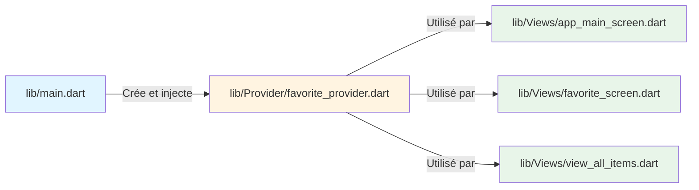
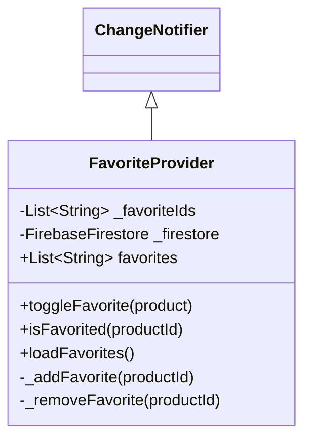
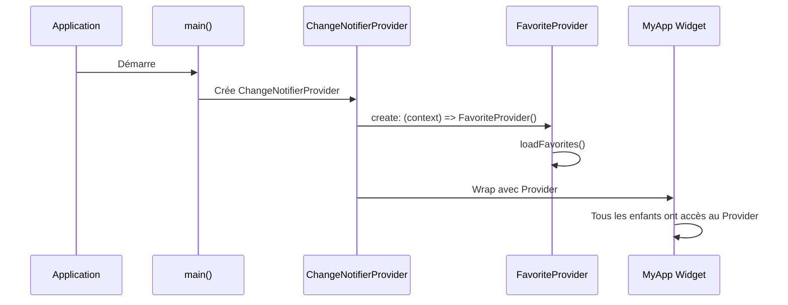
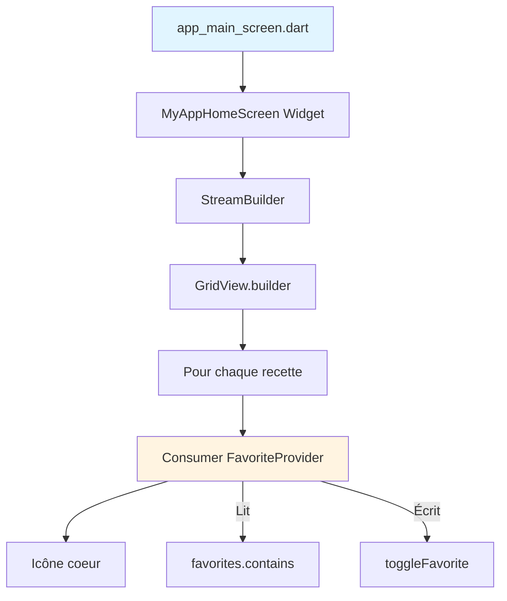
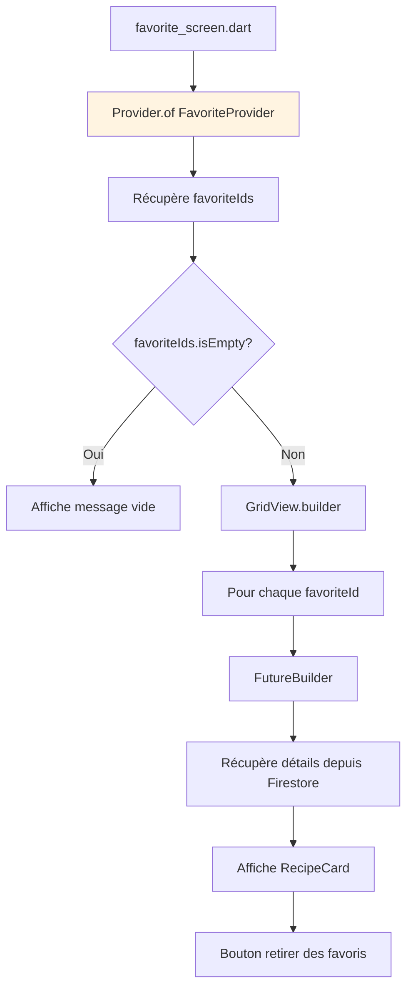
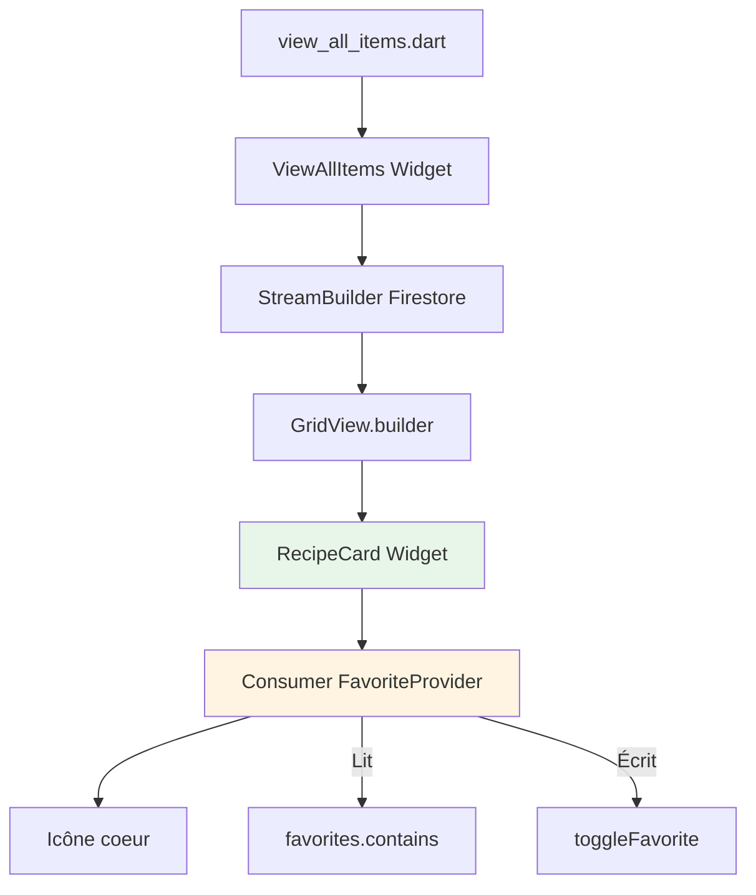
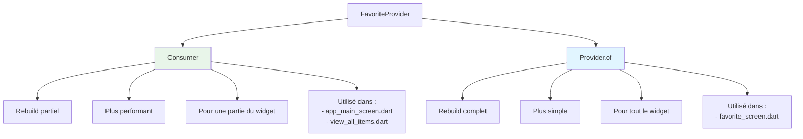
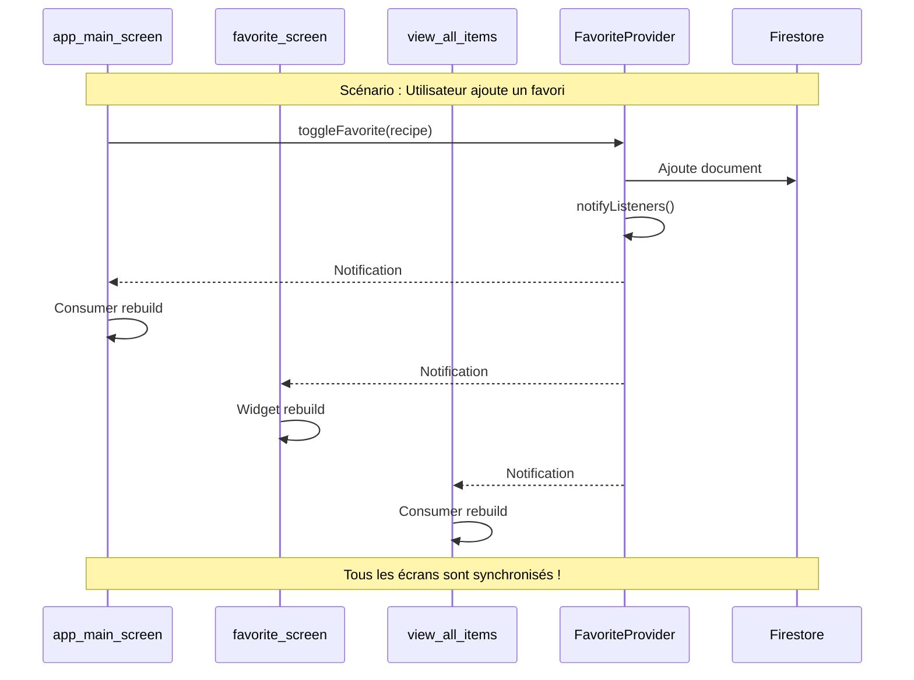
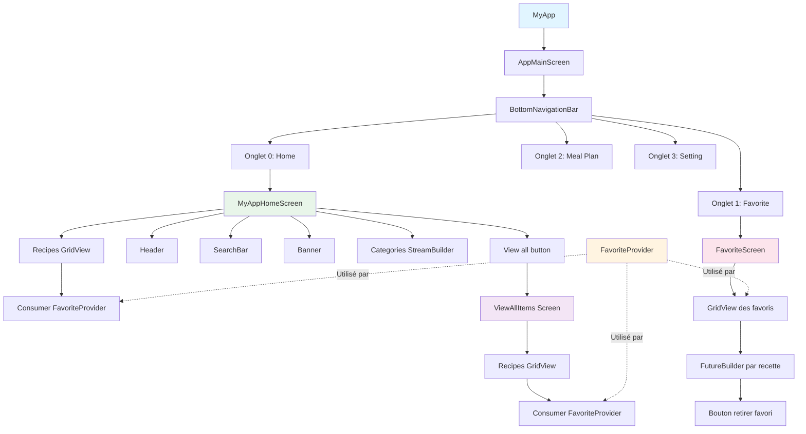
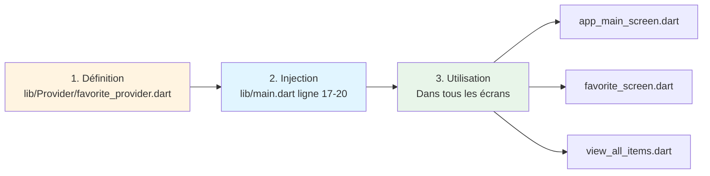

# Résumé : Où sont les Providers et comment les écrans les utilisent

## Table des matières

1. [Vue d'ensemble rapide](#1-vue-densemble-rapide)
2. [Localisation des fichiers](#2-localisation-des-fichiers)
3. [Étape par étape : Construction du système](#3-étape-par-étape--construction-du-système)
4. [Comment chaque écran utilise le Provider](#4-comment-chaque-écran-utilise-le-provider)
5. [Diagramme de navigation complet](#5-diagramme-de-navigation-complet)

---

## 1. Vue d'ensemble rapide



### Réponse rapide

**Où le Provider est créé ?**
- Fichier : `lib/Provider/favorite_provider.dart`
- Classe : `FavoriteProvider`

**Où le Provider est injecté ?**
- Fichier : `lib/main.dart`
- Ligne 17 : `ChangeNotifierProvider`

**Où le Provider est utilisé ?**
- `lib/Views/app_main_screen.dart` (ligne 232-260)
- `lib/Views/favorite_screen.dart` (ligne 13)
- `lib/Views/view_all_items.dart` (ligne 266-294)

---

## 2. Localisation des fichiers

### Structure du projet

```
lib/
│
├── main.dart                          # POINT D'INJECTION du Provider
│   └── ChangeNotifierProvider         # Ligne 17-21
│       └── FavoriteProvider()         # Instance créée ici
│
├── Provider/
│   └── favorite_provider.dart         # DÉFINITION du Provider
│       └── class FavoriteProvider     # Code du Provider
│
└── Views/
    ├── app_main_screen.dart          # UTILISATION n°1
    │   └── Consumer<FavoriteProvider> # Ligne 232-260
    │
    ├── favorite_screen.dart          # UTILISATION n°2
    │   └── Provider.of                # Ligne 13
    │
    └── view_all_items.dart           # UTILISATION n°3
        └── Consumer<FavoriteProvider> # Ligne 266-294
```

---

## 3. Étape par étape : Construction du système

### Étape 1 : Création du Provider (favorite_provider.dart)

**Fichier** : `lib/Provider/favorite_provider.dart`



**Ce qui a été créé** :
```dart
// lib/Provider/favorite_provider.dart

import 'package:flutter/material.dart';
import 'package:cloud_firestore/cloud_firestore.dart';

class FavoriteProvider extends ChangeNotifier {
  // État privé
  List<String> _favoriteIds = [];
  final FirebaseFirestore _firestore = FirebaseFirestore.instance;
  
  // Getter public
  List<String> get favorites => _favoriteIds;
  
  // Méthodes publiques
  void toggleFavorite(DocumentSnapshot product) async { /* ... */ }
  bool isFavorited(String productId) { /* ... */ }
  Future<void> loadFavorites() async { /* ... */ }
  
  // Méthodes privées
  Future<void> _addFavorite(String productId) async { /* ... */ }
  Future<void> _removeFavorite(String productId) async { /* ... */ }
}
```

**Pourquoi ce fichier ?**
- Centralise toute la logique des favoris
- Indépendant de l'interface utilisateur
- Réutilisable dans tout le projet

---

### Étape 2 : Injection du Provider (main.dart)

**Fichier** : `lib/main.dart`



**Code dans main.dart** :
```dart
// lib/main.dart

import 'package:provider/provider.dart';               // 1. Import
import 'Provider/favorite_provider.dart';              // 2. Import du Provider

void main() async {
  WidgetsFlutterBinding.ensureInitialized();
  await Firebase.initializeApp(
    options: DefaultFirebaseOptions.currentPlatform,
  );
  
  runApp(
    // 3. INJECTION : Wrapping de l'app avec le Provider
    ChangeNotifierProvider(
      create: (context) => FavoriteProvider()..loadFavorites(),
      child: const MyApp(),
    ),
  );
}
```

**Lignes importantes** :
- **Ligne 4** : Import du package provider
- **Ligne 5** : Import de notre FavoriteProvider
- **Ligne 17-20** : Création et injection du Provider

**Pourquoi dans main.dart ?**
- Le Provider doit être au-dessus de tous les widgets qui en ont besoin
- Une seule instance pour toute l'application
- Accessible depuis n'importe quel écran

---

### Étape 3 : Utilisation dans app_main_screen.dart

**Fichier** : `lib/Views/app_main_screen.dart`

**Localisation** : Lignes 232-260 (dans le Consumer)



**Code exact dans le fichier** :
```dart
// lib/Views/app_main_screen.dart (ligne 232-260)

Positioned(
  top: 10,
  right: 10,
  child: Consumer<FavoriteProvider>(
    builder: (context, favoriteProvider, child) {
      // LECTURE : Vérifie si la recette est en favori
      final isFavorite = favoriteProvider.favorites.contains(recipe.id);
      
      return GestureDetector(
        onTap: () {
          // ÉCRITURE : Toggle le statut de favori
          favoriteProvider.toggleFavorite(recipe);
        },
        child: Container(
          padding: const EdgeInsets.all(8),
          decoration: BoxDecoration(
            color: Colors.white,
            shape: BoxShape.circle,
          ),
          child: Icon(
            // Interface change selon l'état
            isFavorite ? Iconsax.heart5 : Iconsax.heart,
            size: 16,
            color: isFavorite ? Colors.red : Colors.grey[600],
          ),
        ),
      );
    },
  ),
),
```

**Ce que fait ce code** :
1. **Consumer** : Écoute les changements du FavoriteProvider
2. **favoriteProvider.favorites** : Lit la liste des favoris
3. **contains(recipe.id)** : Vérifie si cette recette est favorite
4. **toggleFavorite(recipe)** : Change l'état quand on clique
5. **Icône change automatiquement** : Rouge si favori, gris sinon

---

### Étape 4 : Utilisation dans favorite_screen.dart

**Fichier** : `lib/Views/favorite_screen.dart`

**Localisation** : Ligne 13 (Provider.of) et ligne 147 (toggle)



**Code exact dans le fichier** :
```dart
// lib/Views/favorite_screen.dart (ligne 13)

@override
Widget build(BuildContext context) {
  // LECTURE : Récupère le Provider
  final favoriteProvider = Provider.of<FavoriteProvider>(context);
  final favoriteIds = favoriteProvider.favorites;

  return Scaffold(
    appBar: AppBar(
      title: const Text('My Favorites'),
    ),
    
    body: favoriteIds.isEmpty
        ? Center(
            child: Text('No favorites yet'),
          )
        : GridView.builder(
            itemCount: favoriteIds.length,
            itemBuilder: (context, index) {
              final recipeId = favoriteIds[index];
              
              return FutureBuilder<DocumentSnapshot>(
                future: FirebaseFirestore.instance
                    .collection('details')
                    .doc(recipeId)
                    .get(),
                builder: (context, snapshot) {
                  // Affiche les détails de la recette
                  // ...
                  
                  // Bouton pour retirer des favoris (ligne 147)
                  return GestureDetector(
                    onTap: () {
                      favoriteProvider.toggleFavorite(recipe);
                    },
                    child: Icon(Iconsax.heart5, color: Colors.red),
                  );
                },
              );
            },
          ),
  );
}
```

**Différence avec app_main_screen.dart** :
- Utilise `Provider.of` au lieu de `Consumer`
- Tout le widget se rebuild quand les favoris changent
- Plus simple car on affiche juste la liste

---

### Étape 5 : Utilisation dans view_all_items.dart

**Fichier** : `lib/Views/view_all_items.dart`

**Localisation** : Lignes 266-294 (Consumer dans RecipeCard)



**Code exact dans le fichier** :
```dart
// lib/Views/view_all_items.dart (ligne 266-294)

// Dans le widget RecipeCard
Positioned(
  top: 10,
  right: 10,
  child: Consumer<FavoriteProvider>(
    builder: (context, favoriteProvider, child) {
      // LECTURE : Vérifie si en favori
      final isFavorite = favoriteProvider.favorites.contains(recipe.id);
      
      return GestureDetector(
        onTap: () {
          // ÉCRITURE : Toggle
          favoriteProvider.toggleFavorite(recipe);
        },
        child: Container(
          padding: const EdgeInsets.all(8),
          decoration: BoxDecoration(
            color: Colors.white,
            shape: BoxShape.circle,
          ),
          child: Icon(
            isFavorite ? Iconsax.heart5 : Iconsax.heart,
            size: 16,
            color: isFavorite ? Colors.red : Colors.grey[600],
          ),
        ),
      );
    },
  ),
),
```

**Identique à app_main_screen.dart** :
- Même pattern : Consumer pour écouter
- Même logique : contains() et toggleFavorite()
- Code réutilisable et cohérent

---

## 4. Comment chaque écran utilise le Provider

### Tableau récapitulatif

| Écran | Fichier | Méthode d'accès | Ligne | Usage |
|-------|---------|-----------------|-------|-------|
| Point d'injection | `main.dart` | `ChangeNotifierProvider` | 17-20 | Crée et injecte le Provider |
| Écran principal | `app_main_screen.dart` | `Consumer` | 232-260 | Toggle favoris + affichage |
| Écran favoris | `favorite_screen.dart` | `Provider.of` | 13 | Lit la liste des favoris |
| Écran favoris | `favorite_screen.dart` | Méthode directe | 147 | Retire un favori |
| Vue complète | `view_all_items.dart` | `Consumer` | 266-294 | Toggle favoris + affichage |

### Comparaison des méthodes d'accès



### Flux de communication



---

## 5. Diagramme de navigation complet

### Architecture de navigation



### Résumé des écrans

#### 1. AppMainScreen (Navigation principale)
- **Fichier** : `lib/Views/app_main_screen.dart`
- **Rôle** : Barre de navigation avec 4 onglets
- **Provider** : Utilisé dans le GridView des recettes (ligne 232-260)
- **Méthode** : Consumer

#### 2. MyAppHomeScreen (Écran d'accueil)
- **Fichier** : `lib/Views/app_main_screen.dart` (ligne 75-425)
- **Rôle** : Affiche catégories et recettes
- **Provider** : Consumer pour les icônes favoris
- **Méthode** : Consumer dans chaque carte de recette

#### 3. FavoriteScreen (Écran des favoris)
- **Fichier** : `lib/Views/favorite_screen.dart`
- **Rôle** : Liste des recettes favorites
- **Provider** : Récupère la liste complète des favoris
- **Méthode** : Provider.of (ligne 13)

#### 4. ViewAllItems (Liste complète)
- **Fichier** : `lib/Views/view_all_items.dart`
- **Rôle** : Affiche toutes les recettes d'une catégorie
- **Provider** : Consumer pour les icônes favoris
- **Méthode** : Consumer dans RecipeCard (ligne 266-294)

---

## Checklist : Comment ajouter un nouveau Provider

Si vous voulez créer un nouveau Provider (par exemple, pour un panier d'achats) :

### Étape 1 : Créer le Provider
```dart
// lib/Provider/cart_provider.dart
import 'package:flutter/material.dart';

class CartProvider extends ChangeNotifier {
  List<String> _cartItems = [];
  
  List<String> get cartItems => _cartItems;
  
  void addToCart(String itemId) {
    _cartItems.add(itemId);
    notifyListeners();
  }
  
  void removeFromCart(String itemId) {
    _cartItems.remove(itemId);
    notifyListeners();
  }
}
```

### Étape 2 : Injecter dans main.dart
```dart
// Option A : Un seul Provider
runApp(
  ChangeNotifierProvider(
    create: (context) => CartProvider(),
    child: const MyApp(),
  ),
);

// Option B : Plusieurs Providers (recommandé)
runApp(
  MultiProvider(
    providers: [
      ChangeNotifierProvider(create: (context) => FavoriteProvider()..loadFavorites()),
      ChangeNotifierProvider(create: (context) => CartProvider()),
    ],
    child: const MyApp(),
  ),
);
```

### Étape 3 : Utiliser dans un widget
```dart
// Méthode 1 : Provider.of
final cart = Provider.of<CartProvider>(context);

// Méthode 2 : Consumer
Consumer<CartProvider>(
  builder: (context, cart, child) {
    return Text('Panier : ${cart.cartItems.length}');
  },
)
```

---

## Résumé final

### Les 3 emplacements clés



### Points clés à retenir

1. **Un seul Provider** pour gérer tous les favoris
2. **Créé dans main.dart** pour être accessible partout
3. **Utilisé différemment** selon les besoins :
   - `Consumer` pour rebuild partiel (icônes)
   - `Provider.of` pour rebuild complet (liste)
4. **Synchronisation automatique** grâce à `notifyListeners()`
5. **Persistance** avec Firebase Firestore

### Avantages de cette architecture

- **Cohérence** : Une seule source de vérité
- **Performance** : Rebuilds optimisés avec Consumer
- **Maintenabilité** : Code centralisé et réutilisable
- **Scalabilité** : Facile d'ajouter de nouveaux Providers
- **Testabilité** : Logique métier séparée de l'UI

Votre projet suit les bonnes pratiques Flutter et utilise une architecture professionnelle et maintenable.

