# Guide Visuel : Code Source du Projet

## Table des matières

1. [Vue d'ensemble visuelle](#1-vue-densemble-visuelle)
2. [Fichier par fichier](#2-fichier-par-fichier)
3. [Flux d'exécution visuel](#3-flux-dexécution-visuel)
4. [Interactions entre fichiers](#4-interactions-entre-fichiers)
5. [Patterns et bonnes pratiques](#5-patterns-et-bonnes-pratiques)

---

## 1. Vue d'ensemble visuelle

### Structure complète du projet

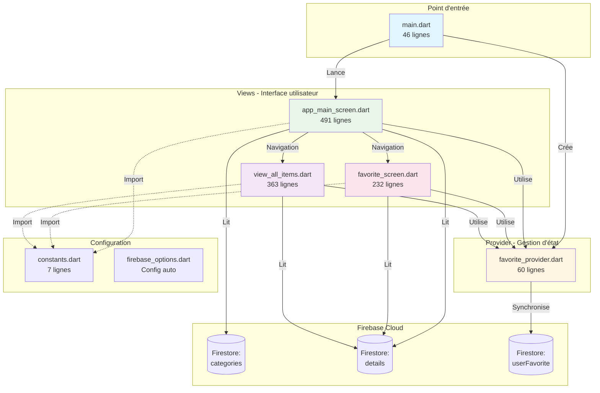
```mermaid
graph TB
    subgraph "Point d'entrée"
    A[main.dart<br/>46 lignes]
    end
    
    subgraph "Provider - Gestion d'état"
    B[favorite_provider.dart<br/>60 lignes]
    end
    
    subgraph "Views - Interface utilisateur"
    C[app_main_screen.dart<br/>491 lignes]
    D[favorite_screen.dart<br/>232 lignes]
    E[view_all_items.dart<br/>363 lignes]
    end
    
    subgraph "Configuration"
    F[constants.dart<br/>7 lignes]
    G[firebase_options.dart<br/>Config auto]
    end
    
    subgraph "Firebase Cloud"
    H[(Firestore:<br/>categories)]
    I[(Firestore:<br/>details)]
    J[(Firestore:<br/>userFavorite)]
    end
    
    A -->|Crée| B
    A -->|Lance| C
    C -->|Navigation| D
    C -->|Navigation| E
    
    B -->|Synchronise| J
    C -->|Lit| H
    C -->|Lit| I
    C -->|Utilise| B
    D -->|Lit| I
    D -->|Utilise| B
    E -->|Lit| I
    E -->|Utilise| B
    
    C -.->|Import| F
    D -.->|Import| F
    E -.->|Import| F
    
    style A fill:#e1f5ff
    style B fill:#fff4e1
    style C fill:#e8f5e9
    style D fill:#fce4ec
    style E fill:#f3e5f5
```

### Hiérarchie des imports

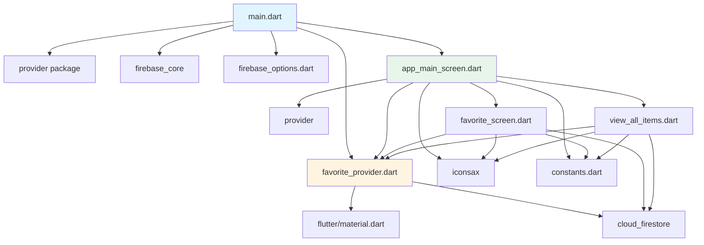
```mermaid
graph TB
    A[main.dart] --> B[provider package]
    A --> C[firebase_core]
    A --> D[firebase_options.dart]
    A --> E[favorite_provider.dart]
    A --> F[app_main_screen.dart]
    
    E --> G[flutter/material.dart]
    E --> H[cloud_firestore]
    
    F --> I[iconsax]
    F --> J[provider]
    F --> E
    F --> K[constants.dart]
    F --> L[favorite_screen.dart]
    F --> M[view_all_items.dart]
    
    L --> E
    L --> K
    L --> H
    L --> I
    
    M --> E
    M --> K
    M --> H
    M --> I
    
    style A fill:#e1f5ff
    style E fill:#fff4e1
    style F fill:#e8f5e9
```

---

## 2. Fichier par fichier

### 2.1. main.dart (Point d'entrée)

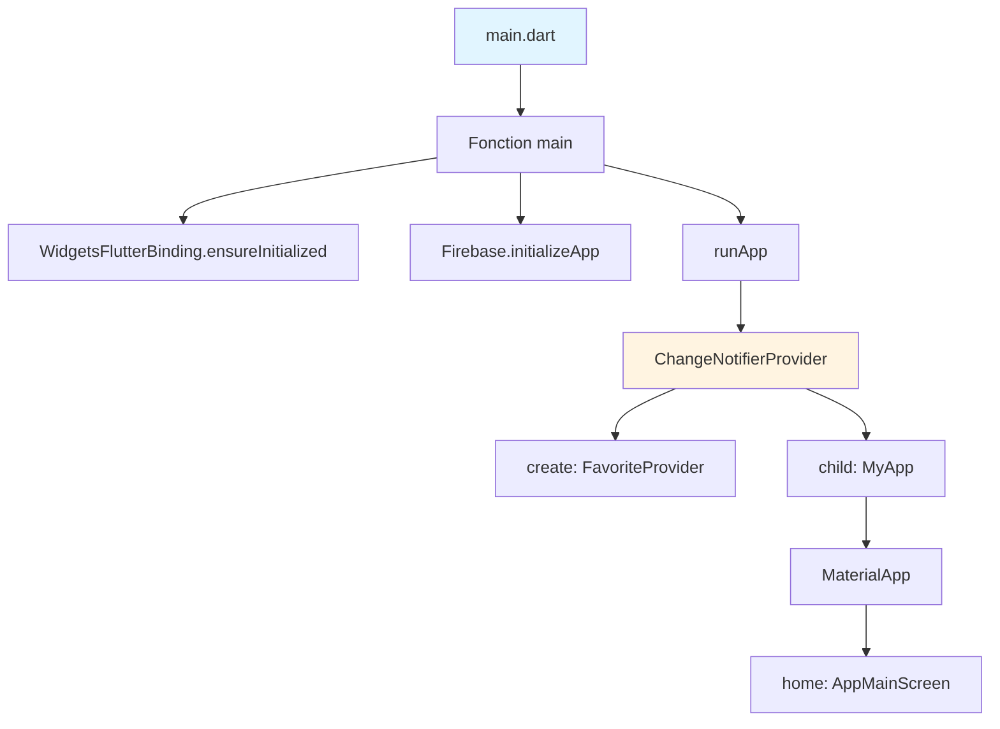
```mermaid
graph TB
    A[main.dart] --> B[Fonction main]
    B --> C[WidgetsFlutterBinding.ensureInitialized]
    B --> D[Firebase.initializeApp]
    B --> E[runApp]
    
    E --> F[ChangeNotifierProvider]
    F --> G[create: FavoriteProvider]
    F --> H[child: MyApp]
    
    H --> I[MaterialApp]
    I --> J[home: AppMainScreen]
    
    style A fill:#e1f5ff
    style F fill:#fff4e1
```

#### Code structure

```dart
// LIGNE 1-7 : IMPORTS
import 'package:flutter/material.dart';
import 'package:firebase_core/firebase_core.dart';
import 'package:flutter_rec_oct_2025_v3/firebase_options.dart';
import 'package:provider/provider.dart';
import 'Provider/favorite_provider.dart';
import 'Views/app_main_screen.dart';

// LIGNE 11-22 : FONCTION MAIN
void main() async {
  // Initialisation
  WidgetsFlutterBinding.ensureInitialized();
  await Firebase.initializeApp(
    options: DefaultFirebaseOptions.currentPlatform,
  );
  
  // Lancement avec Provider
  runApp(
    ChangeNotifierProvider(
      create: (context) => FavoriteProvider()..loadFavorites(),
      child: const MyApp(),
    ),
  );
}

// LIGNE 26-41 : WIDGET MYAPP
class MyApp extends StatelessWidget {
  const MyApp({super.key});

  @override
  Widget build(BuildContext context) {
    return MaterialApp(
      title: 'Flutter Demo',
      debugShowCheckedModeBanner: false,
      theme: ThemeData(
        primarySwatch: Colors.blue,
      ),
      home: const AppMainScreen(),
    );
  }
}
```

**Points clés :**
- Ligne 17-20 : Injection du Provider
- Ligne 18 : Création + chargement initial des favoris
- Ligne 38 : Écran de démarrage

---

### 2.2. favorite_provider.dart (Gestion d'état)

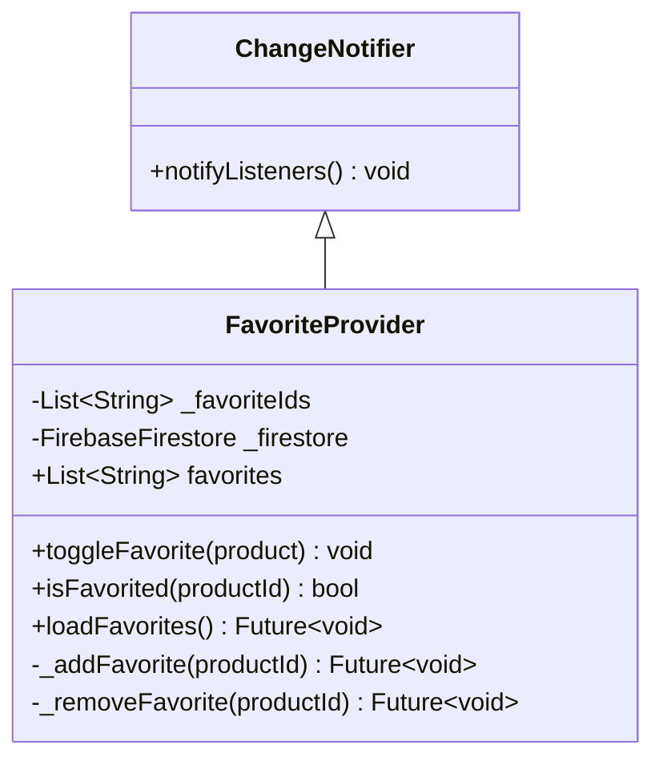
```mermaid
classDiagram
    class FavoriteProvider {
        -List~String~ _favoriteIds
        -FirebaseFirestore _firestore
        +List~String~ favorites
        +toggleFavorite(product) void
        +isFavorited(productId) bool
        +loadFavorites() Future~void~
        -_addFavorite(productId) Future~void~
        -_removeFavorite(productId) Future~void~
    }
    
    ChangeNotifier <|-- FavoriteProvider
    
    class ChangeNotifier {
        +notifyListeners() void
    }
```

#### Code structure

```dart
// LIGNE 1-2 : IMPORTS
import 'package:flutter/material.dart';
import 'package:cloud_firestore/cloud_firestore.dart';

// LIGNE 4-60 : CLASSE FAVORITEPROVIDER
class FavoriteProvider extends ChangeNotifier {
  // LIGNE 5-6 : VARIABLES PRIVÉES
  List<String> _favoriteIds = [];
  final FirebaseFirestore _firestore = FirebaseFirestore.instance;
  
  // LIGNE 8 : GETTER PUBLIC
  List<String> get favorites => _favoriteIds;
  
  // LIGNE 11-23 : TOGGLE FAVORI
  void toggleFavorite(DocumentSnapshot product) async {
    String productId = product.id;
    
    if (_favoriteIds.contains(productId)) {
      _favoriteIds.remove(productId);
      await _removeFavorite(productId);
    } else {
      _favoriteIds.add(productId);
      await _addFavorite(productId);
    }
    
    notifyListeners(); // ← Notifie tous les widgets
  }
  
  // LIGNE 26-28 : VÉRIFICATION
  bool isFavorited(String productId) {
    return _favoriteIds.contains(productId);
  }
  
  // LIGNE 31-39 : AJOUT FIRESTORE
  Future<void> _addFavorite(String productId) async {
    try {
      await _firestore.collection("userFavorite").doc(productId).set({
        'isFavorite': true,
      });
    } catch (e) {
      print(e.toString());
    }
  }
  
  // LIGNE 42-48 : SUPPRESSION FIRESTORE
  Future<void> _removeFavorite(String productId) async {
    try {
      await _firestore.collection("userFavorite").doc(productId).delete();
    } catch (e) {
      print(e.toString());
    }
  }
  
  // LIGNE 51-59 : CHARGEMENT INITIAL
  Future<void> loadFavorites() async {
    try {
      QuerySnapshot snapshot = await _firestore.collection("userFavorite").get();
      _favoriteIds = snapshot.docs.map((doc) => doc.id).toList();
      notifyListeners();
    } catch (e) {
      print(e.toString());
    }
  }
}
```

**Points clés :**
- Ligne 5 : État privé (_favoriteIds)
- Ligne 8 : Getter pour accéder aux favoris
- Ligne 22 : notifyListeners() déclenche le rebuild
- Ligne 31-48 : Méthodes privées pour Firestore

---

### 2.3. app_main_screen.dart (Écran principal)

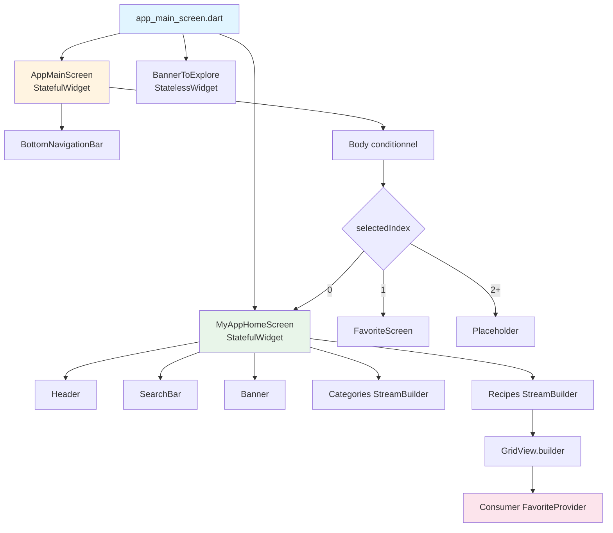
```mermaid
graph TB
    A[app_main_screen.dart] --> B[AppMainScreen<br/>StatefulWidget]
    A --> C[MyAppHomeScreen<br/>StatefulWidget]
    A --> D[BannerToExplore<br/>StatelessWidget]
    
    B --> E[BottomNavigationBar]
    B --> F[Body conditionnel]
    
    F --> G{selectedIndex}
    G -->|0| C
    G -->|1| H[FavoriteScreen]
    G -->|2+| I[Placeholder]
    
    C --> J[Header]
    C --> K[SearchBar]
    C --> L[Banner]
    C --> M[Categories StreamBuilder]
    C --> N[Recipes StreamBuilder]
    
    N --> O[GridView.builder]
    O --> P[Consumer FavoriteProvider]
    
    style A fill:#e1f5ff
    style B fill:#fff4e1
    style C fill:#e8f5e9
    style P fill:#fce4ec
```

#### Structure en 3 parties

**PARTIE 1 : AppMainScreen (Navigation)**
```dart
// LIGNE 10-73 : NAVIGATION PRINCIPALE
class AppMainScreen extends StatefulWidget {
  @override
  State<AppMainScreen> createState() => _AppMainScreenState();
}

class _AppMainScreenState extends State<AppMainScreen> {
  int selectedIndex = 0; // État : onglet sélectionné
  
  @override
  Widget build(BuildContext context) {
    return Scaffold(
      // Barre de navigation
      bottomNavigationBar: BottomNavigationBar(
        currentIndex: selectedIndex,
        items: [
          BottomNavigationBarItem(icon: Icon(Iconsax.home), label: "Home"),
          BottomNavigationBarItem(icon: Icon(Iconsax.heart), label: "Favorite"),
          BottomNavigationBarItem(icon: Icon(Iconsax.calendar), label: "Meal Plan"),
          BottomNavigationBarItem(icon: Icon(Iconsax.setting), label: "Setting"),
        ],
        onTap: (index) {
          setState(() {
            selectedIndex = index;
          });
        },
      ),
      
      // Body : affiche l'écran selon l'index
      body: selectedIndex == 0
          ? const MyAppHomeScreen()
          : selectedIndex == 1
              ? const FavoriteScreen()
              : Center(child: Text("Page index: $selectedIndex")),
    );
  }
}
```

**PARTIE 2 : MyAppHomeScreen (Contenu principal)**
```dart
// LIGNE 75-425 : ÉCRAN D'ACCUEIL
class MyAppHomeScreen extends StatefulWidget {
  @override
  State<MyAppHomeScreen> createState() => _MyAppHomeScreenState();
}

class _MyAppHomeScreenState extends State<MyAppHomeScreen> {
  String selectedCategory = "All";
  final FirebaseFirestore _firestore = FirebaseFirestore.instance;
  
  @override
  Widget build(BuildContext context) {
    return SafeArea(
      child: SingleChildScrollView(
        child: Column(
          children: [
            headerParts(),            // En-tête
            mySearchBar(),            // Barre de recherche
            BannerToExplore(),        // Bannière
            
            // STREAMBUILDER 1 : Catégories
            StreamBuilder<QuerySnapshot>(
              stream: _firestore.collection('categories').snapshots(),
              builder: (context, snapshot) {
                if (snapshot.hasData) {
                  List<String> categories = ["All"];
                  for (var doc in snapshot.data!.docs) {
                    categories.add(doc['name']);
                  }
                  return categoryButtons(categories);
                } else {
                  return CircularProgressIndicator();
                }
              },
            ),
            
            // STREAMBUILDER 2 : Recettes
            StreamBuilder<QuerySnapshot>(
              stream: selectedCategory == "All" 
                  ? _firestore.collection('details').limit(4).snapshots()
                  : _firestore.collection('details')
                      .where('category', isEqualTo: selectedCategory)
                      .limit(4)
                      .snapshots(),
              builder: (context, snapshot) {
                if (snapshot.hasData) {
                  return GridView.builder(
                    itemCount: snapshot.data!.docs.length,
                    itemBuilder: (context, index) {
                      final recipe = snapshot.data!.docs[index];
                      
                      return Container(
                        child: Stack(
                          children: [
                            // Image de la recette
                            Image.network(recipe['image']),
                            
                            // CONSUMER : Bouton favori
                            Positioned(
                              top: 10,
                              right: 10,
                              child: Consumer<FavoriteProvider>(
                                builder: (context, favoriteProvider, child) {
                                  final isFavorite = favoriteProvider
                                      .favorites.contains(recipe.id);
                                  
                                  return GestureDetector(
                                    onTap: () {
                                      favoriteProvider.toggleFavorite(recipe);
                                    },
                                    child: Icon(
                                      isFavorite ? Iconsax.heart5 : Iconsax.heart,
                                      color: isFavorite ? Colors.red : Colors.grey,
                                    ),
                                  );
                                },
                              ),
                            ),
                          ],
                        ),
                      );
                    },
                  );
                }
                return CircularProgressIndicator();
              },
            ),
          ],
        ),
      ),
    );
  }
}
```

**PARTIE 3 : BannerToExplore (Bannière)**
```dart
// LIGNE 427-490 : BANNIÈRE
class BannerToExplore extends StatelessWidget {
  @override
  Widget build(BuildContext context) {
    return Container(
      decoration: BoxDecoration(
        color: Color(0xFF71B77A),
        borderRadius: BorderRadius.circular(15),
      ),
      child: Stack(
        children: [
          // Texte et bouton
          Positioned(
            left: 20,
            child: Column(
              children: [
                Text("Cook the best\nrecipes at home"),
                ElevatedButton(
                  onPressed: () {},
                  child: Text("Explore"),
                ),
              ],
            ),
          ),
          // Image du chef
          Positioned(
            right: -20,
            child: Image.asset("assets/images/chef_PNG190.png"),
          ),
        ],
      ),
    );
  }
}
```

---

### 2.4. favorite_screen.dart (Écran des favoris)

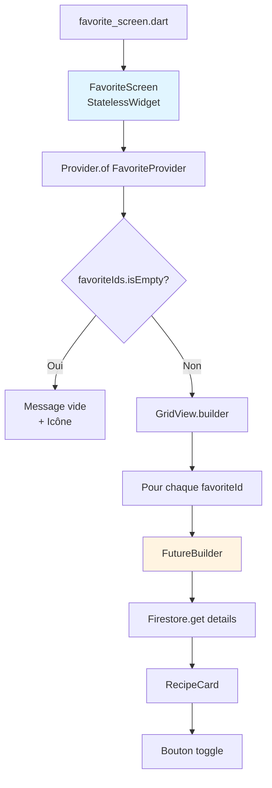
```mermaid
graph TB
    A[favorite_screen.dart] --> B[FavoriteScreen<br/>StatelessWidget]
    
    B --> C[Provider.of FavoriteProvider]
    C --> D{favoriteIds.isEmpty?}
    
    D -->|Oui| E[Message vide<br/>+ Icône]
    D -->|Non| F[GridView.builder]
    
    F --> G[Pour chaque favoriteId]
    G --> H[FutureBuilder]
    H --> I[Firestore.get details]
    I --> J[RecipeCard]
    J --> K[Bouton toggle]
    
    style B fill:#e1f5ff
    style H fill:#fff4e1
```

#### Code structure

```dart
// LIGNE 1-7 : IMPORTS
import 'package:flutter/material.dart';
import 'package:cloud_firestore/cloud_firestore.dart';
import 'package:iconsax/iconsax.dart';
import 'package:provider/provider.dart';
import '../constants.dart';
import '../Provider/favorite_provider.dart';

// LIGNE 8-232 : FAVORITESCREEN
class FavoriteScreen extends StatelessWidget {
  const FavoriteScreen({Key? key}) : super(key: key);

  @override
  Widget build(BuildContext context) {
    // LIGNE 13-14 : RÉCUPÉRATION DU PROVIDER
    final favoriteProvider = Provider.of<FavoriteProvider>(context);
    final favoriteIds = favoriteProvider.favorites;

    return Scaffold(
      appBar: AppBar(
        title: const Text('My Favorites'),
      ),
      
      // LIGNE 30-59 : CAS LISTE VIDE
      body: favoriteIds.isEmpty
          ? Center(
              child: Column(
                mainAxisAlignment: MainAxisAlignment.center,
                children: [
                  Icon(Iconsax.heart, size: 100, color: Colors.grey[300]),
                  const SizedBox(height: 20),
                  Text('No favorites yet'),
                  Text('Start adding recipes to your favorites!'),
                ],
              ),
            )
          
          // LIGNE 60-229 : CAS AVEC FAVORIS
          : Padding(
              padding: const EdgeInsets.all(15),
              child: GridView.builder(
                gridDelegate: const SliverGridDelegateWithFixedCrossAxisCount(
                  crossAxisCount: 2,
                  crossAxisSpacing: 10,
                  mainAxisSpacing: 10,
                  childAspectRatio: 0.8,
                ),
                itemCount: favoriteIds.length,
                
                itemBuilder: (context, index) {
                  final recipeId = favoriteIds[index];
                  
                  // LIGNE 73-89 : FUTUREBUILDER
                  return FutureBuilder<DocumentSnapshot>(
                    future: FirebaseFirestore.instance
                        .collection('details')
                        .doc(recipeId)
                        .get(),
                    
                    builder: (context, snapshot) {
                      // Pendant le chargement
                      if (!snapshot.hasData) {
                        return Container(
                          child: const Center(
                            child: CircularProgressIndicator(),
                          ),
                        );
                      }

                      final recipe = snapshot.data!;
                      final data = recipe.data() as Map<String, dynamic>?;
                      
                      if (data == null) {
                        return const SizedBox.shrink();
                      }

                      // Extraction des données
                      final img = (data['image'] ?? '').toString();
                      final name = (data['name'] ?? 'Sans nom').toString();
                      final time = (data['time'] ?? '').toString();
                      final cal = (data['cal'] ?? '0').toString();

                      // LIGNE 103-224 : CARTE DE RECETTE
                      return Container(
                        child: Column(
                          children: [
                            // Image
                            ClipRRect(
                              child: Image.network(img),
                            ),
                            
                            // LIGNE 145-169 : BOUTON FAVORI
                            Positioned(
                              top: 10,
                              right: 10,
                              child: GestureDetector(
                                onTap: () {
                                  favoriteProvider.toggleFavorite(recipe);
                                },
                                child: Container(
                                  decoration: BoxDecoration(
                                    color: Colors.white,
                                    shape: BoxShape.circle,
                                  ),
                                  child: const Icon(
                                    Iconsax.heart5,
                                    size: 16,
                                    color: Colors.red,
                                  ),
                                ),
                              ),
                            ),
                            
                            // Infos (nom, temps, calories)
                            Padding(
                              padding: const EdgeInsets.all(10),
                              child: Column(
                                children: [
                                  Text(name),
                                  Row(
                                    children: [
                                      Icon(Iconsax.clock),
                                      Text("$time Min"),
                                      Icon(Iconsax.flash_1),
                                      Text("$cal Cal"),
                                    ],
                                  ),
                                ],
                              ),
                            ),
                          ],
                        ),
                      );
                    },
                  );
                },
              ),
            ),
    );
  }
}
```

**Points clés :**
- Ligne 13 : Récupération du Provider
- Ligne 30 : Condition si liste vide
- Ligne 73 : FutureBuilder pour récupérer les détails
- Ligne 147 : Toggle favori

---

## 3. Flux d'exécution visuel

### Démarrage de l'application

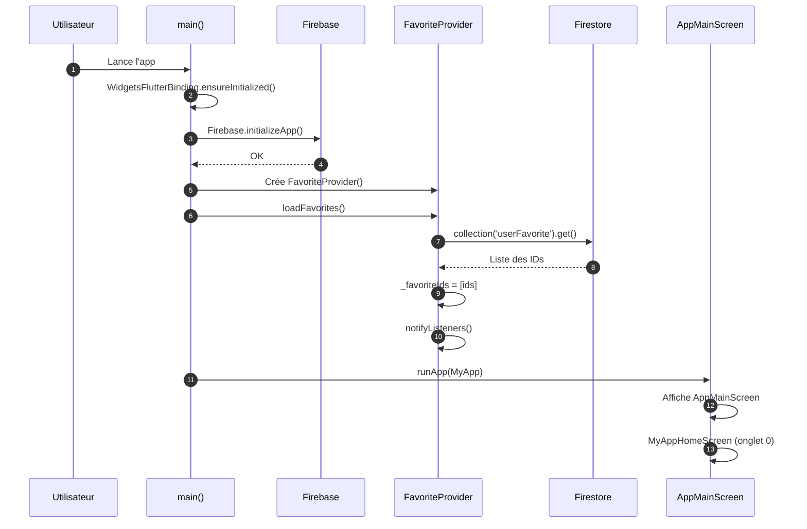
```mermaid
sequenceDiagram
    autonumber
    participant U as Utilisateur
    participant M as main()
    participant FB as Firebase
    participant FP as FavoriteProvider
    participant FS as Firestore
    participant UI as AppMainScreen

    U->>M: Lance l'app
    M->>M: WidgetsFlutterBinding.ensureInitialized()
    M->>FB: Firebase.initializeApp()
    FB-->>M: OK
    M->>FP: Crée FavoriteProvider()
    M->>FP: loadFavorites()
    FP->>FS: collection('userFavorite').get()
    FS-->>FP: Liste des IDs
    FP->>FP: _favoriteIds = [ids]
    FP->>FP: notifyListeners()
    M->>UI: runApp(MyApp)
    UI->>UI: Affiche AppMainScreen
    UI->>UI: MyAppHomeScreen (onglet 0)
```

### Ajout d'un favori

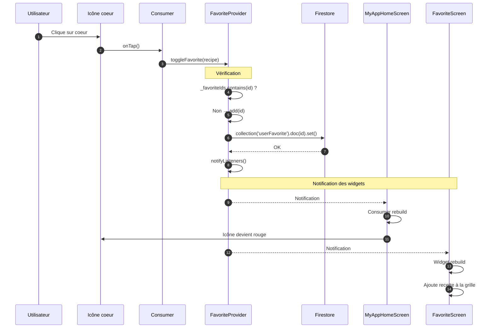
```mermaid
sequenceDiagram
    autonumber
    participant U as Utilisateur
    participant IC as Icône coeur
    participant C as Consumer
    participant FP as FavoriteProvider
    participant FS as Firestore
    participant UI1 as MyAppHomeScreen
    participant UI2 as FavoriteScreen

    U->>IC: Clique sur coeur
    IC->>C: onTap()
    C->>FP: toggleFavorite(recipe)
    
    Note over FP: Vérification
    FP->>FP: _favoriteIds.contains(id) ?
    FP->>FP: Non → add(id)
    FP->>FS: collection('userFavorite').doc(id).set()
    FS-->>FP: OK
    
    FP->>FP: notifyListeners()
    
    Note over FP,UI2: Notification des widgets
    FP-->>UI1: Notification
    UI1->>UI1: Consumer rebuild
    UI1->>IC: Icône devient rouge
    
    FP-->>UI2: Notification
    UI2->>UI2: Widget rebuild
    UI2->>UI2: Ajoute recette à la grille
```

### Navigation entre onglets

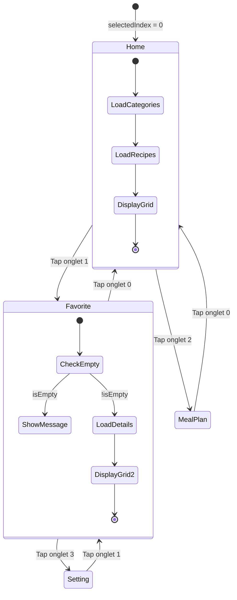
```mermaid
stateDiagram-v2
    [*] --> Home: selectedIndex = 0
    Home --> Favorite: Tap onglet 1
    Favorite --> Home: Tap onglet 0
    Home --> MealPlan: Tap onglet 2
    MealPlan --> Home: Tap onglet 0
    Favorite --> Setting: Tap onglet 3
    Setting --> Favorite: Tap onglet 1
    
    state Home {
        [*] --> LoadCategories
        LoadCategories --> LoadRecipes
        LoadRecipes --> DisplayGrid
        DisplayGrid --> [*]
    }
    
    state Favorite {
        [*] --> CheckEmpty
        CheckEmpty --> ShowMessage : isEmpty
        CheckEmpty --> LoadDetails : !isEmpty
        LoadDetails --> DisplayGrid2
        DisplayGrid2 --> [*]
    }
```

---

## 4. Interactions entre fichiers

### Flux de données complet

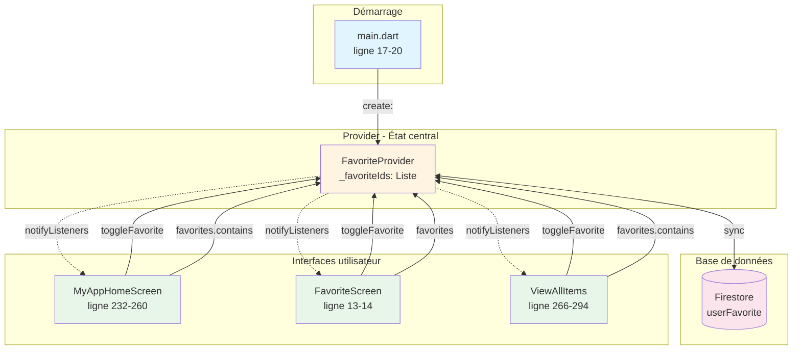
```mermaid
graph TB
    subgraph "Démarrage"
    A[main.dart<br/>ligne 17-20]
    end
    
    subgraph "Provider - État central"
    B[FavoriteProvider<br/>_favoriteIds: Liste]
    end
    
    subgraph "Base de données"
    C[(Firestore<br/>userFavorite)]
    end
    
    subgraph "Interfaces utilisateur"
    D[MyAppHomeScreen<br/>ligne 232-260]
    E[FavoriteScreen<br/>ligne 13-14]
    F[ViewAllItems<br/>ligne 266-294]
    end
    
    A -->|create:| B
    B <-->|sync| C
    
    B -.->|notifyListeners| D
    B -.->|notifyListeners| E
    B -.->|notifyListeners| F
    
    D -->|toggleFavorite| B
    E -->|toggleFavorite| B
    F -->|toggleFavorite| B
    
    D -->|favorites.contains| B
    E -->|favorites| B
    F -->|favorites.contains| B
    
    style A fill:#e1f5ff
    style B fill:#fff4e1
    style C fill:#fce4ec
    style D fill:#e8f5e9
    style E fill:#e8f5e9
    style F fill:#e8f5e9
```

### Dépendances entre fichiers

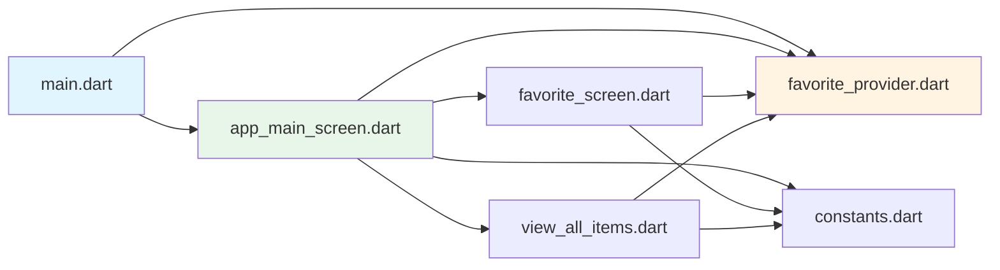
```mermaid
graph LR
    A[main.dart] --> B[favorite_provider.dart]
    A --> C[app_main_screen.dart]
    
    C --> B
    C --> D[constants.dart]
    C --> E[favorite_screen.dart]
    C --> F[view_all_items.dart]
    
    E --> B
    E --> D
    
    F --> B
    F --> D
    
    style A fill:#e1f5ff
    style B fill:#fff4e1
    style C fill:#e8f5e9
```

### Communication Widget-Provider

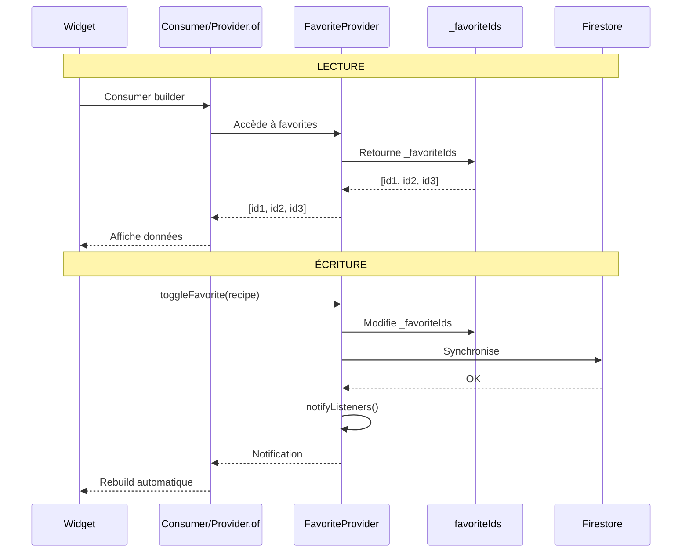
```mermaid
sequenceDiagram
    participant W as Widget
    participant C as Consumer/Provider.of
    participant P as FavoriteProvider
    participant L as _favoriteIds
    participant FS as Firestore

    Note over W,FS: LECTURE
    W->>C: Consumer builder
    C->>P: Accède à favorites
    P->>L: Retourne _favoriteIds
    L-->>P: [id1, id2, id3]
    P-->>C: [id1, id2, id3]
    C-->>W: Affiche données
    
    Note over W,FS: ÉCRITURE
    W->>P: toggleFavorite(recipe)
    P->>L: Modifie _favoriteIds
    P->>FS: Synchronise
    FS-->>P: OK
    P->>P: notifyListeners()
    P-->>C: Notification
    C-->>W: Rebuild automatique
```

---

## 5. Patterns et bonnes pratiques

### Pattern 1 : Séparation des responsabilités

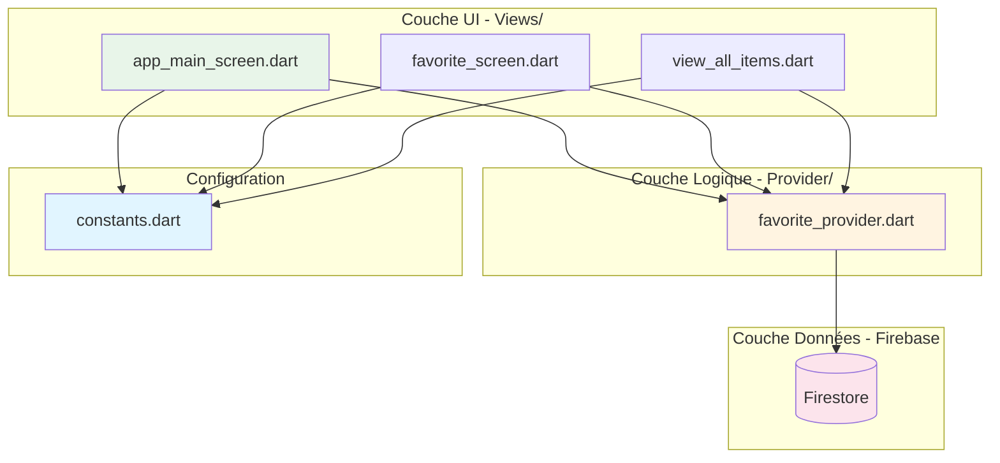
```mermaid
graph TB
    subgraph "Couche UI - Views/"
    A[app_main_screen.dart]
    B[favorite_screen.dart]
    C[view_all_items.dart]
    end
    
    subgraph "Couche Logique - Provider/"
    D[favorite_provider.dart]
    end
    
    subgraph "Couche Données - Firebase"
    E[(Firestore)]
    end
    
    subgraph "Configuration"
    F[constants.dart]
    end
    
    A --> D
    B --> D
    C --> D
    D --> E
    A --> F
    B --> F
    C --> F
    
    style A fill:#e8f5e9
    style D fill:#fff4e1
    style E fill:#fce4ec
    style F fill:#e1f5ff
```

**Avantages :**
- Logique métier centralisée
- UI réutilisable
- Facile à tester
- Maintenabilité

---

### Pattern 2 : Consumer vs Provider.of

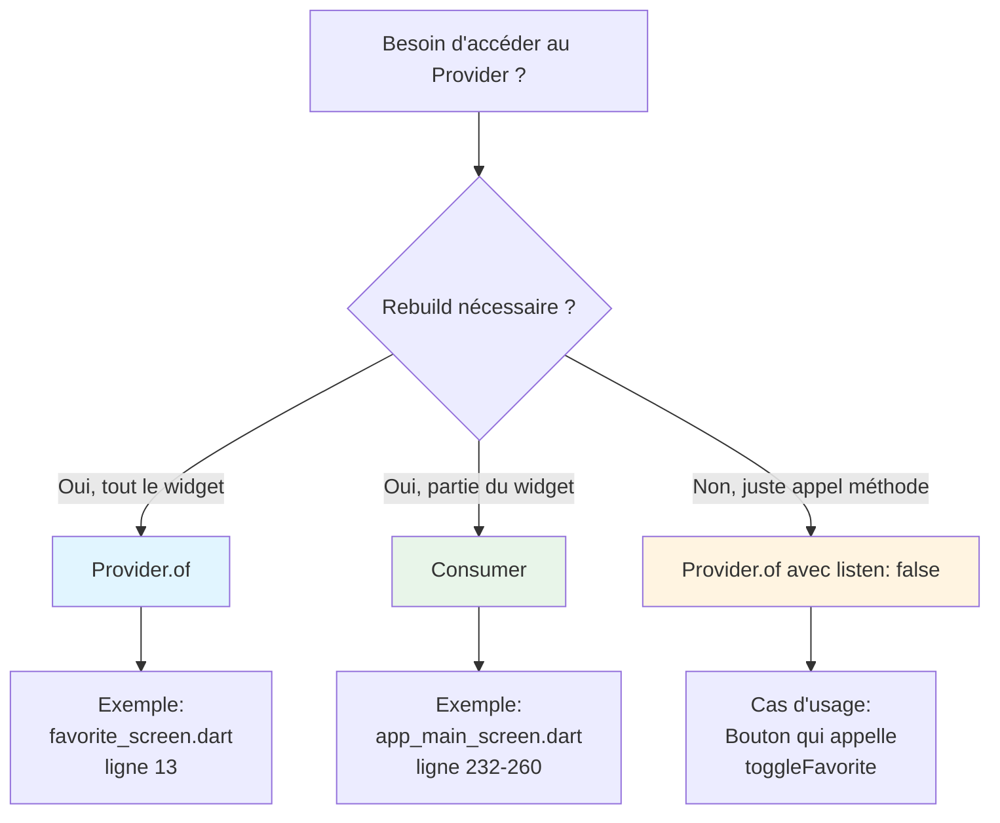
```mermaid
graph TB
    A[Besoin d'accéder au Provider ?] --> B{Rebuild nécessaire ?}
    
    B -->|Oui, tout le widget| C[Provider.of]
    B -->|Oui, partie du widget| D[Consumer]
    B -->|Non, juste appel méthode| E[Provider.of avec listen: false]
    
    C --> C1[Exemple:<br/>favorite_screen.dart<br/>ligne 13]
    D --> D1[Exemple:<br/>app_main_screen.dart<br/>ligne 232-260]
    E --> E1[Cas d'usage:<br/>Bouton qui appelle<br/>toggleFavorite]
    
    style D fill:#e8f5e9
    style C fill:#e1f5ff
    style E fill:#fff4e1
```

**Code comparatif :**

```dart
// PATTERN 1 : Provider.of (rebuild tout)
final provider = Provider.of<FavoriteProvider>(context);
return Text('${provider.favorites.length} favoris');

// PATTERN 2 : Consumer (rebuild seulement cette partie)
return Column(
  children: [
    Text('Mes recettes'),  // Ne rebuild PAS
    Consumer<FavoriteProvider>(
      builder: (context, provider, child) {
        return Text('${provider.favorites.length} favoris');  // Rebuild seulement ici
      },
    ),
  ],
);

// PATTERN 3 : Provider.of listen: false (pas de rebuild)
final provider = Provider.of<FavoriteProvider>(context, listen: false);
ElevatedButton(
  onTap: () => provider.toggleFavorite(recipe),  // Juste appel de méthode
  child: Text('Ajouter'),
);
```

---

### Pattern 3 : StreamBuilder vs FutureBuilder

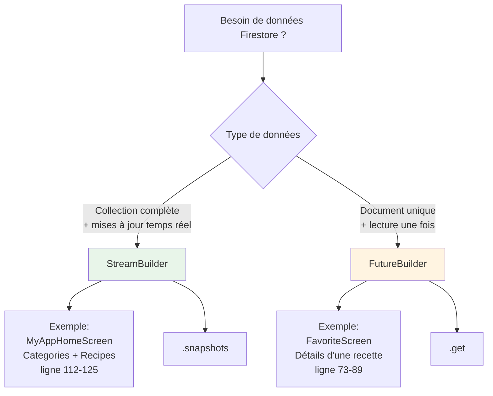
```mermaid
graph TB
    A[Besoin de données Firestore ?] --> B{Type de données}
    
    B -->|Collection complète<br/>+ mises à jour temps réel| C[StreamBuilder]
    B -->|Document unique<br/>+ lecture une fois| D[FutureBuilder]
    
    C --> C1[Exemple:<br/>MyAppHomeScreen<br/>Categories + Recipes<br/>ligne 112-125]
    
    D --> D1[Exemple:<br/>FavoriteScreen<br/>Détails d'une recette<br/>ligne 73-89]
    
    C --> C2[.snapshots]
    D --> D2[.get]
    
    style C fill:#e8f5e9
    style D fill:#fff4e1
```

**Code comparatif :**

```dart
// PATTERN 1 : StreamBuilder (temps réel)
StreamBuilder<QuerySnapshot>(
  stream: _firestore.collection('details').snapshots(),  // ← Stream continu
  builder: (context, snapshot) {
    // Se rebuild automatiquement à chaque changement dans Firestore
    if (snapshot.hasData) {
      return ListView(...);
    }
    return CircularProgressIndicator();
  },
)

// PATTERN 2 : FutureBuilder (une fois)
FutureBuilder<DocumentSnapshot>(
  future: _firestore.collection('details').doc(recipeId).get(),  // ← Future unique
  builder: (context, snapshot) {
    // S'exécute une fois, puis plus jamais
    if (snapshot.hasData) {
      return RecipeCard(...);
    }
    return CircularProgressIndicator();
  },
)
```

---

### Pattern 4 : Gestion des états null-safe

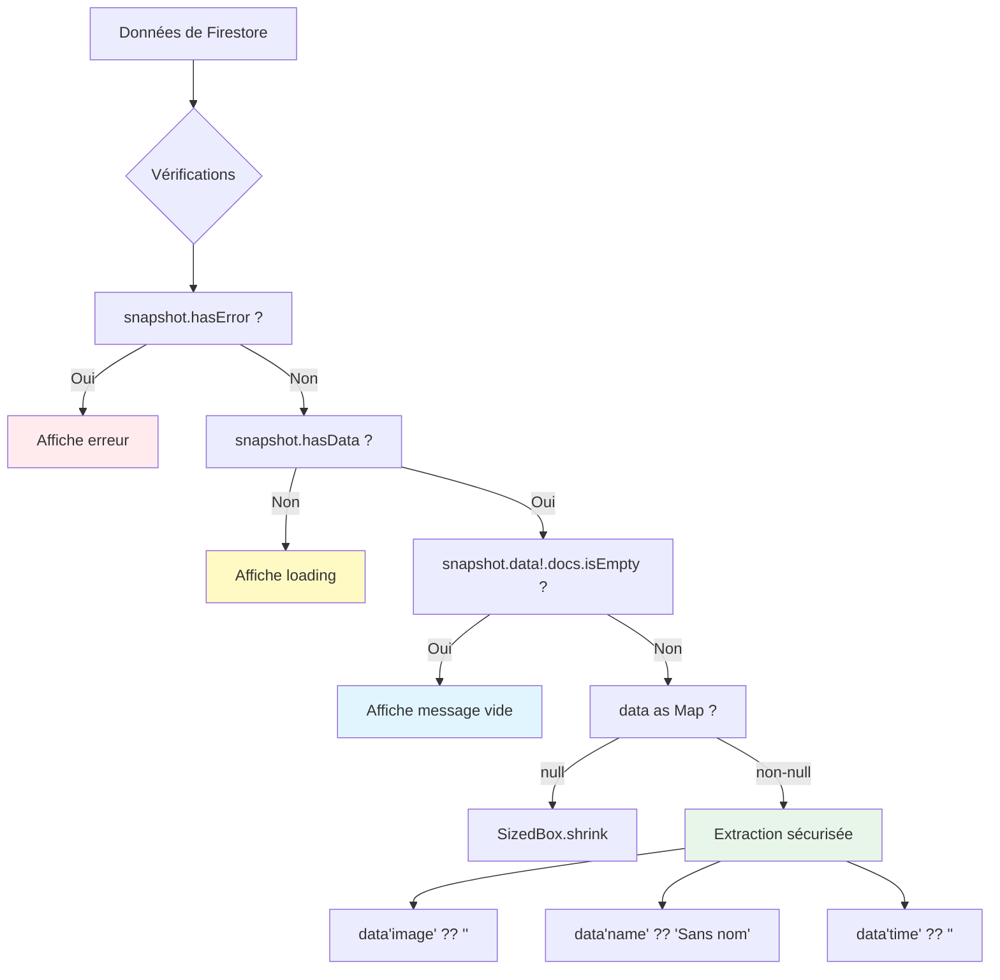
```mermaid
graph TB
    A[Données de Firestore] --> B{Vérifications}
    
    B --> C[snapshot.hasError ?]
    C -->|Oui| D[Affiche erreur]
    C -->|Non| E[snapshot.hasData ?]
    
    E -->|Non| F[Affiche loading]
    E -->|Oui| G[snapshot.data!.docs.isEmpty ?]
    
    G -->|Oui| H[Affiche message vide]
    G -->|Non| I[data as Map ?]
    
    I -->|null| J[SizedBox.shrink]
    I -->|non-null| K[Extraction sécurisée]
    
    K --> L[data'image' ?? '']
    K --> M[data'name' ?? 'Sans nom']
    K --> N[data'time' ?? '']
    
    style D fill:#ffebee
    style F fill:#fff9c4
    style H fill:#e1f5ff
    style K fill:#e8f5e9
```

**Code pattern :**

```dart
StreamBuilder<QuerySnapshot>(
  stream: _firestore.collection('details').snapshots(),
  builder: (context, snapshot) {
    // ÉTAPE 1 : Erreur
    if (snapshot.hasError) {
      return Center(child: Text('Erreur: ${snapshot.error}'));
    }
    
    // ÉTAPE 2 : Chargement
    if (!snapshot.hasData) {
      return Center(child: CircularProgressIndicator());
    }
    
    // ÉTAPE 3 : Liste vide
    if (snapshot.data!.docs.isEmpty) {
      return Center(child: Text('Aucune recette'));
    }
    
    // ÉTAPE 4 : Affichage des données
    return GridView.builder(
      itemCount: snapshot.data!.docs.length,
      itemBuilder: (context, index) {
        final recipe = snapshot.data!.docs[index];
        
        // Extraction sécurisée avec valeurs par défaut
        final img = (recipe['image'] ?? '').toString();
        final name = (recipe['name'] ?? 'Sans nom').toString();
        final time = (recipe['time'] ?? '').toString();
        final cal = (recipe['cal'] ?? '0').toString();
        
        return RecipeCard(...);
      },
    );
  },
)
```

---

### Pattern 5 : Structure de widget réutilisable

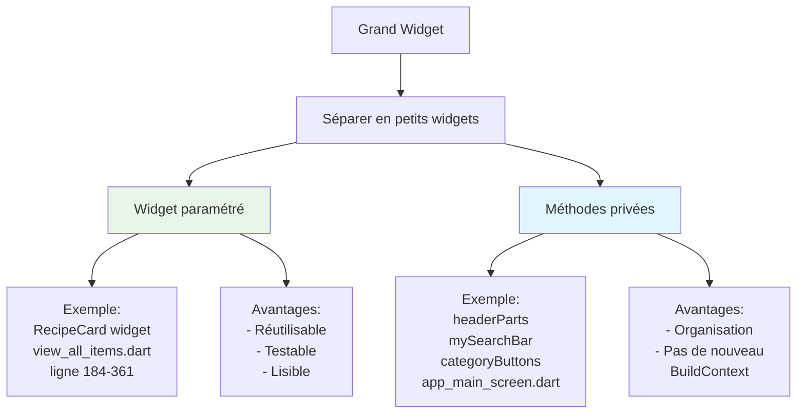
```mermaid
graph TB
    A[Grand Widget] --> B[Séparer en petits widgets]
    
    B --> C[Widget paramétré]
    B --> D[Méthodes privées]
    
    C --> C1[Exemple:<br/>RecipeCard widget<br/>view_all_items.dart<br/>ligne 184-361]
    
    D --> D1[Exemple:<br/>headerParts<br/>mySearchBar<br/>categoryButtons<br/>app_main_screen.dart]
    
    C --> C2[Avantages:<br/>- Réutilisable<br/>- Testable<br/>- Lisible]
    
    D --> D2[Avantages:<br/>- Organisation<br/>- Pas de nouveau<br/>  BuildContext]
    
    style C fill:#e8f5e9
    style D fill:#e1f5ff
```

**Code pattern :**

```dart
// PATTERN 1 : Widget réutilisable (classe séparée)
class RecipeCard extends StatelessWidget {
  final DocumentSnapshot recipe;
  final String image;
  final String name;
  
  const RecipeCard({
    required this.recipe,
    required this.image,
    required this.name,
  });
  
  @override
  Widget build(BuildContext context) {
    return Container(...);
  }
}

// PATTERN 2 : Méthode privée (dans la classe)
class _MyAppHomeScreenState extends State<MyAppHomeScreen> {
  @override
  Widget build(BuildContext context) {
    return Column(
      children: [
        headerParts(),     // ← Méthode privée
        mySearchBar(),     // ← Méthode privée
        categoryButtons(), // ← Méthode privée
      ],
    );
  }
  
  Widget headerParts() {
    return Padding(...);
  }
  
  Widget mySearchBar() {
    return Container(...);
  }
}
```

---

## Résumé visuel final

### Architecture complète en un coup d'oeil

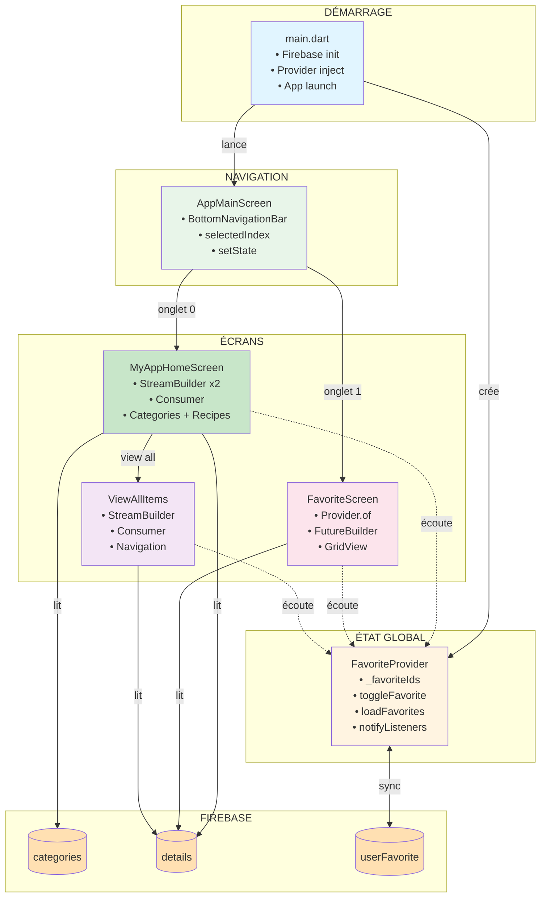
```mermaid
graph TB
    subgraph "DÉMARRAGE"
    A[main.dart<br/>• Firebase init<br/>• Provider inject<br/>• App launch]
    end
    
    subgraph "ÉTAT GLOBAL"
    B[FavoriteProvider<br/>• _favoriteIds<br/>• toggleFavorite<br/>• loadFavorites<br/>• notifyListeners]
    end
    
    subgraph "NAVIGATION"
    C[AppMainScreen<br/>• BottomNavigationBar<br/>• selectedIndex<br/>• setState]
    end
    
    subgraph "ÉCRANS"
    D[MyAppHomeScreen<br/>• StreamBuilder x2<br/>• Consumer<br/>• Categories + Recipes]
    E[FavoriteScreen<br/>• Provider.of<br/>• FutureBuilder<br/>• GridView]
    F[ViewAllItems<br/>• StreamBuilder<br/>• Consumer<br/>• Navigation]
    end
    
    subgraph "FIREBASE"
    G[(categories)]
    H[(details)]
    I[(userFavorite)]
    end
    
    A -->|crée| B
    A -->|lance| C
    C -->|onglet 0| D
    C -->|onglet 1| E
    D -->|"view all"| F
    
    B <-->|sync| I
    D -->|lit| G
    D -->|lit| H
    E -->|lit| H
    F -->|lit| H
    
    D -.->|écoute| B
    E -.->|écoute| B
    F -.->|écoute| B
    
    style A fill:#e1f5ff
    style B fill:#fff4e1
    style C fill:#e8f5e9
    style D fill:#c8e6c9
    style E fill:#fce4ec
    style F fill:#f3e5f5
    style G fill:#ffe0b2
    style H fill:#ffe0b2
    style I fill:#ffe0b2
```

### Checklist de vérification

Votre projet respecte ces bonnes pratiques :

- [x] **Séparation des responsabilités** : UI / Logique / Données
- [x] **État centralisé** : Un seul FavoriteProvider
- [x] **Injection au niveau racine** : Provider dans main.dart
- [x] **Optimisation** : Consumer pour rebuilds partiels
- [x] **Null-safety** : Vérifications et valeurs par défaut
- [x] **Code réutilisable** : RecipeCard widget séparé
- [x] **Structure claire** : Widgets et méthodes organisés
- [x] **Asynchrone** : async/await correctement utilisé
- [x] **Temps réel** : StreamBuilder pour données Firestore
- [x] **Performance** : FutureBuilder pour requêtes uniques

Votre architecture est professionnelle et suit les standards de l'industrie Flutter.

