# Guide Ultra-Simple pour Débutants Absolus

## Introduction

Ce document explique votre projet Flutter en termes très simples, sans jargon technique. Si vous débutez complètement en programmation, commencez par ici.

---

## 1. C'est quoi cette application ?

### Vue simple

Imaginez une application de recettes de cuisine sur votre téléphone.

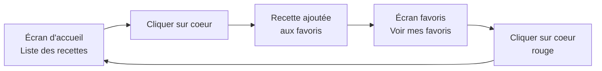

**Fonctionnalités :**
1. Voir des recettes de cuisine avec photos
2. Cliquer sur un coeur pour mettre en favori
3. Aller dans l'onglet "Favoris" pour revoir vos recettes préférées
4. Filtrer par catégorie (Petit-déjeuner, Déjeuner, etc.)

---

## 2. Comment c'est organisé ?

### Analogie : Une bibliothèque

Pensez à votre projet comme une bibliothèque :

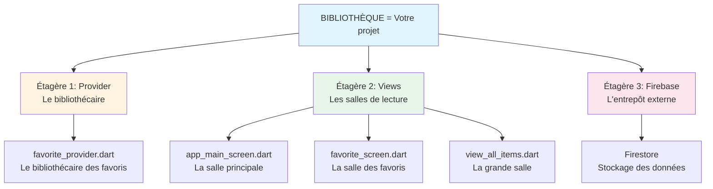

---

## 3. Les fichiers principaux expliqués simplement

### 3.1. main.dart : La porte d'entrée

**C'est quoi ?**
Le premier fichier qui s'exécute quand vous lancez l'app.

**Analogie :** 
La porte d'entrée d'un magasin. Quand vous ouvrez la porte, le magasin s'allume et tout se prépare.

**Ce qui se passe :**
```
1. Allumer Firebase (la connexion Internet)
2. Créer le bibliothécaire des favoris (FavoriteProvider)
3. Ouvrir l'écran principal
```

**Code simplifié :**
```dart
void main() {
  // 1. Préparer Firebase
  Firebase.initializeApp();
  
  // 2. Créer le bibliothécaire (Provider)
  ChangeNotifierProvider(
    create: FavoriteProvider(),
    
    // 3. Lancer l'app
    child: MyApp(),
  );
}
```

---

### 3.2. favorite_provider.dart : Le bibliothécaire

**C'est quoi ?**
Un assistant qui garde en mémoire quelles recettes sont favorites.

**Analogie :**
Un bibliothécaire qui a un carnet. Dans ce carnet, il note les numéros des livres que vous aimez.

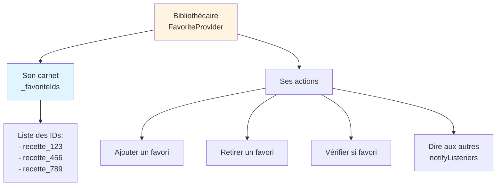

**Ce qu'il fait :**

1. **Ajouter un favori**
   ```
   Vous : "J'aime cette recette"
   Bibliothécaire : "OK, je note le numéro 123 dans mon carnet"
   ```

2. **Retirer un favori**
   ```
   Vous : "Je n'aime plus cette recette"
   Bibliothécaire : "OK, j'efface le numéro 123 de mon carnet"
   ```

3. **Vérifier si favori**
   ```
   Vous : "Est-ce que la recette 123 est dans mes favoris ?"
   Bibliothécaire : "Je regarde dans mon carnet... Oui !"
   ```

4. **Prévenir tout le monde**
   ```
   Bibliothécaire : "Attention ! J'ai changé quelque chose dans mon carnet !"
   Tous les écrans : "OK, on va se mettre à jour"
   ```

**Code simplifié :**
```dart
class FavoriteProvider {
  // Le carnet (liste des favoris)
  List<String> _favoriteIds = [];
  
  // Ajouter ou retirer un favori
  void toggleFavorite(recette) {
    if (déjà_dans_la_liste) {
      Retirer;
    } else {
      Ajouter;
    }
    
    // Dire à tout le monde
    notifyListeners();
  }
  
  // Vérifier si c'est un favori
  bool isFavorited(id) {
    return _favoriteIds contient id;
  }
}
```

---

### 3.3. app_main_screen.dart : L'écran principal

**C'est quoi ?**
L'écran que vous voyez quand vous ouvrez l'app. Il a 4 onglets en bas.

**Analogie :**
Un immeuble avec 4 appartements. Vous cliquez sur un bouton pour aller dans un appartement.

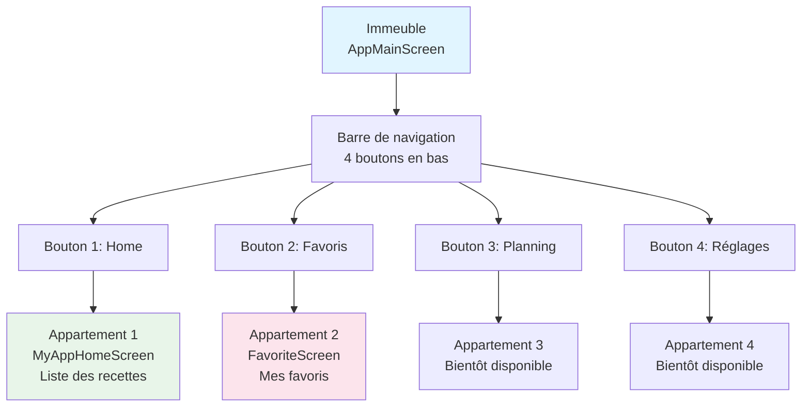

**Ce qu'il fait :**

1. **Afficher 4 boutons en bas**
   - Maison (Home)
   - Coeur (Favoris)
   - Calendrier (Planning)
   - Paramètres (Réglages)

2. **Changer d'écran quand vous cliquez**
   ```
   Si vous cliquez sur Maison → Afficher la liste des recettes
   Si vous cliquez sur Coeur → Afficher les favoris
   ```

**Code simplifié :**
```dart
class AppMainScreen {
  int onglet_sélectionné = 0;  // Au départ : onglet 0 (Home)
  
  Widget build() {
    return (
      // Barre de navigation avec 4 boutons
      BottomNavigationBar(
        boutons: [Home, Favoris, Planning, Réglages],
        quand_clic: (index) {
          onglet_sélectionné = index;
        },
      ),
      
      // Afficher le bon écran
      body: 
        Si onglet_sélectionné == 0 → MyAppHomeScreen
        Si onglet_sélectionné == 1 → FavoriteScreen
        Sinon → Page en construction
    );
  }
}
```

---

### 3.4. MyAppHomeScreen : La liste des recettes

**C'est quoi ?**
C'est ce que vous voyez dans l'onglet "Home". Une liste de recettes avec des photos.

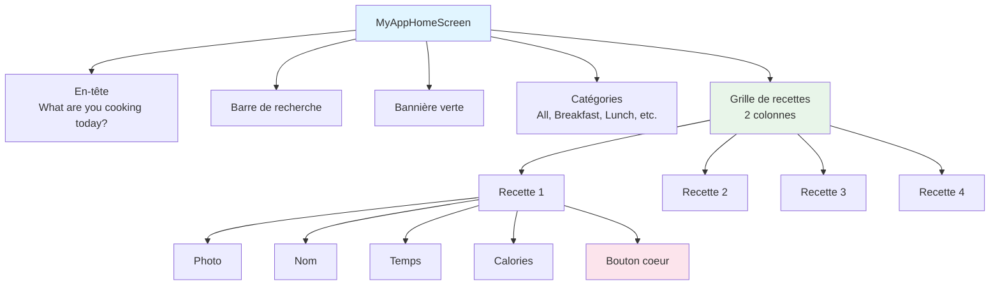

**Ce qu'il fait :**

1. **Se connecter à Firebase**
   ```
   "Hé Firebase, donne-moi toutes les recettes"
   Firebase : "Voici 100 recettes"
   ```

2. **Afficher les recettes**
   ```
   Pour chaque recette :
     - Afficher la photo
     - Afficher le nom
     - Afficher le temps (30 min)
     - Afficher les calories (200 Cal)
     - Afficher un coeur
   ```

3. **Écouter les clics sur le coeur**
   ```
   Si vous cliquez sur le coeur :
     → Demander au bibliothécaire d'ajouter aux favoris
     → Le coeur devient rouge
   ```

**Code simplifié :**
```dart
class MyAppHomeScreen {
  Widget build() {
    return (
      // Écouter Firebase pour les recettes
      StreamBuilder(
        données: Firebase.recettes,
        
        affichage: (recettes) {
          // Grille 2x2
          GridView(
            pour chaque recette:
              Container(
                Photo de la recette,
                Nom de la recette,
                Temps et calories,
                
                // Bouton coeur
                Consumer<FavoriteProvider>(
                  Si favori → Coeur rouge plein
                  Sinon → Coeur gris vide
                  
                  Au clic → toggleFavorite(recette)
                )
              )
          )
        }
      )
    );
  }
}
```

---

### 3.5. favorite_screen.dart : Mes favoris

**C'est quoi ?**
L'écran que vous voyez dans l'onglet "Favoris". Montre seulement vos recettes préférées.

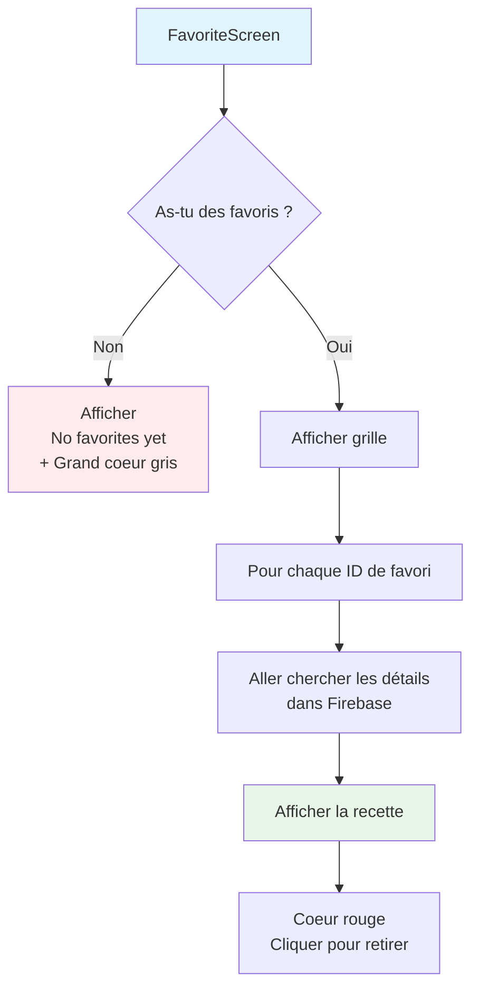

**Ce qu'il fait :**

1. **Demander au bibliothécaire**
   ```
   Écran : "Bibliothécaire, c'est quoi mes favoris ?"
   Bibliothécaire : "Tu as 3 favoris : recette_123, recette_456, recette_789"
   ```

2. **Si pas de favoris**
   ```
   Afficher un message :
   "No favorites yet"
   "Start adding recipes to your favorites!"
   + Un grand coeur gris
   ```

3. **Si tu as des favoris**
   ```
   Pour chaque ID de favori :
     1. Aller chercher les détails dans Firebase
     2. Afficher la recette avec photo, nom, temps, calories
     3. Mettre un coeur rouge (car c'est un favori)
   ```

4. **Cliquer sur le coeur rouge**
   ```
   Tu cliques → Demander au bibliothécaire de retirer
   Le bibliothécaire retire → La recette disparaît de l'écran
   ```

**Code simplifié :**
```dart
class FavoriteScreen {
  Widget build() {
    // Demander au bibliothécaire
    liste_favoris = FavoriteProvider.favorites;
    
    // Si vide
    if (liste_favoris est vide) {
      return "No favorites yet" + Coeur gris;
    }
    
    // Si pas vide
    return GridView(
      pour chaque id dans liste_favoris:
        // Aller chercher les détails
        FutureBuilder(
          données: Firebase.get_recette(id),
          
          affichage: (recette) {
            Container(
              Photo,
              Nom,
              Temps,
              Calories,
              
              Coeur rouge,
              Au clic → Retirer des favoris
            )
          }
        )
    );
  }
}
```

---

## 4. Comment ça communique ?

### Le flux complet en 5 étapes

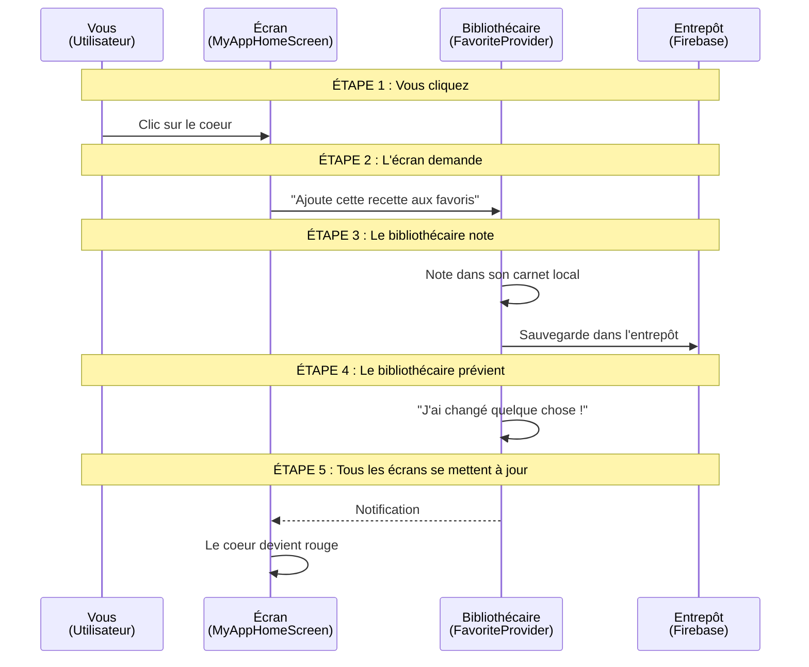

### Explication simple

1. **Vous cliquez sur un coeur**
   - "J'aime cette recette de cookies"

2. **L'écran demande au bibliothécaire**
   - "Bibliothécaire, ajoute les cookies à mes favoris"

3. **Le bibliothécaire fait 2 choses :**
   - Il note dans son carnet : "cookies = favori"
   - Il sauvegarde dans l'entrepôt Firebase pour ne pas oublier

4. **Le bibliothécaire crie**
   - "Hé tout le monde ! J'ai changé quelque chose !"

5. **Tous les écrans se mettent à jour**
   - L'écran d'accueil : "OK, je mets le coeur en rouge"
   - L'écran des favoris : "OK, j'ajoute les cookies à ma liste"

---

## 5. Les concepts clés expliqués simplement

### 5.1. Provider : Le bibliothécaire

**Question :** Pourquoi un bibliothécaire ?

**Sans bibliothécaire :**
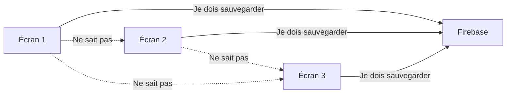

**Problèmes :**
- Chaque écran doit gérer Firebase tout seul
- Les écrans ne savent pas ce que font les autres
- Si vous ajoutez un favori sur l'écran 1, l'écran 2 ne le sait pas

**Avec bibliothécaire :**
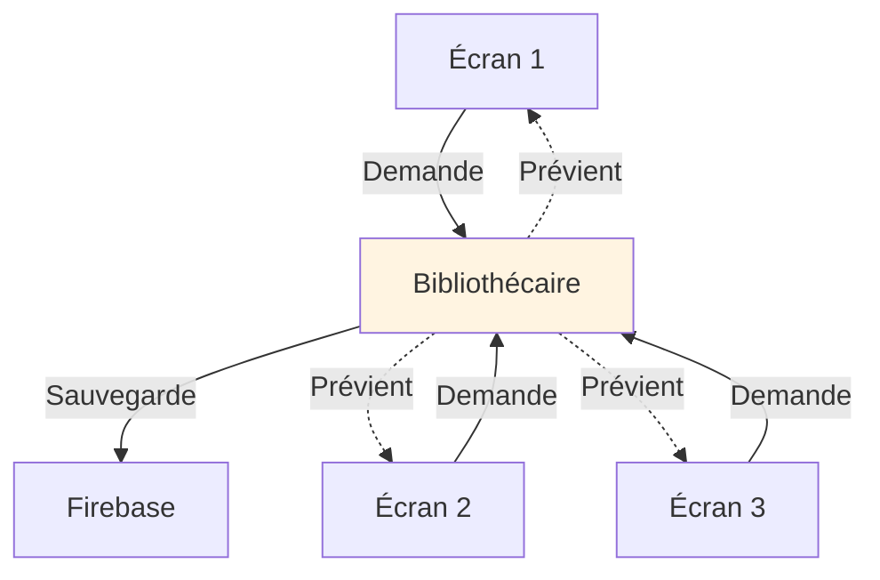

**Avantages :**
- Un seul responsable des favoris
- Tous les écrans voient les mêmes données
- Si un écran change quelque chose, tous sont prévenus

---

### 5.2. notifyListeners : Crier dans un mégaphone

**Analogie :**
Le bibliothécaire a un mégaphone. Quand il change quelque chose, il crie dedans.

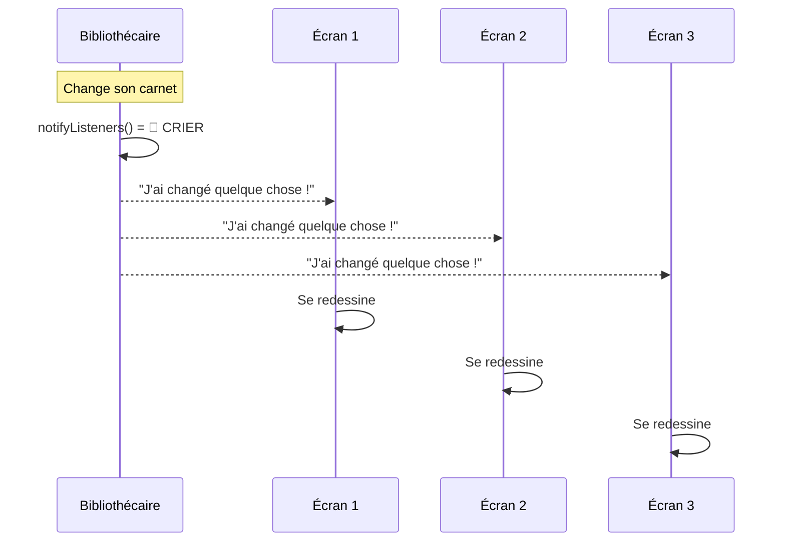

**En code :**
```dart
void toggleFavorite(recette) {
  _favoriteIds.add(recette_id);  // Change le carnet
  notifyListeners();              // 📢 CRIE dans le mégaphone
}
```

---

### 5.3. Consumer : L'oreille qui écoute

**Analogie :**
Un Consumer, c'est une oreille géante qui écoute le bibliothécaire.

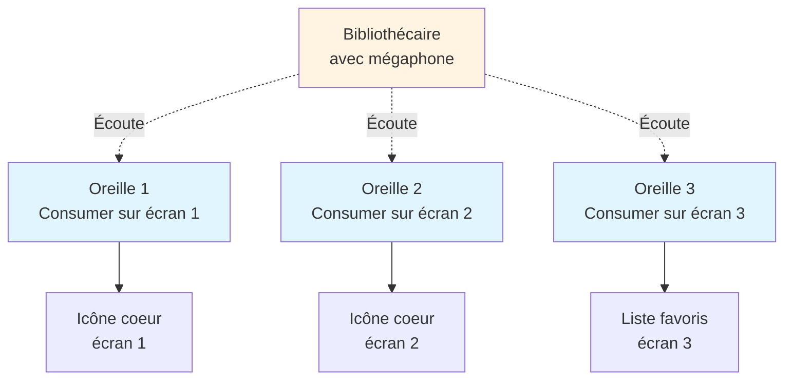

**En code :**
```dart
Consumer<FavoriteProvider>(
  // L'oreille écoute le bibliothécaire
  builder: (context, bibliothécaire, child) {
    // Demander au bibliothécaire
    bool est_favori = bibliothécaire.isFavorited(recette_id);
    
    // Dessiner le coeur
    return Icon(
      est_favori ? Coeur_rouge : Coeur_gris
    );
  }
)
```

**Que se passe-t-il ?**
1. Le Consumer écoute le bibliothécaire
2. Quand le bibliothécaire crie (notifyListeners), le Consumer l'entend
3. Le Consumer se redessine automatiquement

---

### 5.4. StreamBuilder : La radio en continu

**Analogie :**
Imaginez une radio qui diffuse en direct. Dès qu'il y a une nouvelle info, vous l'entendez.

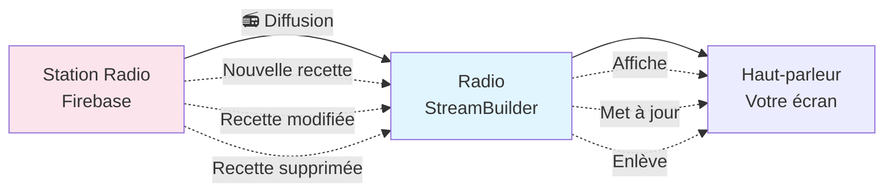

**En code :**
```dart
StreamBuilder(
  stream: Firebase.recettes.snapshots(),  // 📻 Écouter la radio
  builder: (context, données) {
    // Afficher les données reçues
    return ListView(données);
  }
)
```

**Quand l'utiliser ?**
- Pour afficher une liste qui peut changer à tout moment
- Exemple : liste des recettes, liste des catégories

---

### 5.5. FutureBuilder : Commander par téléphone

**Analogie :**
Vous appelez un restaurant pour commander. Vous attendez. Puis le livreur arrive avec votre commande.

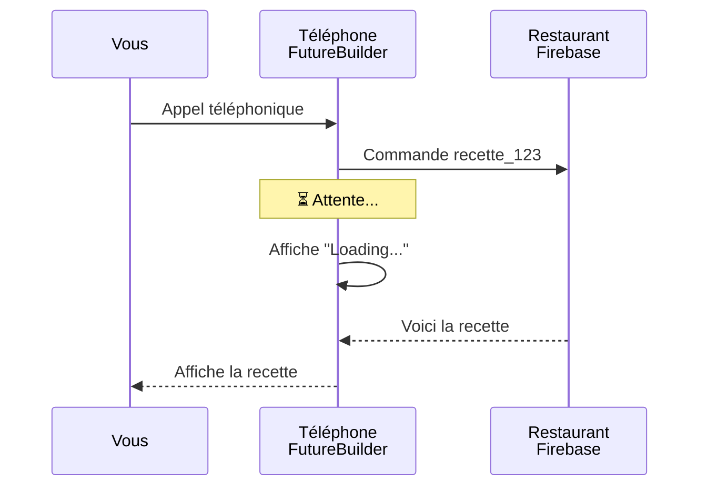

**En code :**
```dart
FutureBuilder(
  future: Firebase.get_recette(id),  // 📞 Commander
  builder: (context, données) {
    if (données pas encore arrivées) {
      return "Loading...";  // ⏳ Attendre
    }
    return Afficher(données);  // ✅ Afficher
  }
)
```

**Quand l'utiliser ?**
- Pour récupérer UNE SEULE FOIS des données
- Exemple : détails d'une recette spécifique

---

## 6. Résumé : Les acteurs de votre application

### Les 5 personnages principaux

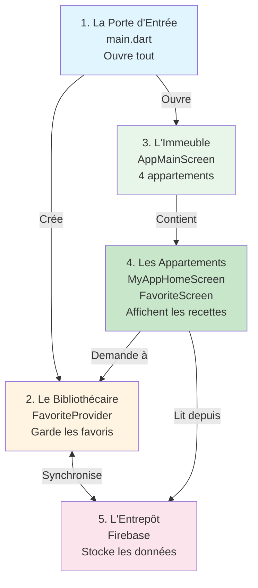

### Tableau récapitulatif

| Personnage | Fichier | Rôle | Analogie |
|------------|---------|------|----------|
| La Porte | main.dart | Démarre tout | Interrupteur principal |
| Le Bibliothécaire | favorite_provider.dart | Gère les favoris | Carnet + mégaphone |
| L'Immeuble | AppMainScreen | Navigation | 4 appartements |
| Les Appartements | MyAppHomeScreen, FavoriteScreen | Affichage | Salles de lecture |
| L'Entrepôt | Firebase Firestore | Stockage | Bibliothèque externe |

---

## 7. Exercice : Suivre un favori de bout en bout

### Scénario : Vous aimez une recette de cookies

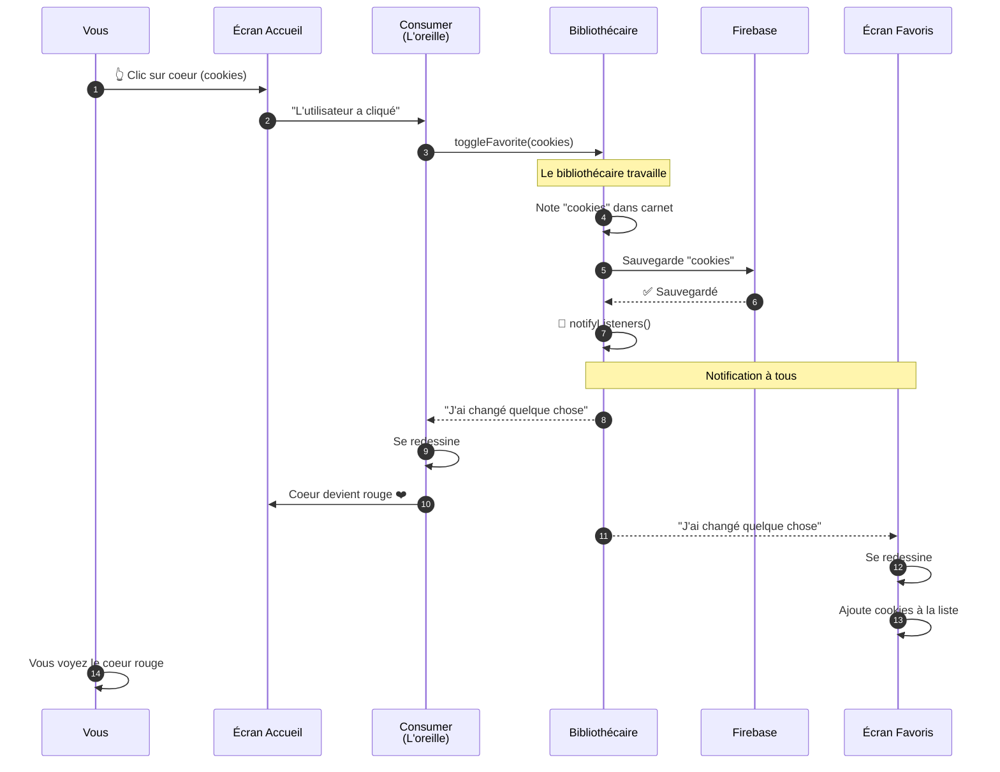

### Étapes détaillées

1. **Vous cliquez sur le coeur**
   - La recette de cookies a l'air délicieuse
   - Vous cliquez sur le coeur vide à côté

2. **Le Consumer entend le clic**
   - Le Consumer (l'oreille) est déclenché
   - Il appelle `toggleFavorite(cookies)`

3. **Le bibliothécaire note**
   - Le bibliothécaire prend son carnet
   - Il écrit : "cookies = favori"

4. **Le bibliothécaire sauvegarde**
   - Il envoie l'info à Firebase (l'entrepôt)
   - Firebase répond : "OK, sauvegardé"

5. **Le bibliothécaire crie**
   - Il prend son mégaphone
   - Il crie : "J'ai changé quelque chose !"
   - C'est `notifyListeners()`

6. **Tous les Consumers entendent**
   - Le Consumer sur l'écran d'accueil : "J'ai entendu !"
   - Le Consumer sur l'écran favoris : "Moi aussi !"

7. **Tous se redessinent**
   - Écran d'accueil : Le coeur devient rouge ❤️
   - Écran favoris : Les cookies apparaissent dans la liste

8. **Vous voyez le changement**
   - Le coeur est maintenant rouge
   - Si vous allez dans "Favoris", les cookies sont là

---

## 8. Questions fréquentes

### Q1 : Pourquoi le coeur change de couleur tout seul ?

**Réponse simple :**
Grâce à `notifyListeners()`. C'est comme un mégaphone qui prévient tous les écrans.

**Détails :**
1. Vous cliquez → Le bibliothécaire change son carnet
2. Le bibliothécaire crie → `notifyListeners()`
3. Le Consumer entend → Se redessine automatiquement
4. Le coeur change de couleur → Rouge si favori, gris sinon

---

### Q2 : Comment l'écran des favoris sait quelles recettes afficher ?

**Réponse simple :**
Il demande au bibliothécaire : "C'est quoi mes favoris ?"

**Détails :**
```
Écran Favoris : "Bibliothécaire, donne-moi mes favoris"
Bibliothécaire : "Tu as 3 favoris : cookies, pizza, salade"
Écran Favoris : "OK, je vais chercher les détails"
Firebase : "Voici les détails de cookies, pizza, salade"
Écran Favoris : "Je les affiche"
```

---

### Q3 : Que se passe-t-il si je ferme l'app ?

**Réponse simple :**
Vos favoris sont sauvegardés dans Firebase (l'entrepôt).

**Détails :**
1. Vous fermez l'app → Le carnet du bibliothécaire disparaît
2. Vous rouvrez l'app → Le bibliothécaire va chercher dans Firebase
3. Firebase donne les favoris → Le bibliothécaire remplit son carnet
4. Tout redevient comme avant → Vos coeurs sont toujours rouges

---

### Q4 : Pourquoi plusieurs fichiers ? On ne peut pas tout mettre dans un seul ?

**Réponse simple :**
Imaginez un livre de 1000 pages sans chapitres. Impossible à lire !

**Analogie :**
```
Un seul fichier = Une seule immense pièce dans une maison
  → Difficile à ranger
  → Difficile à retrouver quelque chose
  → Le bazar

Plusieurs fichiers = Plusieurs pièces
  → Cuisine, salon, chambre, salle de bain
  → Chaque chose à sa place
  → Facile à retrouver
```

---

### Q5 : C'est quoi la différence entre StreamBuilder et FutureBuilder ?

**Réponse simple :**
- **StreamBuilder** = Radio en direct (infos en continu)
- **FutureBuilder** = Appel téléphonique (une seule info)

**Exemples :**
```
StreamBuilder : 
  Liste des recettes → Peut changer à tout moment
  Si quelqu'un ajoute une recette → Vous la voyez immédiatement

FutureBuilder :
  Détails d'UNE recette → Ne change pas souvent
  Vous demandez une fois → Vous affichez le résultat
```

---

## 9. Pour aller plus loin

### Ce que vous avez appris

Félicitations ! Vous comprenez maintenant :

- [x] L'organisation du projet en fichiers
- [x] Le rôle du Provider (le bibliothécaire)
- [x] Comment les écrans communiquent
- [x] Le flux de données de bout en bout
- [x] Les concepts de base (Consumer, notifyListeners, etc.)

### Prochaines étapes suggérées

1. **Regarder le code en vrai**
   - Ouvrir `lib/Provider/favorite_provider.dart`
   - Chercher `notifyListeners()` dans le code
   - Comprendre où il est appelé

2. **Suivre un favori dans le code**
   - Ouvrir `lib/Views/app_main_screen.dart`
   - Chercher `Consumer<FavoriteProvider>`
   - Voir comment il utilise `toggleFavorite`

3. **Lire les guides détaillés**
   - `05-GUIDE_ARCHITECTURE_COMPLETE.md` pour plus de détails
   - `07-GUIDE_VISUEL_CODE_SOURCE.md` pour voir le code ligne par ligne

4. **Expérimenter**
   - Ajouter un `print()` dans `toggleFavorite`
   - Lancer l'app et voir dans la console
   - Observer le message quand vous cliquez sur un coeur

---

## 10. Schéma final : Vue d'ensemble

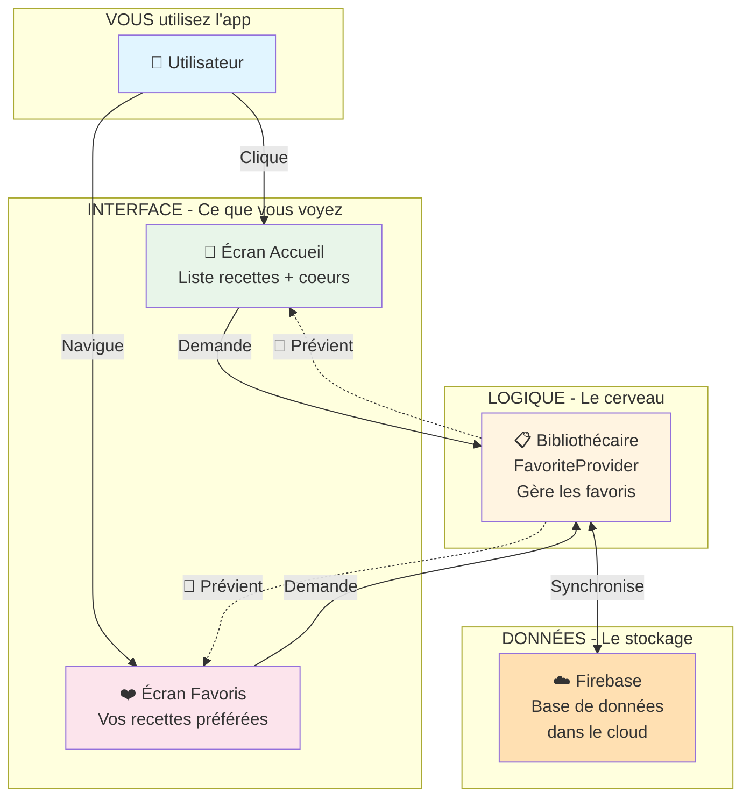

### Les 3 couches

1. **INTERFACE (Ce que vous voyez)**
   - Les écrans, les boutons, les images
   - `app_main_screen.dart`, `favorite_screen.dart`

2. **LOGIQUE (Le cerveau)**
   - Le bibliothécaire qui gère tout
   - `favorite_provider.dart`

3. **DONNÉES (Le stockage)**
   - Firebase qui garde en mémoire
   - Base de données dans le cloud

---

## Conclusion

Votre application Flutter est bien organisée comme une bibliothèque :
- Un **bibliothécaire** (Provider) qui gère les favoris
- Des **salles de lecture** (Écrans) où vous consultez les recettes
- Un **entrepôt** (Firebase) qui stocke tout

Quand vous cliquez sur un coeur :
1. Le Consumer entend le clic
2. Le bibliothécaire note dans son carnet
3. Le bibliothécaire crie dans son mégaphone
4. Tous les écrans se mettent à jour
5. Le coeur devient rouge

C'est ça, la magie du Provider !

---

**Prochaine lecture recommandée :**
- Pour des explications avec code : `05-GUIDE_ARCHITECTURE_COMPLETE.md`
- Pour voir le code ligne par ligne : `07-GUIDE_VISUEL_CODE_SOURCE.md`

