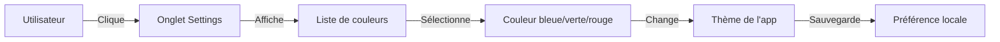
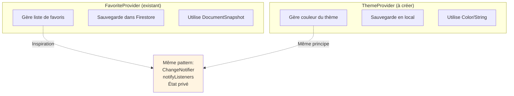
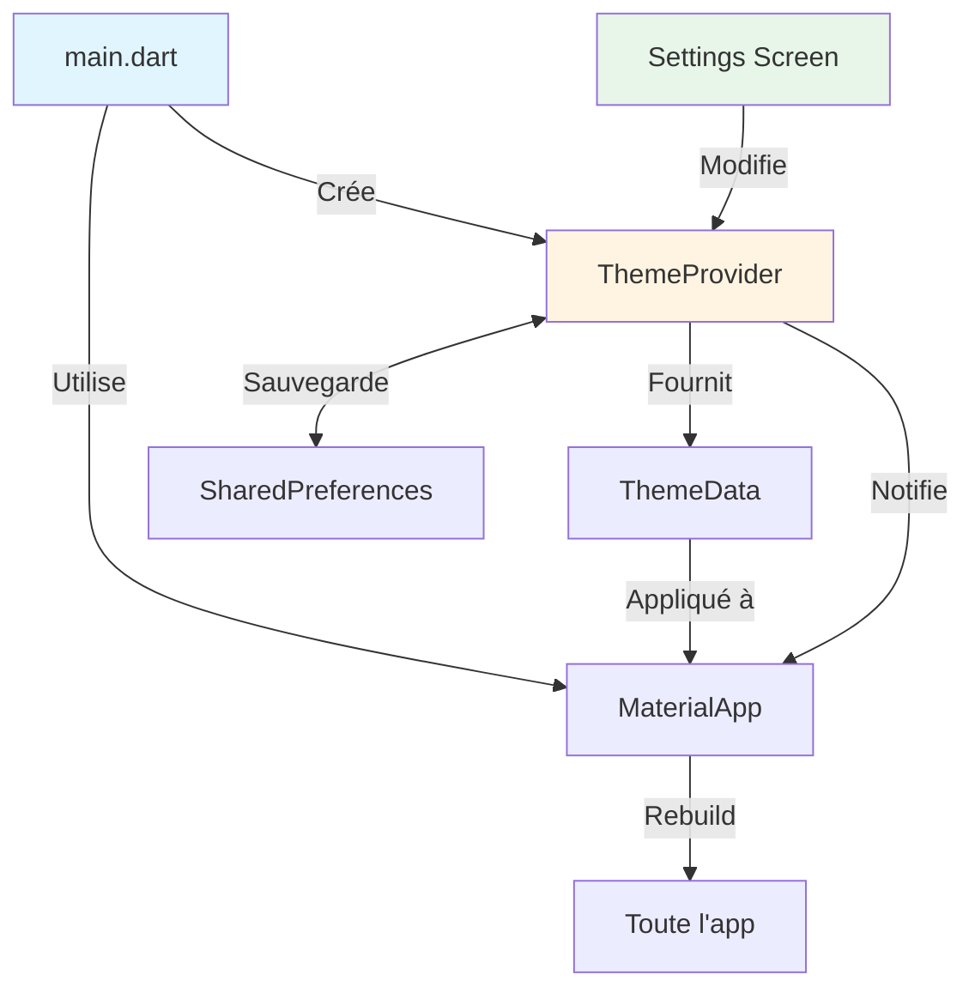
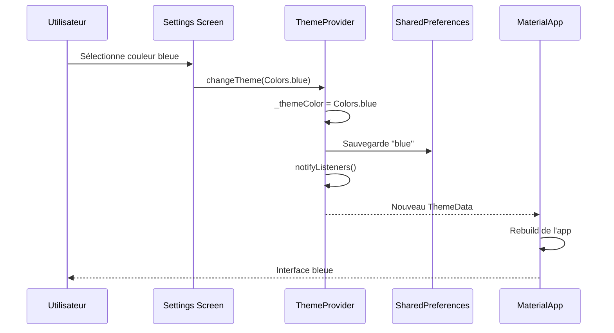
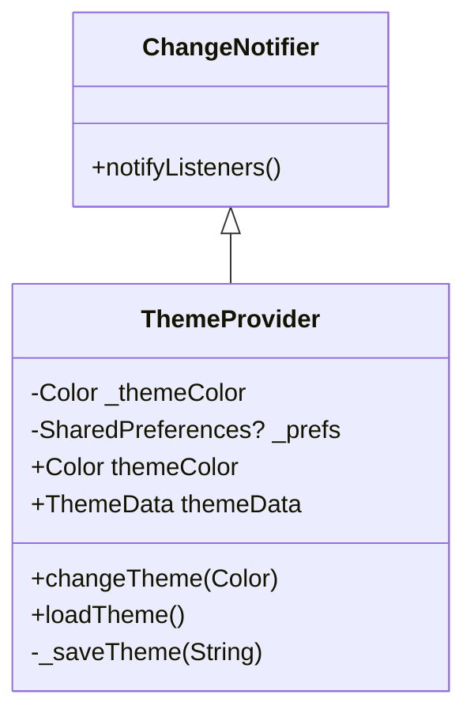
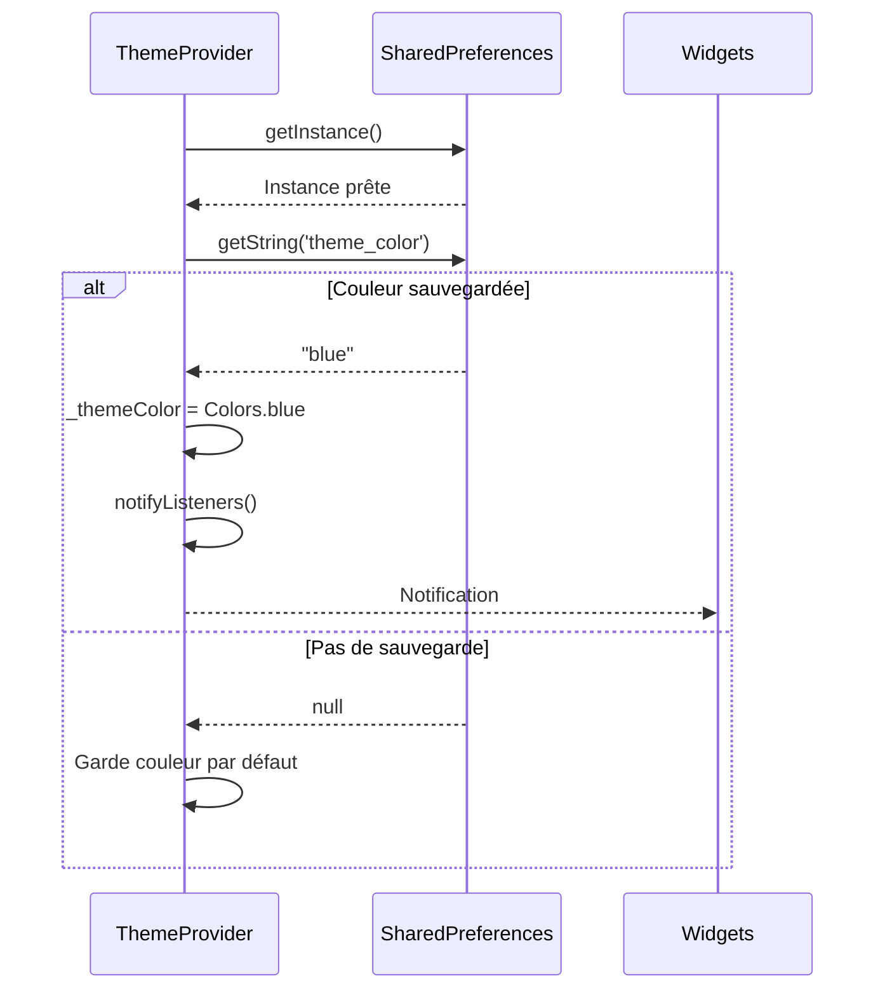
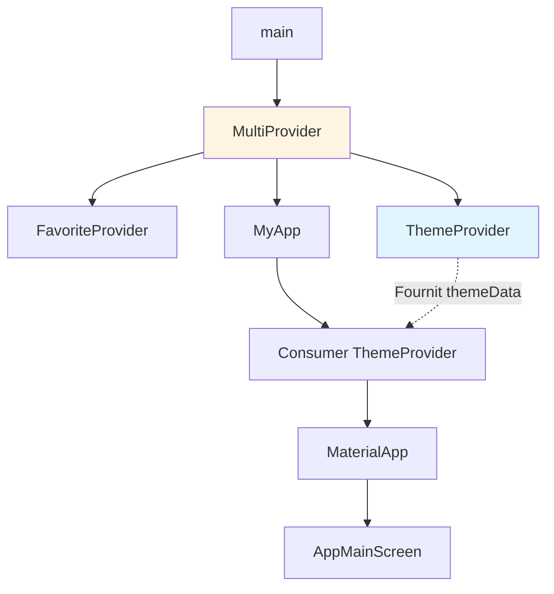
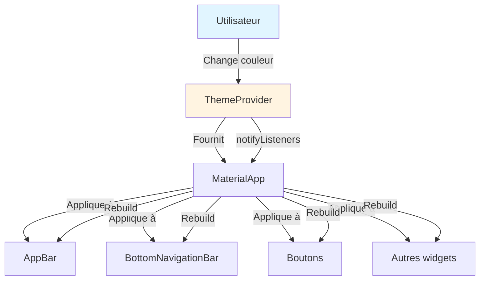
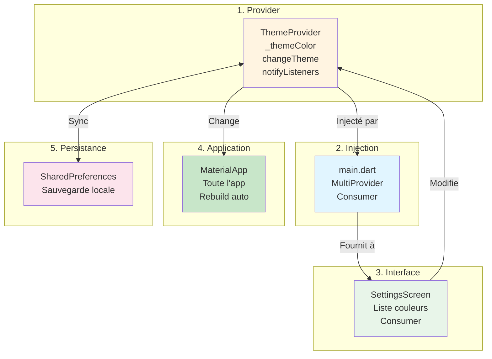

# Exercice Pratique : Créer un ThemeProvider

## Objectif de l'exercice

Créer un Provider pour changer la couleur du thème de l'application depuis l'onglet Settings. Cet exercice vous permettra de :
- Appliquer les concepts appris avec FavoriteProvider
- Créer un Provider de A à Z
- Gérer l'état global du thème
- Sauvegarder les préférences utilisateur

**Note** : Ceci est un guide théorique. Vous pouvez le suivre pour implémenter la fonctionnalité plus tard.

---

## Table des matières

1. [Analyse du besoin](#1-analyse-du-besoin)
2. [Architecture de la solution](#2-architecture-de-la-solution)
3. [Étape 1 : Créer le ThemeProvider](#3-étape-1--créer-le-themeprovider)
4. [Étape 2 : Injecter le Provider](#4-étape-2--injecter-le-provider)
5. [Étape 3 : Créer l'interface Settings](#5-étape-3--créer-linterface-settings)
6. [Étape 4 : Utiliser le thème](#6-étape-4--utiliser-le-thème)
7. [Pour aller plus loin](#7-pour-aller-plus-loin)

---

## 1. Analyse du besoin

### Ce que nous voulons faire



### Fonctionnalités requises

1. **Afficher** : Liste de couleurs disponibles dans Settings
2. **Changer** : Modifier le thème en temps réel
3. **Sauvegarder** : Persister le choix de l'utilisateur
4. **Restaurer** : Charger la couleur au démarrage

### Comparaison avec FavoriteProvider



**Similarités** :
- Extends ChangeNotifier
- État privé avec getter public
- Méthodes pour modifier l'état
- Appel à notifyListeners()

**Différences** :
- Type de données (Color au lieu de List)
- Stockage local (SharedPreferences au lieu de Firestore)
- Une seule valeur au lieu d'une liste

---

## 2. Architecture de la solution

### Vue d'ensemble



### Structure des fichiers

```
lib/
├── main.dart                          # Injection du ThemeProvider
├── Provider/
│   ├── favorite_provider.dart         # Existant
│   └── theme_provider.dart            # À créer
└── Views/
    └── app_main_screen.dart           # Onglet 3 : Settings
```

### Flux de données



---

## 3. Étape 1 : Créer le ThemeProvider

### Diagramme de classe



### Code à créer

**Fichier** : `lib/Provider/theme_provider.dart`

```dart
import 'package:flutter/material.dart';
import 'package:shared_preferences/shared_preferences.dart';

class ThemeProvider extends ChangeNotifier {
  // ÉTAPE 1.1 : Variables privées
  Color _themeColor = Colors.blue;  // Couleur par défaut
  SharedPreferences? _prefs;
  
  // ÉTAPE 1.2 : Getters publics
  Color get themeColor => _themeColor;
  
  // Getter pour ThemeData complet
  ThemeData get themeData => ThemeData(
    primarySwatch: _getMaterialColor(_themeColor),
    primaryColor: _themeColor,
    appBarTheme: AppBarTheme(
      backgroundColor: _themeColor,
    ),
  );
  
  // ÉTAPE 1.3 : Constructeur avec chargement initial
  ThemeProvider() {
    loadTheme();
  }
  
  // ÉTAPE 1.4 : Charger le thème sauvegardé
  Future<void> loadTheme() async {
    _prefs = await SharedPreferences.getInstance();
    String? savedColor = _prefs?.getString('theme_color');
    
    if (savedColor != null) {
      _themeColor = _getColorFromString(savedColor);
      notifyListeners();
    }
  }
  
  // ÉTAPE 1.5 : Changer le thème
  Future<void> changeTheme(Color newColor) async {
    _themeColor = newColor;
    await _saveTheme(newColor);
    notifyListeners();  // Important !
  }
  
  // ÉTAPE 1.6 : Sauvegarder le thème
  Future<void> _saveTheme(Color color) async {
    String colorString = _getStringFromColor(color);
    await _prefs?.setString('theme_color', colorString);
  }
  
  // ÉTAPE 1.7 : Utilitaires de conversion
  Color _getColorFromString(String colorString) {
    switch (colorString) {
      case 'blue':
        return Colors.blue;
      case 'green':
        return Colors.green;
      case 'red':
        return Colors.red;
      case 'purple':
        return Colors.purple;
      case 'orange':
        return Colors.orange;
      default:
        return Colors.blue;
    }
  }
  
  String _getStringFromColor(Color color) {
    if (color == Colors.blue) return 'blue';
    if (color == Colors.green) return 'green';
    if (color == Colors.red) return 'red';
    if (color == Colors.purple) return 'purple';
    if (color == Colors.orange) return 'orange';
    return 'blue';
  }
  
  // Convertir Color en MaterialColor
  MaterialColor _getMaterialColor(Color color) {
    if (color == Colors.blue) return Colors.blue;
    if (color == Colors.green) return Colors.green;
    if (color == Colors.red) return Colors.red;
    if (color == Colors.purple) return Colors.purple;
    if (color == Colors.orange) return Colors.orange;
    return Colors.blue;
  }
}
```

### Explications détaillées

#### Variables privées (Étape 1.1)

```dart
Color _themeColor = Colors.blue;  // État : couleur actuelle
SharedPreferences? _prefs;        // Pour sauvegarder localement
```

**Pourquoi privées ?**
- Protection des données
- Contrôle des modifications
- Encapsulation

#### Getters publics (Étape 1.2)

```dart
Color get themeColor => _themeColor;           // Couleur seule
ThemeData get themeData => ThemeData(...);     // Thème complet
```

**Deux getters différents** :
- `themeColor` : Pour afficher dans l'interface
- `themeData` : Pour MaterialApp

#### Chargement initial (Étape 1.4)



#### Changement de thème (Étape 1.5)

```dart
Future<void> changeTheme(Color newColor) async {
  _themeColor = newColor;          // 1. Change localement
  await _saveTheme(newColor);      // 2. Sauvegarde
  notifyListeners();               // 3. Notifie tout le monde
}
```

**L'ordre est important** :
1. Modifier l'état local d'abord
2. Sauvegarder pour la persistance
3. Notifier pour rebuild

---

## 4. Étape 2 : Injecter le Provider

### Modification de main.dart

**Avant** (avec un seul Provider) :

```dart
void main() async {
  WidgetsFlutterBinding.ensureInitialized();
  await Firebase.initializeApp(
    options: DefaultFirebaseOptions.currentPlatform,
  );
  
  runApp(
    ChangeNotifierProvider(
      create: (context) => FavoriteProvider()..loadFavorites(),
      child: const MyApp(),
    ),
  );
}
```

**Après** (avec deux Providers) :

```dart
import 'Provider/theme_provider.dart';  // Ajouter cet import

void main() async {
  WidgetsFlutterBinding.ensureInitialized();
  await Firebase.initializeApp(
    options: DefaultFirebaseOptions.currentPlatform,
  );
  
  runApp(
    MultiProvider(
      providers: [
        ChangeNotifierProvider(
          create: (context) => FavoriteProvider()..loadFavorites(),
        ),
        ChangeNotifierProvider(
          create: (context) => ThemeProvider(),
        ),
      ],
      child: const MyApp(),
    ),
  );
}
```

### Utiliser le thème dans MyApp

**Avant** :

```dart
class MyApp extends StatelessWidget {
  const MyApp({super.key});

  @override
  Widget build(BuildContext context) {
    return MaterialApp(
      title: 'Flutter Demo',
      debugShowCheckedModeBanner: false,
      theme: ThemeData(
        primarySwatch: Colors.blue,  // Thème fixe
      ),
      home: const AppMainScreen(),
    );
  }
}
```

**Après** :

```dart
class MyApp extends StatelessWidget {
  const MyApp({super.key});

  @override
  Widget build(BuildContext context) {
    return Consumer<ThemeProvider>(
      builder: (context, themeProvider, child) {
        return MaterialApp(
          title: 'Flutter Demo',
          debugShowCheckedModeBanner: false,
          theme: themeProvider.themeData,  // Thème dynamique
          home: const AppMainScreen(),
        );
      },
    );
  }
}
```

### Diagramme de la structure



---

## 5. Étape 3 : Créer l'interface Settings

### Localisation

Dans `app_main_screen.dart`, l'onglet 3 (Settings) affiche actuellement :

```dart
body: selectedIndex == 0
    ? const MyAppHomeScreen()
    : selectedIndex == 1
        ? const FavoriteScreen()
        : Center(child: Text("Page index: $selectedIndex")),
```

**À modifier** :

```dart
body: selectedIndex == 0
    ? const MyAppHomeScreen()
    : selectedIndex == 1
        ? const FavoriteScreen()
        : selectedIndex == 3
            ? const SettingsScreen()  // Nouvel écran
            : Center(child: Text("Page index: $selectedIndex")),
```

### Créer SettingsScreen

**Nouveau fichier** : `lib/Views/settings_screen.dart`

```dart
import 'package:flutter/material.dart';
import 'package:provider/provider.dart';
import '../Provider/theme_provider.dart';

class SettingsScreen extends StatelessWidget {
  const SettingsScreen({Key? key}) : super(key: key);

  @override
  Widget build(BuildContext context) {
    return Scaffold(
      backgroundColor: Colors.white,
      appBar: AppBar(
        title: const Text(
          'Settings',
          style: TextStyle(
            fontSize: 24,
            fontWeight: FontWeight.bold,
          ),
        ),
      ),
      body: Padding(
        padding: const EdgeInsets.all(20),
        child: Column(
          crossAxisAlignment: CrossAxisAlignment.start,
          children: [
            const Text(
              'Choisir un thème',
              style: TextStyle(
                fontSize: 20,
                fontWeight: FontWeight.bold,
              ),
            ),
            const SizedBox(height: 20),
            const Text(
              'Sélectionnez une couleur pour personnaliser votre application',
              style: TextStyle(
                fontSize: 14,
                color: Colors.grey,
              ),
            ),
            const SizedBox(height: 30),
            
            // Liste des couleurs disponibles
            Consumer<ThemeProvider>(
              builder: (context, themeProvider, child) {
                return Column(
                  children: [
                    _buildColorOption(
                      context,
                      'Bleu',
                      Colors.blue,
                      Icons.water_drop,
                      themeProvider,
                    ),
                    _buildColorOption(
                      context,
                      'Vert',
                      Colors.green,
                      Icons.eco,
                      themeProvider,
                    ),
                    _buildColorOption(
                      context,
                      'Rouge',
                      Colors.red,
                      Icons.favorite,
                      themeProvider,
                    ),
                    _buildColorOption(
                      context,
                      'Violet',
                      Colors.purple,
                      Icons.auto_awesome,
                      themeProvider,
                    ),
                    _buildColorOption(
                      context,
                      'Orange',
                      Colors.orange,
                      Icons.sunny,
                      themeProvider,
                    ),
                  ],
                );
              },
            ),
          ],
        ),
      ),
    );
  }

  Widget _buildColorOption(
    BuildContext context,
    String name,
    Color color,
    IconData icon,
    ThemeProvider themeProvider,
  ) {
    bool isSelected = themeProvider.themeColor == color;

    return GestureDetector(
      onTap: () {
        themeProvider.changeTheme(color);
      },
      child: Container(
        margin: const EdgeInsets.only(bottom: 15),
        padding: const EdgeInsets.all(15),
        decoration: BoxDecoration(
          color: isSelected ? color.withOpacity(0.1) : Colors.grey[100],
          borderRadius: BorderRadius.circular(15),
          border: Border.all(
            color: isSelected ? color : Colors.grey[300]!,
            width: isSelected ? 2 : 1,
          ),
        ),
        child: Row(
          children: [
            // Icône de la couleur
            Container(
              padding: const EdgeInsets.all(10),
              decoration: BoxDecoration(
                color: color,
                shape: BoxShape.circle,
              ),
              child: Icon(
                icon,
                color: Colors.white,
                size: 24,
              ),
            ),
            const SizedBox(width: 15),
            
            // Nom de la couleur
            Expanded(
              child: Text(
                name,
                style: TextStyle(
                  fontSize: 16,
                  fontWeight: isSelected ? FontWeight.bold : FontWeight.normal,
                  color: isSelected ? color : Colors.black,
                ),
              ),
            ),
            
            // Indicateur de sélection
            if (isSelected)
              Icon(
                Icons.check_circle,
                color: color,
                size: 28,
              ),
          ],
        ),
      ),
    );
  }
}
```

### Interface visuelle

```
┌─────────────────────────────────────┐
│  ←  Settings                        │
├─────────────────────────────────────┤
│                                     │
│  Choisir un thème                   │
│                                     │
│  Sélectionnez une couleur pour      │
│  personnaliser votre application    │
│                                     │
│  ┌───────────────────────────────┐  │
│  │ 🔵  Bleu              ✓       │  │
│  └───────────────────────────────┘  │
│                                     │
│  ┌───────────────────────────────┐  │
│  │ 🟢  Vert                      │  │
│  └───────────────────────────────┘  │
│                                     │
│  ┌───────────────────────────────┐  │
│  │ 🔴  Rouge                     │  │
│  └───────────────────────────────┘  │
│                                     │
│  ┌───────────────────────────────┐  │
│  │ 🟣  Violet                    │  │
│  └───────────────────────────────┘  │
│                                     │
│  ┌───────────────────────────────┐  │
│  │ 🟠  Orange                    │  │
│  └───────────────────────────────┘  │
│                                     │
└─────────────────────────────────────┘
```

---

## 6. Étape 4 : Utiliser le thème

### Propagation du thème



### Ce qui change automatiquement

Quand vous changez le thème dans Settings, ces éléments se mettent à jour automatiquement :

1. **AppBar** : Couleur de fond
2. **BottomNavigationBar** : Couleur de sélection
3. **Boutons** : Couleur primaire
4. **Icônes sélectionnées** : Couleur d'accentuation
5. **Textes importants** : Couleur primaire

### Exemple d'utilisation dans un widget

```dart
// Le thème est automatiquement disponible
Container(
  color: Theme.of(context).primaryColor,  // Utilise la couleur du thème
  child: Text(
    'Titre',
    style: Theme.of(context).textTheme.headline6,  // Utilise le style du thème
  ),
)
```

---

## 7. Pour aller plus loin

### Ajouter un mode sombre

```dart
class ThemeProvider extends ChangeNotifier {
  bool _isDarkMode = false;
  
  bool get isDarkMode => _isDarkMode;
  
  ThemeData get themeData => _isDarkMode
      ? ThemeData.dark().copyWith(primaryColor: _themeColor)
      : ThemeData.light().copyWith(primaryColor: _themeColor);
  
  void toggleDarkMode() {
    _isDarkMode = !_isDarkMode;
    notifyListeners();
  }
}
```

### Ajouter des couleurs personnalisées

```dart
// Permettre à l'utilisateur de créer sa propre couleur
void setCustomColor(int r, int g, int b) {
  _themeColor = Color.fromRGBO(r, g, b, 1.0);
  notifyListeners();
}
```

### Sauvegarder plus d'options

```dart
class ThemeProvider extends ChangeNotifier {
  Color _themeColor = Colors.blue;
  bool _isDarkMode = false;
  double _fontSize = 14.0;
  
  // Sauvegarder tout dans SharedPreferences
  Future<void> saveAllSettings() async {
    await _prefs?.setString('theme_color', _getStringFromColor(_themeColor));
    await _prefs?.setBool('dark_mode', _isDarkMode);
    await _prefs?.setDouble('font_size', _fontSize);
  }
}
```

---

## Résumé : Checklist de l'exercice

### Phase 1 : Création du Provider

- [ ] Créer le fichier `theme_provider.dart`
- [ ] Définir les variables privées (_themeColor, _prefs)
- [ ] Créer les getters (themeColor, themeData)
- [ ] Implémenter loadTheme() pour le chargement initial
- [ ] Implémenter changeTheme() avec notifyListeners()
- [ ] Créer les méthodes utilitaires de conversion

### Phase 2 : Injection

- [ ] Modifier main.dart pour utiliser MultiProvider
- [ ] Ajouter ThemeProvider dans la liste des providers
- [ ] Wrapper MyApp avec Consumer<ThemeProvider>
- [ ] Utiliser themeProvider.themeData dans MaterialApp

### Phase 3 : Interface

- [ ] Créer le fichier `settings_screen.dart`
- [ ] Créer l'interface avec liste de couleurs
- [ ] Utiliser Consumer<ThemeProvider> pour écouter les changements
- [ ] Implémenter _buildColorOption() pour chaque couleur
- [ ] Ajouter l'indicateur de sélection (check)

### Phase 4 : Intégration

- [ ] Modifier app_main_screen.dart pour afficher SettingsScreen
- [ ] Tester le changement de couleur
- [ ] Vérifier la sauvegarde (fermer/rouvrir l'app)
- [ ] Vérifier que toute l'app change de couleur

---

## Diagramme récapitulatif



---

## Comparaison : FavoriteProvider vs ThemeProvider

| Aspect | FavoriteProvider | ThemeProvider |
|--------|------------------|---------------|
| **Type de donnée** | List<String> | Color |
| **Stockage** | Firestore (cloud) | SharedPreferences (local) |
| **Portée** | Écrans spécifiques | Toute l'application |
| **Rebuild** | Widgets avec Consumer | MaterialApp + descendants |
| **Complexité** | Moyenne (liste + Firebase) | Simple (valeur unique + local) |
| **Pattern** | Même : ChangeNotifier + notifyListeners() | Même : ChangeNotifier + notifyListeners() |

---

## Conclusion

Cet exercice vous a permis de :

1. **Appliquer** les concepts du Provider
2. **Créer** un Provider de A à Z
3. **Comprendre** MultiProvider pour plusieurs Providers
4. **Gérer** la persistance locale avec SharedPreferences
5. **Construire** une interface utilisateur réactive

**Différences clés avec FavoriteProvider** :
- Données plus simples (une couleur vs une liste)
- Stockage local au lieu de cloud
- Impact sur toute l'app au lieu de quelques widgets

**Concepts communs** :
- ChangeNotifier
- notifyListeners()
- Consumer / Provider.of
- État privé + getters publics

Vous pouvez maintenant créer n'importe quel type de Provider pour gérer l'état de votre application !

