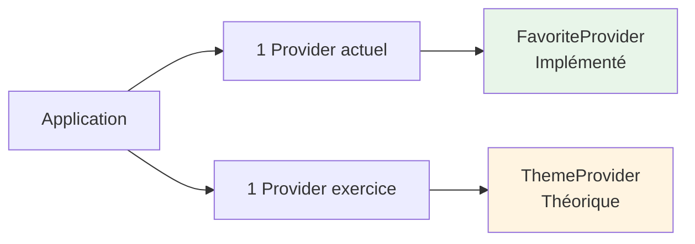

# Tableau Récapitulatif des Providers

## Vue d'ensemble



## Tableau comparatif

| Provider | État | Localisation | Données gérées | Stockage | Où utilisé |
|----------|------|--------------|----------------|----------|------------|
| **FavoriteProvider** | ✅ Implémenté | `lib/Provider/favorite_provider.dart` | Liste d'IDs de favoris (`List<String>`) | Firestore (cloud) | - MyAppHomeScreen<br/>- FavoriteScreen<br/>- ViewAllItems |
| **ThemeProvider** | 📚 Exercice | `lib/Provider/theme_provider.dart` | Couleur du thème (`Color`) | SharedPreferences (local) | - MaterialApp (toute l'app)<br/>- SettingsScreen |

## Injection dans main.dart

### Actuellement (1 Provider)

```dart
ChangeNotifierProvider(
  create: (context) => FavoriteProvider()..loadFavorites(),
  child: const MyApp(),
)
```

### Avec l'exercice (2 Providers)

```dart
MultiProvider(
  providers: [
    ChangeNotifierProvider(create: (context) => FavoriteProvider()..loadFavorites()),
    ChangeNotifierProvider(create: (context) => ThemeProvider()),
  ],
  child: const MyApp(),
)
```

## Statistiques

| Métrique | Valeur |
|----------|--------|
| **Providers implémentés** | 1 |
| **Providers en exercice** | 1 |
| **Total possible** | 2 |
| **Lignes de code (FavoriteProvider)** | 60 lignes |
| **Lignes de code (ThemeProvider)** | ~100 lignes |
| **Écrans utilisant FavoriteProvider** | 3 |
| **Écrans utilisant ThemeProvider** | Tous (via MaterialApp) |

## Points communs

Les 2 providers partagent :
- Extends `ChangeNotifier`
- Méthode `notifyListeners()`
- Variables privées (`_`)
- Getters publics
- Chargement initial
- Sauvegarde des données

## Différences clés

| Aspect | FavoriteProvider | ThemeProvider |
|--------|------------------|---------------|
| **Complexité** | Moyenne | Simple |
| **Type de donnée** | Liste | Valeur unique |
| **Portée** | Widgets spécifiques | Toute l'app |
| **Stockage** | Cloud (Firestore) | Local (SharedPreferences) |
| **Package requis** | `cloud_firestore` | `shared_preferences` |

