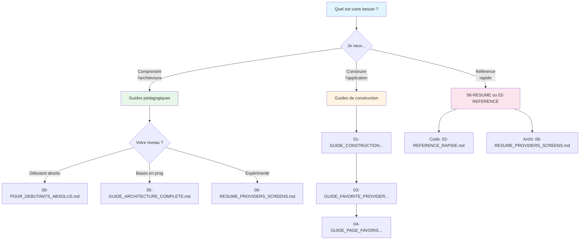

# PAR OÙ COMMENCER ? Guide Rapide

## Bienvenue dans la documentation du projet Flutter

Ce dossier contient **plusieurs types de guides** pour différents besoins.

---

## Vous voulez COMPRENDRE l'architecture ?

### Débutant absolu (sans expérience)

**Commencez par** : `08-POUR_DEBUTANTS_ABSOLUS.md`

- Explications sans jargon technique
- Analogies du quotidien (bibliothécaire, mégaphone, etc.)
- Diagrammes simples
- Questions-réponses

### Débutant en Flutter

**Commencez par** : `05-GUIDE_ARCHITECTURE_COMPLETE.md`

- Architecture complète expliquée
- 10 sections détaillées
- 20+ diagrammes Mermaid
- Code commenté ligne par ligne

### Besoin d'une info précise

**Consultez** : `06-RESUME_PROVIDERS_SCREENS.md`

- Localisation exacte de chaque élément
- Numéros de lignes dans les fichiers
- Tableaux récapitulatifs
- Checklist pour créer des Providers

### Analyser le code en détail

**Lisez** : `07-GUIDE_VISUEL_CODE_SOURCE.md`

- Code source complet ligne par ligne
- Diagrammes de classes et séquence
- 5 patterns expliqués
- Bonnes pratiques

---

## Vous voulez CONSTRUIRE l'application ?

### Construction étape par étape

**Suivez** : `01-GUIDE_CONSTRUCTION_ETAPE_PAR_ETAPE.md`

- 16 bouts de code numérotés
- Indications précises "OÙ AJOUTER"
- Interface ASCII à chaque étape
- Durée : 60 minutes

### Référence rapide (code uniquement)

**Utilisez** : `02-REFERENCE_RAPIDE.md`

- Tous les bouts de code sans explications
- Format ultra-condensé
- Pour copier-coller rapidement
- Durée : 30 minutes

### Ajouter le système de favoris

**Suivez** : `03-GUIDE_FAVORITE_PROVIDER.md`

- 9 étapes pour créer le Provider
- Sauvegarde dans Firestore
- UI mise à jour automatiquement
- Durée : 30 minutes

### Créer la page des favoris

**Suivez** : `04-GUIDE_PAGE_FAVORIS.md`

- 3 étapes simples
- GridView des recettes favorites
- Message si liste vide
- Durée : 15 minutes

---

## Navigation complète

**Index complet** : `00-INDEX.md`

Liste exhaustive de tous les documents avec :
- Parcours d'apprentissage recommandés
- Table de correspondance documentation/code
- Questions fréquentes avec références
- Glossaire des termes

---

## Récapitulatif récent

**Nouveaux guides créés** : `NOUVEAU_GUIDES_CREES.md`

Récapitulatif des 4 nouveaux guides créés avec :
- Descriptions détaillées
- Contenus et sections
- Statistiques (lignes, diagrammes, exemples)
- Parcours d'apprentissage

---

## Parcours recommandés

### Je veux comprendre le projet existant

```
1. 08-POUR_DEBUTANTS_ABSOLUS.md (si débutant absolu)
   OU
   05-GUIDE_ARCHITECTURE_COMPLETE.md (si bases en prog)
   ↓
2. 07-GUIDE_VISUEL_CODE_SOURCE.md (voir le code)
   ↓
3. 06-RESUME_PROVIDERS_SCREENS.md (aide-mémoire)
```

### Je veux construire l'application de zéro

```
1. 01-GUIDE_CONSTRUCTION_ETAPE_PAR_ETAPE.md (app de base)
   ↓
2. 03-GUIDE_FAVORITE_PROVIDER.md (système favoris)
   ↓
3. 04-GUIDE_PAGE_FAVORIS.md (page favoris)
   ↓
4. 05-GUIDE_ARCHITECTURE_COMPLETE.md (comprendre ce qu'on a fait)
```

### Je suis développeur expérimenté

```
1. 06-RESUME_PROVIDERS_SCREENS.md (vue rapide)
   ↓
2. 07-GUIDE_VISUEL_CODE_SOURCE.md (si besoin de détails)
```

---

## Liste complète des documents

### Nouveaux guides pédagogiques (créés récemment)

1. `05-GUIDE_ARCHITECTURE_COMPLETE.md` (1200 lignes)
2. `06-RESUME_PROVIDERS_SCREENS.md` (700 lignes)
3. `07-GUIDE_VISUEL_CODE_SOURCE.md` (1100 lignes)
4. `08-POUR_DEBUTANTS_ABSOLUS.md` (900 lignes)

### Guides de construction (existants)

1. `01-GUIDE_CONSTRUCTION_ETAPE_PAR_ETAPE.md` (1129 lignes)
2. `02-REFERENCE_RAPIDE.md` (référence code)
3. `03-GUIDE_FAVORITE_PROVIDER.md` (430 lignes)
4. `04-GUIDE_PAGE_FAVORIS.md` (page favoris)

### Index et navigation

1. `00-INDEX.md` (index complet mis à jour)
2. `00-README.md` (vue d'ensemble construction)
3. `NOUVEAU_GUIDES_CREES.md` (récapitulatif nouveautés)
4. `START_HERE.md` (ce fichier)

---

## Choix rapide selon votre besoin



---

## Statistiques de la documentation

### Guides pédagogiques

- 4 nouveaux documents
- ~4000 lignes de documentation
- 50+ diagrammes Mermaid
- 30+ exemples de code commentés
- 15+ concepts expliqués

### Guides de construction

- 4 guides existants
- ~2000 lignes de documentation
- 16+ étapes de construction
- 100% du code source

### Total

- **8+ documents principaux**
- **~6000 lignes** de documentation
- **70+ diagrammes** visuels
- **Couverture complète** du projet (1199 lignes de code analysées)

---

## Contact et support

Si vous êtes bloqué :

1. Consultez `00-INDEX.md` section "Questions fréquentes"
2. Cherchez dans les guides avec Ctrl+F
3. Relisez la section correspondante
4. Consultez les autres dossiers documentation (1, 2, 3) pour plus de contexte

---

## Prochaines étapes

### Après avoir lu la documentation

1. **Expérimenter** : Modifier le code et observer
2. **Ajouter des features** : Utiliser les patterns expliqués
3. **Créer de nouveaux Providers** : Suivre la checklist
4. **Déboguer** : Comprendre les flux de données

### Ressources complémentaires

- `documentation-1/` : Analyses comparatives, quiz
- `documentation-2/` : 16 documents théoriques approfondis
- `documentation-3/` : Exercices pratiques

---

**Bonne lecture et bon apprentissage !**

Commencez par le guide correspondant à votre niveau et vos besoins.

---

**Créé pour vous aider à comprendre et maîtriser votre projet Flutter**

